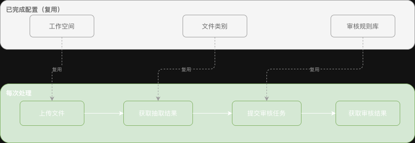
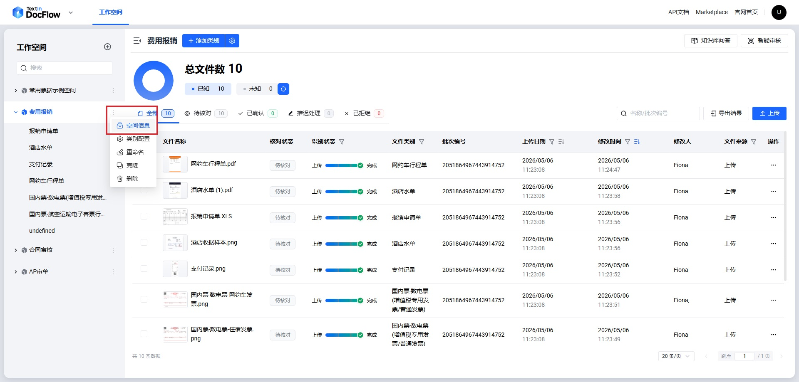
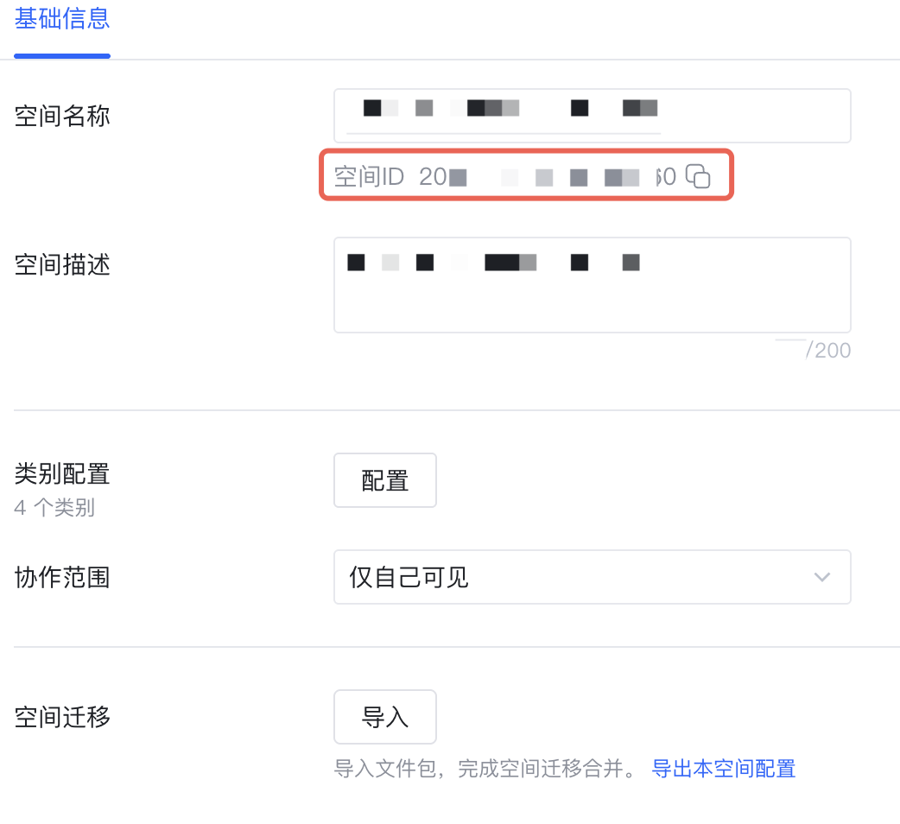

<Tip>
  本文面向**已完成**工作空间创建、文件类别配置和审核规则库设置的用户，演示如何在现有配置基础上，通过 API 完成日常的合同文件上传、字段抽取和智能审核流程。
  如果您还没有配置过 DocFlow，请先阅读 [合同审核场景（从零开始）](./contract_review)。
</Tip>

## 01 场景说明

工作空间、文件类别、审核规则库属于**一次性基础配置**，完成后即可持续复用。在日常合同审核业务中，只需通过 API 重复以下三步：

1. **上传文件**：将待审核的采购合同上传至工作空间
2. **获取抽取结果**：等待系统完成分类识别与字段抽取，获取结构化数据
3. **智能审核**：绑定已有规则库，提交审核任务并获取审核结论

本文演示的完整流程如下图所示：



## 02 先决条件

在运行本文代码之前，您需要准备：

1. **认证信息**：从 [TextIn 控制台](https://www.textin.com/console/dashboard/setting) 获取 `x-ti-app-id` 和 `x-ti-secret-code`
2. **workspace_id**：已创建的工作空间 ID（查看方式见下方）
3. **repo_id**：已配置的审核规则库 ID（查看方式见下方）
4. **待处理文件**：本次需要审核的采购合同文件（PDF 或 Word 格式）

### 如何获取 workspace_id

**第一步**：在左侧工作空间列表中，将鼠标悬停在目标空间名称上，点击出现的「设置」按钮。



**第二步**：进入空间的「基础信息」页，右侧「空间ID」字段即为 `workspace_id`，点击复制图标可直接复制。



### 如何获取 repo_id

**第一步**：进入目标工作空间后，点击右上角「智能审核」按钮。


**第二步**：在智能审核页面中，点击顶部「规则库」标签页。


**第三步**：规则库列表的「规则库ID」列即为 `repo_id`。


## 03 代码结构说明

本示例只包含日常处理所需的**三个步骤**，代码量比从零开始版本少约 60%。

### API 调用函数

| 函数（Python） | 方法（Java） | 对应 API 端点 | 说明 |
|---|---|---|---|
| `upload_file` | `uploadFile` | `POST /file/upload` | 上传待处理文件，返回 batch_number |
| `submit_review_task` | `submitReviewTask` | `POST /review/task/submit` | 提交审核任务，返回审核 task_id |

### 逐步代码说明

<AccordionGroup>
  <Accordion defaultOpen title="步骤 1：上传待处理文件">
    将采购合同文件上传至工作空间，系统根据已配置的文件类别自动完成分类识别，并返回 `batch_number`。

    <Tabs>
      <Tab title="Python">
        ```python
        batch_number = upload_file(WORKSPACE_ID, os.path.join(FILES_DIR, "示例_采购合同.docx"))
        ```
      </Tab>
      <Tab title="Java">
        ```java
        String batchNumber = uploadFile(WORKSPACE_ID, FILES_DIR + "/示例_采购合同.docx");
        ```
      </Tab>
    </Tabs>
  </Accordion>
  <Accordion defaultOpen title="步骤 2：获取抽取结果">
    对 `batch_number` 轮询 `file/fetch` 接口，等待识别完成后获取文档的分类和字段抽取结果，并从结果中收集 `task_id` 供后续审核使用。

    <Tabs>
      <Tab title="Python">
        ```python
        file_result = wait_for_result(WORKSPACE_ID, batch_number)
        display_result(file_result)

        extract_task_id = file_result.get("task_id")
        ```
      </Tab>
      <Tab title="Java">
        ```java
        JsonObject fileResult = waitForResult(WORKSPACE_ID, batchNumber, 180, 3);
        displayResult(fileResult);

        String extractTaskId = null;
        if (fileResult.has("task_id") && !fileResult.get("task_id").isJsonNull()) {
            extractTaskId = fileResult.get("task_id").getAsString();
        }
        ```
      </Tab>
    </Tabs>
  </Accordion>
  <Accordion defaultOpen title="步骤 3：提交审核任务并获取结果">
    将文件的 `task_id` 传入 `review/task/submit` 接口，绑定已有规则库提交审核；审核完成后轮询获取每条规则的通过/不通过结论及 AI 依据。

    <Tabs>
      <Tab title="Python">
        ```python
        task_name = f"合同审核_{datetime.now().strftime('%Y%m%d_%H%M%S')}"
        review_task_id = submit_review_task(WORKSPACE_ID, task_name, REPO_ID, [extract_task_id])

        review_result = wait_for_review(WORKSPACE_ID, review_task_id)
        display_review_result(review_result)
        ```
      </Tab>
      <Tab title="Java">
        ```java
        String taskName = "合同审核_" + new SimpleDateFormat("yyyyMMdd_HHmmss").format(new Date());
        List<String> extractTaskIds = new ArrayList<>();
        if (extractTaskId != null) extractTaskIds.add(extractTaskId);
        String reviewTaskId = submitReviewTask(WORKSPACE_ID, taskName, REPO_ID, extractTaskIds);

        JsonObject reviewResult = waitForReview(WORKSPACE_ID, reviewTaskId, 300, 5);
        displayReviewResult(reviewResult);
        ```
      </Tab>
    </Tabs>
  </Accordion>
</AccordionGroup>

## 04 运行示例

<Steps>
  <Step title="填写配置项">
    打开示例代码，将 `APP_ID`、`SECRET_CODE`、`WORKSPACE_ID`、`REPO_ID` 替换为您的实际值。
  </Step>
  <Step title="准备待处理文件">
    将待审核的采购合同放入 `examples/sample_files/合同审核/` 目录，或修改代码中的文件路径指向您的实际文件。
  </Step>
  <Step title="安装依赖并运行">
    <Tabs>
      <Tab title="Python">
        ```bash
        pip install requests
        python examples/python/contract_review_configured.py
        ```
      </Tab>
      <Tab title="Java">
        ```bash
        cd examples/java
        mvn compile exec:java -Dexec.mainClass="com.docflow.ContractReviewConfigured"
        ```
      </Tab>
    </Tabs>
  </Step>
</Steps>
