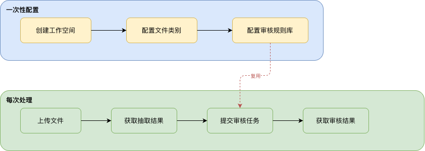
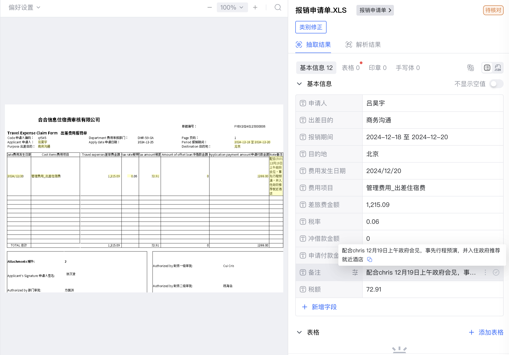
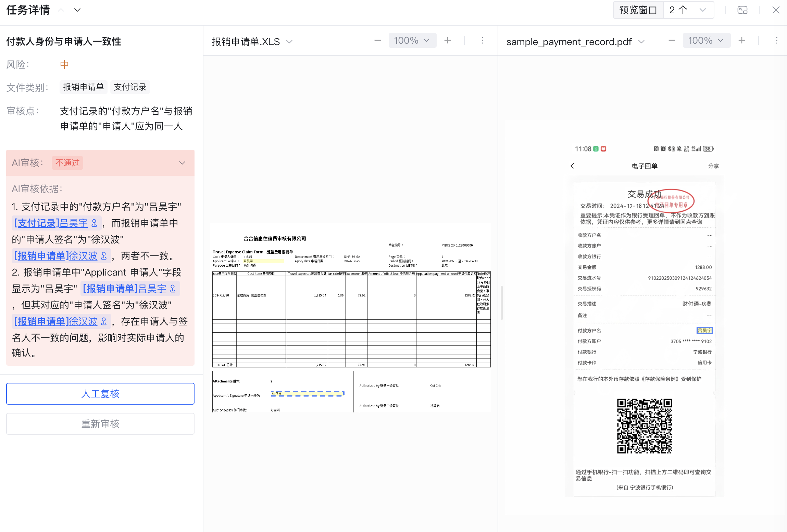

<Tip>
  本文以**费用报销**为业务场景，演示如何通过 API 完成从创建空间、配置类别、上传文件、获取抽取结果到智能审核的完整流程。
  如果您刚刚接触 DocFlow，建议先在 [Web 页面](https://docflow.textin.com/) 体验一下产品的基本功能，再阅读本文。
</Tip>

## 01 场景说明

在费用报销业务中，财务人员每天需要处理大量不同类型的报销单据，例如：

- **报销申请单**（XLS 格式）：记录申请人、出差目的、费用明细等信息
- **酒店水单**（图片）：记录入住日期、离店日期及消费明细
- **支付记录**（PDF）：记录交易流水号、交易金额、收付款方信息

通过 DocFlow，您只需配置一次分类和字段，后续上传的单据即可自动完成**分类识别**和**结构化信息抽取**；配置好审核规则库后，还可对抽取结果进行**智能审核**，自动发现金额不符、字段缺失等问题。

## 02 业务流程



<Note>
  **工作空间、文件类别和审核规则库只需配置一次**，后续可持续复用——直接上传新的待处理文件并创建新的审核任务即可。本示例为演示完整流程，将配置步骤和处理步骤放在同一段代码中运行。
</Note>

## 03 先决条件

1. 登录 [TextIn 控制台](https://www.textin.com/console/dashboard/setting)，获取 `x-ti-app-id` 和 `x-ti-secret-code`
2. 在控制台「企业管理」中查看企业组织 ID（`enterprise_id`），参考 [如何获取企业 ID](../100-faq/get_enterprise_id)
3. 下载[示例样本文件](https://github.com/ichaozai/docflow-docs/tree/master/examples/sample_files)，或使用自己的报销单据

## 04 类别与字段配置

本示例配置三个文件类别，字段设计如下：

<AccordionGroup>
  <Accordion defaultOpen title="酒店水单（样本：sample_hotel_receipt.png）">
    酒店水单是住宿消费的凭证，通常包含入住/离店日期等全局信息，以及按天计费的消费明细表格。字段配置同时使用**基本信息字段**（全局信息）和**表格字段**（逐行消费记录），以完整提取单据中的结构化数据：

    

    | 字段名 | 类型 |
    |---|---|
    | <span style={{color: "#3b82f6"}}>入住日期</span> | 基本信息字段 |
    | <span style={{color: "#3b82f6"}}>离店日期</span> | 基本信息字段 |
    | <span style={{color: "#3b82f6"}}>总金额</span> | 基本信息字段 |
    | <span style={{color: "#3b82f6"}}>日期</span> | 表格字段 |
    | <span style={{color: "#3b82f6"}}>费用类型</span> | 表格字段 |
    | <span style={{color: "#3b82f6"}}>金额</span> | 表格字段 |
    | <span style={{color: "#3b82f6"}}>备注</span> | 表格字段 |
  </Accordion>
  <Accordion defaultOpen title="支付记录（样本：sample_payment_record.pdf）">
    支付记录是银行或支付机构出具的电子回单，包含交易流水号、交易双方及金额等详情。通过字段抽取，可快速核验报销金额和收付款方是否与申请单一致：

    

    | 字段名 | 类型 |
    |---|---|
    | <span style={{color: "#3b82f6"}}>交易流水号</span> | 基本信息字段 |
    | <span style={{color: "#3b82f6"}}>交易授权码</span> | 基本信息字段 |
    | <span style={{color: "#3b82f6"}}>付款卡种</span> | 基本信息字段 |
    | <span style={{color: "#3b82f6"}}>收款方户名</span> | 基本信息字段 |
    | <span style={{color: "#3b82f6"}}>付款方户名</span> | 基本信息字段 |
    | <span style={{color: "#3b82f6"}}>交易时间</span> | 基本信息字段 |
    | <span style={{color: "#3b82f6"}}>备注</span> | 基本信息字段 |
    | <span style={{color: "#3b82f6"}}>收款方账户</span> | 基本信息字段 |
    | <span style={{color: "#3b82f6"}}>收款方银行</span> | 基本信息字段 |
    | <span style={{color: "#3b82f6"}}>交易金额</span> | 基本信息字段 |
    | <span style={{color: "#3b82f6"}}>交易描述</span> | 基本信息字段 |
    | <span style={{color: "#3b82f6"}}>付款银行</span> | 基本信息字段 |
    | <span style={{color: "#3b82f6"}}>币种</span> | 基本信息字段 |
    | <span style={{color: "#3b82f6"}}>交易账号/支付方式</span> | 基本信息字段 |
  </Accordion>
  <Accordion defaultOpen title="报销申请单（样本：报销申请单.XLS）">
    报销申请单是差旅费用报销的主单据，以 Excel 表格形式记录申请人信息、出差行程及各项费用明细。通过字段抽取，系统可自动录入申请人、金额、税率等关键数据，避免手工填表出错：

    | 字段名 | 类型 |
    |---|---|
    | <span style={{color: "#3b82f6"}}>申请人</span> | 基本信息字段 |
    | <span style={{color: "#3b82f6"}}>出差目的</span> | 基本信息字段 |
    | <span style={{color: "#3b82f6"}}>报销期间</span> | 基本信息字段 |
    | <span style={{color: "#3b82f6"}}>目的地</span> | 基本信息字段 |
    | <span style={{color: "#3b82f6"}}>费用发生日期</span> | 基本信息字段 |
    | <span style={{color: "#3b82f6"}}>费用项目</span> | 基本信息字段 |
    | <span style={{color: "#3b82f6"}}>差旅费金额</span> | 基本信息字段 |
    | <span style={{color: "#3b82f6"}}>税率</span> | 基本信息字段 |
    | <span style={{color: "#3b82f6"}}>冲借款金额</span> | 基本信息字段 |
    | <span style={{color: "#3b82f6"}}>申请付款金额</span> | 基本信息字段 |
    | <span style={{color: "#3b82f6"}}>备注</span> | 基本信息字段 |
    | <span style={{color: "#3b82f6"}}>税额</span> | 基本信息字段 |
  </Accordion>
</AccordionGroup>

## 05 审核规则配置

本示例的审核规则库包含 **3 个规则组、8 条审核规则**，覆盖单据内合规性检查、差旅政策匹配和跨单据交叉核验三个维度：

<AccordionGroup>
  <Accordion defaultOpen title="规则组 1：报销申请单合规性检查（适用分类：报销申请单）">
    | 规则名称 | 风险等级 | 审核逻辑 |
    |---|---|---|
    | <span style={{color: "#3b82f6"}}>行报销金额校验</span> | 🔴 高风险 | 行申请付款金额 ≤ 行差旅费金额（含税）- 行冲借款金额，冲借款金额为空时视为 0 |
    | <span style={{color: "#3b82f6"}}>报销总金额校验</span> | 🔴 高风险 | 申请付款总金额 ≤ Σ 行申请付款金额 |
    | <span style={{color: "#3b82f6"}}>报销期间与费用日期匹配</span> | 🟡 中风险 | "费用发生日期"应在"报销期间"所覆盖的日期范围内 |
    | <span style={{color: "#3b82f6"}}>必填字段完整性校验</span> | 🔴 高风险 | "申请人"、"费用发生日期"、"费用项目"、"申请付款金额"均不为空 |
  </Accordion>
  <Accordion defaultOpen title="规则组 2：差旅费用政策匹配审核（适用分类：酒店水单）">
    | 规则名称 | 风险等级 | 审核逻辑 |
    |---|---|---|
    | <span style={{color: "#3b82f6"}}>城市差标匹配</span> | 🟡 中风险 | 酒店住宿单价 ≤ 目的地城市差旅标准：一线城市（北京/上海/广州/深圳）≤ 800 元/晚，省会及计划单列市 ≤ 500 元/晚，其他城市 ≤ 300 元/晚 |
    | <span style={{color: "#3b82f6"}}>酒店明细合计金额校验</span> | 🟡 中风险 | 所有明细行"金额"合计 = "总金额" |
  </Accordion>
  <Accordion defaultOpen title="规则组 3：跨文档交叉审核（适用分类：报销申请单 + 酒店水单 + 支付记录）">
    | 规则名称 | 风险等级 | 审核逻辑 |
    |---|---|---|
    | <span style={{color: "#3b82f6"}}>跨文档金额匹配</span> | 🔴 高风险 | 报销申请单差旅费金额 = 酒店水单总金额 = 支付记录交易金额，允许 ±0.1 元误差 |
    | <span style={{color: "#3b82f6"}}>付款人身份与申请人一致性</span> | 🟡 中风险 | 支付记录"付款方户名"与报销申请单"申请人"为同一人 |

    <Tip>
      跨文档规则的 `category_ids` 包含多个分类 ID，只有当审核任务覆盖所有关联分类时，该规则才会被触发执行。
    </Tip>
  </Accordion>
</AccordionGroup>

## 06 代码结构说明

示例代码将完整的七步流程放在一起运行，便于理解端到端的调用链路。在实际生产中，**步骤 1、2、5（创建工作空间、配置文件类别、配置审核规则库）只需执行一次**；后续处理新单据时，只需重复**步骤 3、4、6、7（上传文件 → 获取抽取结果 → 提交审核任务 → 获取审核结果）**，直接复用已有的工作空间、类别和规则库即可。

示例代码中的函数分为两类，理解这一点有助于对照 API 文档进行调试和扩展。

### 两类函数

**REST API 调用函数** — 每个函数直接封装一个 API 端点，函数参数与接口文档一一对应：

| 函数（Python） | 方法（Java） | 对应 API 端点 | 说明 |
|---|---|---|---|
| `create_workspace` | `createWorkspace` | `POST /workspace/create` | 创建工作空间，返回 workspace_id |
| `create_category` | `createCategory` | `POST /category/create` | 创建文件类别并上传样本文件，返回 category_id |
| `add_category_field` | `addCategoryField` | `POST /category/fields/add` | 为已有类别追加字段（用于添加表格字段） |
| `upload_file` | `uploadFile` | `POST /file/upload` | 上传待处理文件，返回 batch_number |
| `create_rule_repo` | `createRuleRepo` | `POST /review/rule_repo/create` | 创建审核规则库，返回 repo_id |
| `create_rule_group` | `createRuleGroup` | `POST /review/rule_group/create` | 在规则库内创建规则组，返回 group_id |
| `create_rule` | `createRule` | `POST /review/rule/create` | 在规则组内创建审核规则，绑定适用分类 |
| `submit_review_task` | `submitReviewTask` | `POST /review/task/submit` | 提交审核任务，返回审核 task_id |

**工具辅助函数** — 不直接对应 API 端点，提供公共基础能力或封装轮询/展示逻辑：

| 函数（Python） | 方法（Java） | 作用 |
|---|---|---|
| `_headers` | `authHeaders` | 构造鉴权请求头 |
| `_check` | `checkResponse` | 校验响应 code，统一异常处理 |
| `_mime` | `mimeType` | 根据扩展名推断 MIME 类型 |
| `wait_for_result` | `waitForResult` | 循环轮询 `file/fetch`，等待抽取完成 |
| `display_result` | `displayResult` | 格式化打印抽取结果 |
| `wait_for_review` | `waitForReview` | 循环轮询 `review/task/result`，等待审核完成 |
| `display_review_result` | `displayReviewResult` | 格式化打印审核结果 |

### 逐步代码说明

<AccordionGroup>
  <Accordion defaultOpen title="步骤 1：创建工作空间">
    工作空间名称中加入时间戳，确保每次运行都会创建独立的新空间，避免重名错误。

    <Tabs>
      <Tab title="Python">
        ```python
        def create_workspace(name: str, description: str = "") -> str:
            """创建工作空间，返回 workspace_id。"""
            url = f"{BASE_URL}/api/app-api/sip/platform/v2/workspace/create"
            payload = {
                "name":          name,
                "description":   description,
                "enterprise_id": ENTERPRISE_ID,
                "auth_scope":    0,
            }
            resp = requests.post(url, json=payload, headers=_headers(), timeout=30)
            data = _check(resp, "创建工作空间")
            return data["result"]["workspace_id"]

        # 调用示例（名称含时间戳，避免重名）
        workspace_name = f"费用报销_{datetime.now().strftime('%Y%m%d_%H%M%S')}"
        workspace_id = create_workspace(name=workspace_name, description="费用报销单据自动化处理空间")
        ```
      </Tab>
      <Tab title="Java">
        ```java
        public static String createWorkspace(String name, String description) throws IOException {
            String url = BASE_URL + "/api/app-api/sip/platform/v2/workspace/create";
            JsonObject payload = new JsonObject();
            payload.addProperty("name", name);
            payload.addProperty("description", description);
            payload.addProperty("enterprise_id", ENTERPRISE_ID);
            payload.addProperty("auth_scope", 0);

            Request req = new Request.Builder().url(url).headers(authHeaders())
                    .post(RequestBody.create(GSON.toJson(payload), JSON_TYPE)).build();
            try (Response resp = HTTP.newCall(req).execute()) {
                JsonObject data = checkResponse(resp.body().string(), "创建工作空间");
                return data.getAsJsonObject("result").get("workspace_id").getAsString();
            }
        }

        // 调用示例
        String workspaceName = "费用报销_"
                + new SimpleDateFormat("yyyyMMdd_HHmmss").format(new Date());
        String workspaceId = createWorkspace(workspaceName, "费用报销单据自动化处理空间");
        ```
      </Tab>
    </Tabs>
  </Accordion>

  <Accordion defaultOpen title="步骤 2：配置文件类别">
    `create_category` 通过 multipart 表单一次性完成类别创建、样本上传和字段配置。对于需要表格字段的类别（如酒店水单），在创建后再调用 `add_category_field` 追加。

    <Tabs>
      <Tab title="Python">
        ```python
        def create_category(workspace_id, name, sample_file_path, fields, category_prompt="") -> str:
            url = f"{BASE_URL}/api/app-api/sip/platform/v2/category/create"
            with open(sample_file_path, "rb") as f:
                form_data = [
                    ("workspace_id",    (None, workspace_id)),
                    ("name",            (None, name)),
                    ("extract_model",   (None, "llm")),
                    ("category_prompt", (None, category_prompt)),
                    ("fields",          (None, json.dumps(fields, ensure_ascii=False))),
                    ("sample_files",    (os.path.basename(sample_file_path), f, _mime(sample_file_path))),
                ]
                resp = requests.post(url, files=form_data, headers=_headers(), timeout=60)
            return _check(resp, f"创建文件类别[{name}]")["result"]["category_id"]

        def add_category_field(workspace_id, category_id, field_name, table_id=None) -> str:
            url = f"{BASE_URL}/api/app-api/sip/platform/v2/category/fields/add"
            payload = {"workspace_id": workspace_id, "category_id": category_id, "name": field_name}
            if table_id:
                payload["table_id"] = table_id
            resp = requests.post(url, json=payload, headers=_headers(), timeout=30)
            return _check(resp, f"追加字段[{field_name}]")["result"]["field_id"]

        # 调用示例：酒店水单（含表格字段）
        hotel_id = create_category(workspace_id, "酒店水单",
            os.path.join(SAMPLE_DIR, "sample_hotel_receipt.png"),
            [{"name": "入住日期"}, {"name": "离店日期"}, {"name": "总金额"}])
        for fn in ["日期", "费用类型", "金额", "备注"]:
            add_category_field(workspace_id, hotel_id, fn, -1)
        ```
      </Tab>
      <Tab title="Java">
        ```java
        public static String createCategory(String workspaceId, String name,
                String sampleFilePath, List<Map<String, String>> fields,
                String categoryPrompt) throws IOException {
            File sampleFile = new File(sampleFilePath);
            MultipartBody body = new MultipartBody.Builder().setType(MultipartBody.FORM)
                    .addFormDataPart("workspace_id",  workspaceId)
                    .addFormDataPart("name",          name)
                    .addFormDataPart("extract_model", "llm")
                    .addFormDataPart("category_prompt", categoryPrompt)
                    .addFormDataPart("fields", GSON.toJson(fields))
                    .addFormDataPart("sample_files", sampleFile.getName(),
                            RequestBody.create(sampleFile, MediaType.get(mimeType(sampleFile.getName()))))
                    .build();
            Request req = new Request.Builder().url(BASE_URL + "/api/app-api/sip/platform/v2/category/create")
                    .headers(authHeaders()).post(body).build();
            try (Response resp = HTTP.newCall(req).execute()) {
                return checkResponse(resp.body().string(), "创建文件类别")
                        .getAsJsonObject("result").get("category_id").getAsString();
            }
        }

        // 调用示例：酒店水单（含表格字段）
        String hotelId = createCategory(workspaceId, "酒店水单",
                SAMPLE_DIR + "/sample_hotel_receipt.png",
                Arrays.asList(field("入住日期"), field("离店日期"), field("总金额")), "");
        for (String fn : new String[]{"日期", "费用类型", "金额", "备注"}) {
            addCategoryField(workspaceId, hotelId, fn, "-1");
        }
        ```
      </Tab>
    </Tabs>
  </Accordion>

  <Accordion defaultOpen title="步骤 3：上传待处理文件">
    `upload_file` 将文件上传至工作空间，系统返回 `batch_number`，后续通过该 ID 查询处理结果。

    <Tabs>
      <Tab title="Python">
        ```python
        def upload_file(workspace_id: str, file_path: str) -> str:
            url = f"{BASE_URL}/api/app-api/sip/platform/v2/file/upload"
            with open(file_path, "rb") as f:
                resp = requests.post(url,
                    params={"workspace_id": workspace_id},
                    files={"file": (os.path.basename(file_path), f, _mime(file_path))},
                    headers=_headers(), timeout=60)
            return _check(resp, "上传文件")["result"]["batch_number"]

        # 调用示例
        batch_numbers = [upload_file(workspace_id, p) for p in [
            os.path.join(SAMPLE_DIR, "报销申请单.XLS"),
            os.path.join(SAMPLE_DIR, "sample_hotel_receipt.png"),
            os.path.join(SAMPLE_DIR, "sample_payment_record.pdf"),
        ]]
        ```
      </Tab>
      <Tab title="Java">
        ```java
        public static String uploadFile(String workspaceId, String filePath) throws IOException {
            File file = new File(filePath);
            HttpUrl url = HttpUrl.parse(BASE_URL + "/api/app-api/sip/platform/v2/file/upload")
                    .newBuilder().addQueryParameter("workspace_id", workspaceId).build();
            MultipartBody body = new MultipartBody.Builder().setType(MultipartBody.FORM)
                    .addFormDataPart("file", file.getName(),
                            RequestBody.create(file, MediaType.get(mimeType(file.getName()))))
                    .build();
            Request req = new Request.Builder().url(url).headers(authHeaders()).post(body).build();
            try (Response resp = HTTP.newCall(req).execute()) {
                return checkResponse(resp.body().string(), "上传文件")
                        .getAsJsonObject("result").get("batch_number").getAsString();
            }
        }

        // 调用示例
        String[] files = {
            SAMPLE_DIR + "/报销申请单.XLS",
            SAMPLE_DIR + "/sample_hotel_receipt.png",
            SAMPLE_DIR + "/sample_payment_record.pdf"
        };
        List<String> batchNumbers = new ArrayList<>();
        for (String path : files) batchNumbers.add(uploadFile(workspaceId, path));
        ```
      </Tab>
    </Tabs>
  </Accordion>

  <Accordion defaultOpen title="步骤 4：获取抽取结果">
    `wait_for_result` 封装了轮询逻辑，每隔 3 秒查询一次 `file/fetch`，直到 `recognition_status` 变为 `1`（成功）。返回的文件对象中包含 `task_id`，后续审核步骤需要用到。

    <Tabs>
      <Tab title="Python">
        ```python
        def wait_for_result(workspace_id, batch_number, timeout=120, interval=3) -> dict:
            url = f"{BASE_URL}/api/app-api/sip/platform/v2/file/fetch"
            deadline = time.time() + timeout
            while time.time() < deadline:
                resp = requests.get(url,
                    params={"workspace_id": workspace_id, "batch_number": batch_number},
                    headers=_headers(), timeout=30)
                files = _check(resp, "获取处理结果").get("result", {}).get("files", [])
                if files:
                    status = files[0].get("recognition_status")
                    if status == 1:
                        return files[0]   # 含 task_id，供后续审核使用
                    elif status == 2:
                        raise RuntimeError(f"文件处理失败: {files[0].get('failure_causes')}")
                time.sleep(interval)
            raise TimeoutError("等待超时")

        # 调用示例（收集 task_id 用于后续审核）
        raw_results = []
        for batch_number in batch_numbers:
            result = wait_for_result(workspace_id, batch_number)
            raw_results.append(result)
        ```
      </Tab>
      <Tab title="Java">
        ```java
        public static JsonObject waitForResult(String workspaceId, String batchNumber,
                int timeoutSec, int intervalSec) throws IOException, InterruptedException {
            HttpUrl url = HttpUrl.parse(BASE_URL + "/api/app-api/sip/platform/v2/file/fetch")
                    .newBuilder().addQueryParameter("workspace_id", workspaceId)
                    .addQueryParameter("batch_number", batchNumber).build();
            long deadline = System.currentTimeMillis() + (long) timeoutSec * 1000;
            while (System.currentTimeMillis() < deadline) {
                Request req = new Request.Builder().url(url).headers(authHeaders()).get().build();
                try (Response resp = HTTP.newCall(req).execute()) {
                    JsonObject data = checkResponse(resp.body().string(), "获取处理结果");
                    JsonArray files = data.getAsJsonObject("result").getAsJsonArray("files");
                    if (files != null && files.size() > 0) {
                        JsonObject file = files.get(0).getAsJsonObject();
                        int status = file.get("recognition_status").getAsInt();
                        if (status == 1) return file;   // 含 task_id
                        if (status == 2) throw new RuntimeException("文件处理失败");
                    }
                }
                Thread.sleep((long) intervalSec * 1000);
            }
            throw new RuntimeException("等待超时");
        }

        // 调用示例
        List<JsonObject> rawResults = new ArrayList<>();
        for (String bn : batchNumbers) {
            rawResults.add(waitForResult(workspaceId, bn, 120, 3));
        }
        ```
      </Tab>
    </Tabs>
  </Accordion>

  <Accordion defaultOpen title="步骤 5：配置审核规则库">
    规则库采用**三层结构**：规则库 → 规则组 → 规则。`create_rule` 的 `category_ids` 参数指定规则适用的分类，使用步骤 2 中获得的 `category_id`。

    <Tabs>
      <Tab title="Python">
        ```python
        # 创建规则库
        repo_id = create_rule_repo(workspace_id, "费用报销审核规则库")

        # 规则组1：报销申请单合规性检查
        group1_id = create_rule_group(workspace_id, repo_id, "报销申请单合规性检查")
        create_rule(workspace_id, repo_id, group1_id,
            "必填字段完整性校验",
            "\"申请人\"、\"费用发生日期\"、\"费用项目\"、\"申请付款金额\"均不为空，"
            "任一字段为空则审核不通过",
            [baoxiao_id], 10)   # category_ids 传入步骤2获得的 category_id

        # 规则组3：跨文档交叉审核（关联多个分类）
        group3_id = create_rule_group(workspace_id, repo_id, "跨文档交叉审核")
        create_rule(workspace_id, repo_id, group3_id,
            "跨文档金额匹配",
            "报销申请单差旅费金额 = 酒店水单总金额 = 支付记录交易金额，允许±0.1元误差",
            [baoxiao_id, hotel_id, payment_id], 10)   # 关联三个分类
        ```
      </Tab>
      <Tab title="Java">
        ```java
        // 创建规则库
        String repoId = createRuleRepo(workspaceId, "费用报销审核规则库");

        // 规则组1：报销申请单合规性检查
        String group1Id = createRuleGroup(workspaceId, repoId, "报销申请单合规性检查");
        createRule(workspaceId, repoId, group1Id,
                "必填字段完整性校验",
                "\"申请人\"、\"费用发生日期\"、\"费用项目\"、\"申请付款金额\"均不为空，" +
                "任一字段为空则审核不通过",
                Arrays.asList(baoxiaoId), 10);   // category_ids 传入步骤2获得的 category_id

        // 规则组3：跨文档交叉审核（关联多个分类）
        String group3Id = createRuleGroup(workspaceId, repoId, "跨文档交叉审核");
        createRule(workspaceId, repoId, group3Id,
                "跨文档金额匹配",
                "报销申请单差旅费金额 = 酒店水单总金额 = 支付记录交易金额，允许±0.1元误差",
                Arrays.asList(baoxiaoId, hotelId, paymentId), 10);   // 关联三个分类
        ```
      </Tab>
    </Tabs>
  </Accordion>

  <Accordion defaultOpen title="步骤 6：提交审核任务">
    从步骤 4 的抽取结果中提取 `task_id`，传入审核接口。审核任务是**异步执行**的，提交后需要轮询结果。

    <Tabs>
      <Tab title="Python">
        ```python
        def submit_review_task(workspace_id, name, repo_id, extract_task_ids) -> str:
            url = f"{BASE_URL}/api/app-api/sip/platform/v2/review/task/submit"
            payload = {
                "workspace_id":     workspace_id,
                "name":             name,
                "repo_id":          repo_id,
                "extract_task_ids": extract_task_ids,
            }
            resp = requests.post(url, json=payload, headers=_headers(), timeout=30)
            return _check(resp, "提交审核任务")["result"]["task_id"]

        # 调用示例（从抽取结果中收集 task_id）
        extract_task_ids = [r.get("task_id") for r in raw_results if r.get("task_id")]
        review_task_id = submit_review_task(workspace_id, "费用报销审核", repo_id, extract_task_ids)
        ```
      </Tab>
      <Tab title="Java">
        ```java
        public static String submitReviewTask(String workspaceId, String name,
                String repoId, List<String> extractTaskIds) throws IOException {
            JsonObject payload = new JsonObject();
            payload.addProperty("workspace_id", workspaceId);
            payload.addProperty("name", name);
            payload.addProperty("repo_id", repoId);
            JsonArray ids = new JsonArray();
            extractTaskIds.forEach(ids::add);
            payload.add("extract_task_ids", ids);
            Request req = new Request.Builder()
                    .url(BASE_URL + "/api/app-api/sip/platform/v2/review/task/submit")
                    .headers(authHeaders()).post(RequestBody.create(GSON.toJson(payload), JSON_TYPE)).build();
            try (Response resp = HTTP.newCall(req).execute()) {
                return checkResponse(resp.body().string(), "提交审核任务")
                        .getAsJsonObject("result").get("task_id").getAsString();
            }
        }

        // 调用示例
        List<String> extractTaskIds = new ArrayList<>();
        for (JsonObject r : rawResults) {
            if (r.has("task_id")) extractTaskIds.add(r.get("task_id").getAsString());
        }
        String reviewTaskId = submitReviewTask(workspaceId, "费用报销审核", repoId, extractTaskIds);
        ```
      </Tab>
    </Tabs>
  </Accordion>

  <Accordion defaultOpen title="步骤 7：获取审核结果">
    `wait_for_review` 轮询 `review/task/result` 接口，直到任务状态变为终态（1=审核通过、2=审核失败、4=审核不通过、7=识别失败）。

    <Tabs>
      <Tab title="Python">
        ```python
        def wait_for_review(workspace_id, task_id, timeout=300, interval=5) -> dict:
            url = f"{BASE_URL}/api/app-api/sip/platform/v2/review/task/result"
            payload = {"workspace_id": workspace_id, "task_id": task_id}
            deadline = time.time() + timeout
            while time.time() < deadline:
                resp = requests.post(url, json=payload, headers=_headers(), timeout=30)
                result = _check(resp, "获取审核结果").get("result", {})
                if result.get("status") in (1, 2, 4, 7):
                    return result
                time.sleep(interval)
            raise TimeoutError("等待审核结果超时")

        # 调用示例
        review_result = wait_for_review(workspace_id, review_task_id)
        # review_result["status"]      → 任务整体状态
        # review_result["statistics"]  → 通过/不通过规则数统计
        # review_result["groups"]      → 各规则组的详细审核结果
        ```
      </Tab>
      <Tab title="Java">
        ```java
        public static JsonObject waitForReview(String workspaceId, String taskId,
                int timeoutSec, int intervalSec) throws IOException, InterruptedException {
            JsonObject payload = new JsonObject();
            payload.addProperty("workspace_id", workspaceId);
            payload.addProperty("task_id", taskId);
            long deadline = System.currentTimeMillis() + (long) timeoutSec * 1000;
            while (System.currentTimeMillis() < deadline) {
                Request req = new Request.Builder()
                        .url(BASE_URL + "/api/app-api/sip/platform/v2/review/task/result")
                        .headers(authHeaders()).post(RequestBody.create(GSON.toJson(payload), JSON_TYPE)).build();
                try (Response resp = HTTP.newCall(req).execute()) {
                    JsonObject result = checkResponse(resp.body().string(), "获取审核结果")
                            .getAsJsonObject("result");
                    int status = result.get("status").getAsInt();
                    if (status == 1 || status == 2 || status == 4 || status == 7) return result;
                }
                Thread.sleep((long) intervalSec * 1000);
            }
            throw new RuntimeException("等待审核结果超时");
        }

        // 调用示例
        JsonObject reviewResult = waitForReview(workspaceId, reviewTaskId, 300, 5);
        ```
      </Tab>
    </Tabs>
  </Accordion>
</AccordionGroup>

### 抽取结果示例



### 审核结果示例



## 07 完整示例代码下载

完整可运行代码（含 Python、Java 两个版本）已内置在文档仓库的 `examples/` 目录下：

```
examples/
├── python/
│   ├── expense_reimbursement.py   # Python 完整示例
│   ├── requirements.txt
│   └── README.md
├── java/
│   ├── src/main/java/com/docflow/ExpenseReimbursement.java
│   ├── pom.xml
│   └── README.md
└── sample_files/
    └── 费用报销/
        ├── 报销申请单.XLS
        ├── sample_hotel_receipt.png
        ├── sample_payment_record.pdf
        └── DocFlow规则库_费用报销场景.xlsx
```

<CardGroup cols={2}>
  <Card title="Python 示例" icon="python" href="https://github.com/ichaozai/docflow-docs/tree/master/examples/python">
    查看 Python 完整示例代码
  </Card>
  <Card title="Java 示例" icon="java" href="https://github.com/ichaozai/docflow-docs/tree/master/examples/java">
    查看 Java 完整示例代码
  </Card>
</CardGroup>

## 08 运行示例

<Tabs>
  <Tab title="Python">
    **环境要求**：Python 3.8+

    **1. 安装依赖**

    ```bash
    cd examples/python
    pip install -r requirements.txt
    ```

    **2. 填写配置**

    打开 `expense_reimbursement.py`，填写文件顶部的配置项：

    ```python
    APP_ID        = "your-app-id"      # x-ti-app-id
    SECRET_CODE   = "your-secret-code" # x-ti-secret-code
    ENTERPRISE_ID = 0                  # 企业组织 ID
    ```

    **3. 运行**

    ```bash
    python expense_reimbursement.py
    ```
  </Tab>
  <Tab title="Java">
    **环境要求**：JDK 11+，Maven 3.6+

    **1. 填写配置**

    打开 `src/main/java/com/docflow/ExpenseReimbursement.java`，填写文件顶部的配置项：

    ```java
    private static final String APP_ID        = "your-app-id";
    private static final String SECRET_CODE   = "your-secret-code";
    private static final long   ENTERPRISE_ID = 0L;   // 替换为企业组织 ID
    ```

    **2. 编译并运行**

    ```bash
    cd examples/java
    mvn clean package -q
    java -jar target/expense-reimbursement-1.0.0.jar
    ```
  </Tab>
</Tabs>

<Tip>
  运行成功后，可登录 [DocFlow Web 页面](https://docflow.textin.com/)，在对应工作空间下直观查看每份文件的分类、字段抽取结果和智能审核结果，便于与代码输出对照验证。
</Tip>

### 预期控制台输出

成功运行后，控制台将输出如下内容（workspace_id、category_id 等 ID 因运行环境不同而变化）：

```
============================================================
  DocFlow 费用报销场景示例
============================================================
[步骤1] 工作空间创建成功  workspace_id=<workspace_id>
[步骤2] 文件类别创建成功  name=报销申请单  category_id=<category_id>
[步骤2] 文件类别创建成功  name=酒店水单  category_id=<category_id>
  追加字段成功  name=日期  field_id=<field_id>
  追加字段成功  name=费用类型  field_id=<field_id>
  追加字段成功  name=金额  field_id=<field_id>
  追加字段成功  name=备注  field_id=<field_id>
[步骤2] 文件类别创建成功  name=支付记录  category_id=<category_id>

配置完成  workspace_id=<workspace_id>
  报销申请单: category_id=<category_id>
  酒店水单:   category_id=<category_id>
  支付记录:   category_id=<category_id>

开始上传待处理文件...
[步骤3] 文件上传成功  name=报销申请单.XLS  batch_number=<batch_number>
[步骤3] 文件上传成功  name=sample_hotel_receipt.png  batch_number=<batch_number>
[步骤3] 文件上传成功  name=sample_payment_record.pdf  batch_number=<batch_number>

开始获取处理结果...
[步骤4] 等待处理结果（batch_number=<batch_number>）..... 完成

============================================================
文件名   : 报销申请单.XLS
分类结果 : 报销申请单

── 普通字段 ──────────────────────────
  申请人                 : 吕昊宇
  出差目的                : 商务沟通
  报销期间                : 2024-12-18 至 2024-12-20
  目的地                 : 北京
  费用发生日期              : 2024/12/20
  费用项目                : 管理费用_出差住宿费
  差旅费金额               : 1,215.09
  税率                  : 0.06
  税额                  : 72.91
  冲借款金额               : 0
  申请付款金额              : 1288.00
[步骤4] 等待处理结果（batch_number=<batch_number>）... 完成

============================================================
文件名   : sample_hotel_receipt.png
分类结果 : 酒店水单

── 普通字段 ──────────────────────────
  入住日期                : 2024-12-18
  离店日期                : 2024-12-20
  总金额                 : 1,288.00

── 表格行数据 ────────────────────────
  第1行: 日期=2024-12-18  |  费用类型=房费*Room Charge  |  金额=644.00  |  备注=*Room Charge
  第2行: 日期=2024-12-19  |  费用类型=房费*Room Charge  |  金额=644.00  |  备注=*Room Charge
[步骤4] 等待处理结果（batch_number=<batch_number>）.... 完成

============================================================
文件名   : sample_payment_record.pdf
分类结果 : 支付记录

── 普通字段 ──────────────────────────
  交易流水号               : 910220250309124124624054
  交易授权码               : 929632
  付款卡种                : 信用卡
  付款方户名               : 吕昊宇
  付款银行                : 宁波银行
  交易时间                : 2024-12-18 12:41:24
  交易金额                : 1288.00
  交易描述                : 财付通-房费
  交易账号/支付方式           : 信用卡

原始抽取结果已保存至: .../examples/python/results.json

开始配置审核规则库...
[步骤5] 规则库创建成功  name=费用报销审核规则库  repo_id=<repo_id>
  规则组创建成功  name=报销申请单合规性检查  group_id=<group_id>
    规则创建成功  name=行报销金额校验  rule_id=<rule_id>
    规则创建成功  name=报销总金额校验  rule_id=<rule_id>
    规则创建成功  name=报销期间与费用日期匹配  rule_id=<rule_id>
    规则创建成功  name=必填字段完整性校验  rule_id=<rule_id>
  规则组创建成功  name=差旅费用政策匹配审核  group_id=<group_id>
    规则创建成功  name=城市差标匹配  rule_id=<rule_id>
    规则创建成功  name=酒店明细合计金额校验  rule_id=<rule_id>
  规则组创建成功  name=跨文档交叉审核  group_id=<group_id>
    规则创建成功  name=跨文档金额匹配  rule_id=<rule_id>
    规则创建成功  name=付款人身份与申请人一致性  rule_id=<rule_id>
[步骤6] 审核任务提交成功  task_id=<task_id>
[步骤7] 等待审核结果（task_id=<task_id>）................... 完成

============================================================
审核任务状态  : 审核不通过
规则通过数    : 5
规则不通过数  : 3

── 规则组：跨文档交叉审核 ───────────────────
  ✗ [中风险] 付款人身份与申请人一致性: 审核不通过
    依据: 支付记录付款方户名"吕昊宇"与报销申请单申请人签名"徐汉波"不一致。
  ✓ [高风险] 跨文档金额匹配: 审核通过
    依据: 报销申请单差旅费金额 1288.00 = 酒店水单总金额 1288.00 = 支付记录交易金额 1288.00，在允许误差范围内。

── 规则组：差旅费用政策匹配审核 ───────────────────
  ✓ [中风险] 酒店明细合计金额校验: 审核通过
    依据: 明细行金额 644.00 + 644.00 = 1288.00，与总金额一致。
  ✓ [中风险] 城市差标匹配: 审核通过
    依据: 酒店位于北京（一线城市），住宿单价 644.00 元/晚未超过 800 元/晚的标准。

── 规则组：报销申请单合规性检查 ───────────────────
  ✓ [高风险] 必填字段完整性校验: 审核通过
    依据: 申请人、费用发生日期、费用项目、申请付款金额均已填写。
  ✗ [中风险] 报销期间与费用日期匹配: 审核不通过
    依据: 费用发生日期 2024/12/20 在报销期间范围内，但申请人签名与申请人字段不一致。
  ✓ [高风险] 报销总金额校验: 审核通过
    依据: 申请付款总金额 1288.00 等于行申请付款金额合计 1288.00。
  ✗ [高风险] 行报销金额校验: 审核不通过
    依据: 行申请付款金额 1288.00 大于行差旅费金额（含税）1215.09 + 税额 72.91 - 冲借款金额 0 = 1288.00，等于上限，审核不通过。

============================================================
  示例运行完成
============================================================
```

## 09 结果说明

### 抽取结果

处理完成后，每份文件将返回分类结果和字段抽取结果。字段抽取结果位于 `data.fields[]`，每个字段包含 `key`、`value` 及坐标 `position`（可用于原文高亮回显）。

以下为三份样本文件的实际接口返回（来自 `file/fetch`，省略了部分 `position` 坐标）：

<AccordionGroup>
  <Accordion defaultOpen title="报销申请单.XLS">
    ```json
    {
      "id": "2029124607672344576",
      "name": "报销申请单.XLS",
      "format": "xls",
      "category": "报销申请单",
      "recognition_status": 1,
      "duration_ms": 5316,
      "data": {
        "fields": [
          {
            "key": "目的地",
            "value": "无锡",
            "position": [{ "page": 0, "vertices": [902, 158, 925, 158, 925, 170, 902, 170] }]
          },
          { "key": "费用发生日期", "value": "2025/4/22" },
          { "key": "费用项目",    "value": "管理费用_出差住宿费(含洗衣费)" },
          { "key": "申请付款金额", "value": "531.00" },
          { "key": "申请人",      "value": "合合信息" },
          { "key": "出差目的",    "value": "商务沟通" },
          { "key": "差旅费金额",  "value": "500.94" },
          { "key": "税率",        "value": "6%" },
          { "key": "冲借款金额",  "value": "" },
          { "key": "备注",        "value": "配合chris 4月22日上午政府会见，事先行程预演，并入住政府推荐就近酒店" },
          { "key": "税额",        "value": "30.06" },
          { "key": "报销期间",    "value": "2025年04月" }
        ],
        "stamps": [],
        "handwritings": []
      }
    }
    ```
  </Accordion>
  <Accordion defaultOpen title="sample_hotel_receipt.png">
    ```json
    {
      "id": "2029521862627704832",
      "name": "sample_hotel_receipt.png",
      "format": "png",
      "category": "酒店水单",
      "recognition_status": 1,
      "duration_ms": 6185,
      "data": {
        "fields": [
          {
            "key": "总金额",
            "value": "1,288.00",
            "position": [{ "page": 0, "vertices": [1258, 838, 1337, 838, 1337, 860, 1258, 860] }]
          },
          { "key": "入住日期", "value": "2024-12-18" },
          { "key": "离店日期", "value": "2024-12-20" }
        ],
        "items": [
          [
            { "key": "日期",     "value": "2024-12-18", "position": [{ "page": 0, "vertices": [259, 714, 370, 714, 370, 732, 259, 732] }] },
            { "key": "费用类型", "value": "房费*Room Charge" },
            { "key": "金额",     "value": "644.00" },
            { "key": "备注",     "value": "*Room Charge" }
          ],
          [
            { "key": "日期",     "value": "2024-12-19" },
            { "key": "费用类型", "value": "房费*Room Charge" },
            { "key": "金额",     "value": "644.00" },
            { "key": "备注",     "value": "*Room Charge" }
          ]
        ],
        "stamps": [
          {
            "page": 0,
            "text": "北京中■马哥华罗大酒店有限 911101007916219X 发票专用章",
            "type": "其他",
            "color": "红色",
            "shape": "椭圆章"
          }
        ],
        "handwritings": []
      }
    }
    ```
  </Accordion>
  <Accordion defaultOpen title="sample_payment_record.pdf">
    ```json
    {
      "id": "2029124614827827202",
      "name": "sample_payment_record.pdf",
      "format": "pdf",
      "category": "支付记录",
      "recognition_status": 1,
      "duration_ms": 7203,
      "data": {
        "fields": [
          {
            "key": "交易描述",
            "value": "财付通-叶婆婆钵钵鸡",
            "position": [{ "page": 0, "vertices": [741, 1288, 1157, 1288, 1157, 1330, 741, 1330] }]
          },
          { "key": "交易流水号",       "value": "910220250309124124624054" },
          { "key": "收款方户名",       "value": "" },
          { "key": "交易时间",         "value": "2025-03-09 12:41:24" },
          { "key": "收款方账户",       "value": "" },
          { "key": "交易金额",         "value": "240.00" },
          { "key": "付款银行",         "value": "宁波银行" },
          { "key": "币种",             "value": "" },
          { "key": "交易账号/支付方式", "value": "信用卡" },
          { "key": "交易授权码",       "value": "929632" },
          { "key": "付款卡种",         "value": "信用卡" },
          { "key": "付款方户名",       "value": "吕昊宇" },
          { "key": "备注",             "value": "" },
          { "key": "收款方银行",       "value": "" }
        ],
        "stamps": [
          {
            "page": 0,
            "text": "宁波银行股份有限公司 电子回单专用章",
            "type": "其他",
            "color": "红色",
            "shape": "椭圆章"
          }
        ],
        "handwritings": []
      }
    }
    ```
  </Accordion>
</AccordionGroup>

### 审核结果

审核完成后，可从 `review/task/result` 接口获取以下信息：

- **`status`**：任务整体状态（`1`=审核通过，`4`=审核不通过，`2`=审核失败）
- **`statistics`**：规则通过数、不通过数汇总
- **`groups[].review_tasks[]`**：每条规则的详细审核结果，包含：
  - `review_result`：该规则的审核结论
  - `reasoning`：AI 给出的审核依据说明
  - `anchors`：依据在原文中的坐标位置（可用于高亮回显）

```json
{
  "task_id": "31415926",
  "task_name": "费用报销审核",
  "status": 4,
  "statistics": { "pass_count": 5, "failure_count": 3, "error_count": 0 },
  "groups": [
    {
      "group_name": "报销申请单合规性检查",
      "review_tasks": [
        {
          "rule_name": "必填字段完整性校验",
          "risk_level": 10,
          "review_result": 1,
          "reasoning": "申请人、费用发生日期、费用项目、申请付款金额均已填写，审核通过。"
        },
        {
          "rule_name": "行报销金额校验",
          "risk_level": 10,
          "review_result": 4,
          "reasoning": "行申请付款金额 1288.00 大于行差旅费金额（含税）1215.09 + 税额 72.91 = 1288.00，等于上限，审核不通过。"
        },
        {
          "rule_name": "报销总金额校验",
          "risk_level": 10,
          "review_result": 1,
          "reasoning": "申请付款总金额 1288.00 等于行申请付款金额合计 1288.00，审核通过。"
        },
        {
          "rule_name": "报销期间与费用日期匹配",
          "risk_level": 20,
          "review_result": 4,
          "reasoning": "费用发生日期 2024/12/20 在报销期间 2024-12-18 至 2024-12-20 范围内，但申请人签名与申请人字段不一致，审核不通过。"
        }
      ]
    },
    {
      "group_name": "差旅费用政策匹配审核",
      "review_tasks": [
        {
          "rule_name": "城市差标匹配",
          "risk_level": 20,
          "review_result": 1,
          "reasoning": "酒店位于北京（一线城市），住宿单价 644.00 元/晚未超过 800 元/晚的标准，审核通过。"
        },
        {
          "rule_name": "酒店明细合计金额校验",
          "risk_level": 20,
          "review_result": 1,
          "reasoning": "明细行金额 644.00 + 644.00 = 1288.00，与总金额 1288.00 一致，审核通过。"
        }
      ]
    },
    {
      "group_name": "跨文档交叉审核",
      "review_tasks": [
        {
          "rule_name": "跨文档金额匹配",
          "risk_level": 10,
          "review_result": 1,
          "reasoning": "报销申请单差旅费金额 1288.00 = 酒店水单总金额 1288.00 = 支付记录交易金额 1288.00，在允许误差范围内，审核通过。"
        },
        {
          "rule_name": "付款人身份与申请人一致性",
          "risk_level": 20,
          "review_result": 4,
          "reasoning": "支付记录付款方户名"吕昊宇"与报销申请单申请人签名"徐汉波"不一致，审核不通过。"
        }
      ]
    }
  ]
}
```
