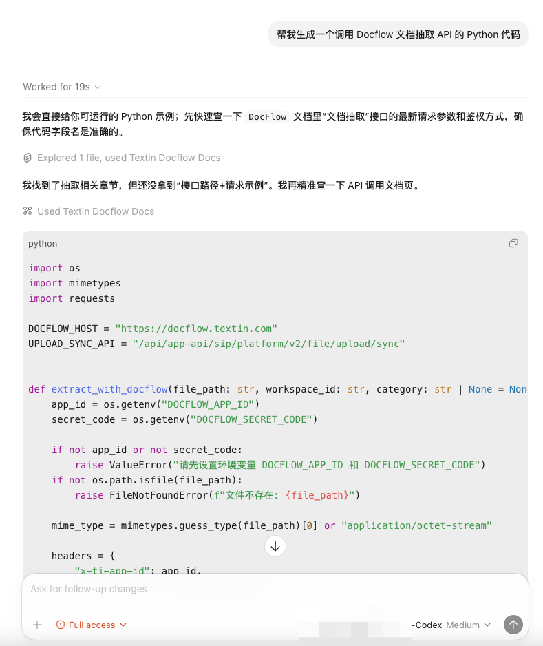

## 01 场景说明

安装 Docflow 文档 Skill 后，Agent 可以根据 API 文档自动生成规范的调用代码，包含参数处理、错误处理等完整逻辑。

## 02 示例

### 2.1 生成文档抽取调用代码

```text
帮我生成一个调用 Docflow 文档抽取 API 的 Python 代码
```



<Tip>
  Agent 生成的代码会自动引用最新的 API 文档，确保参数名称和接口地址是准确的。
</Tip>
