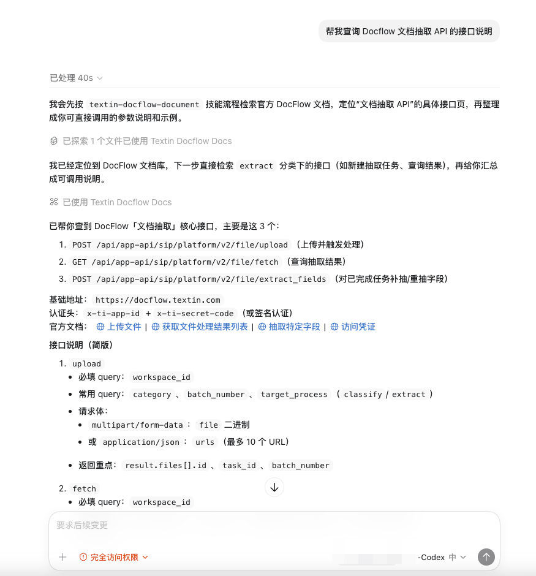
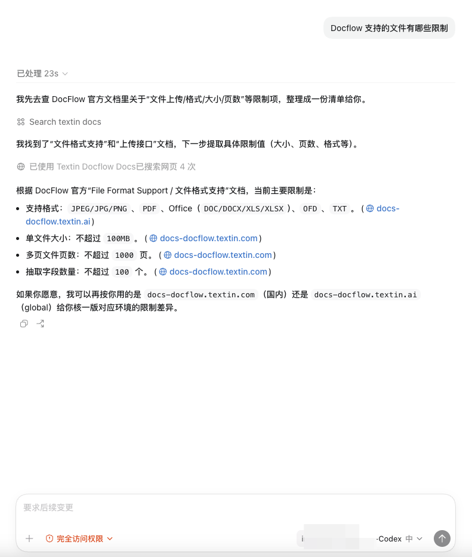
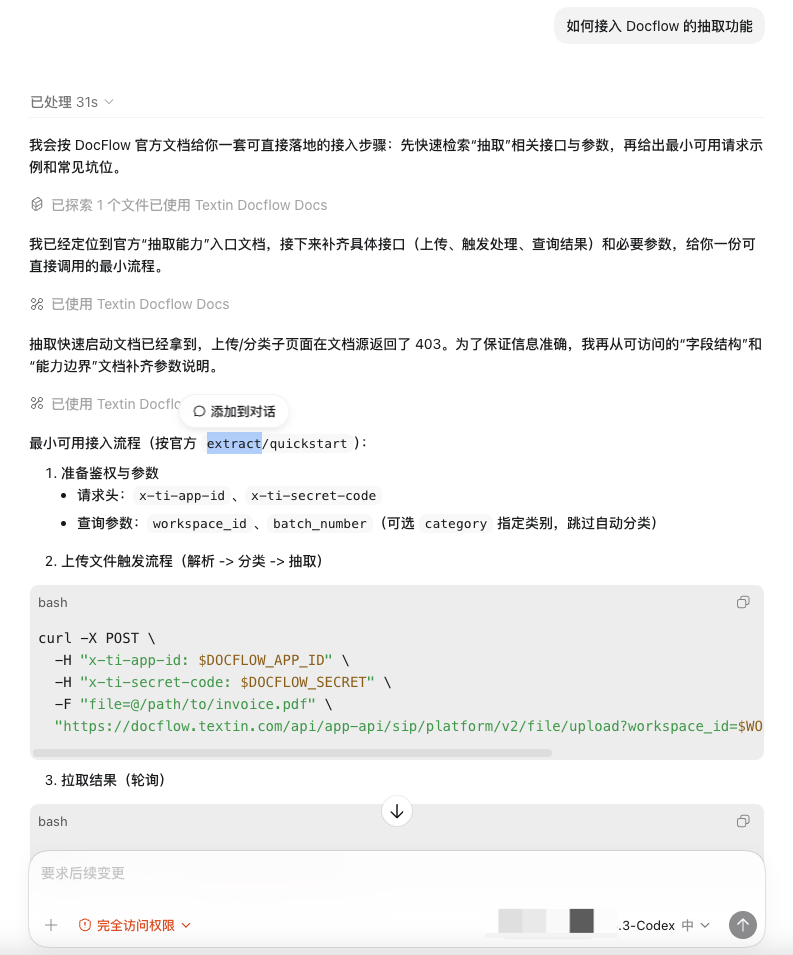

## 01 场景说明

当你需要查找 Docflow 的 API 文档、参数说明或使用指引时，可以直接向 Agent 提问，它会通过 MCP 服务检索相关内容。

## 02 示例

### 2.1 查询 API 接口

```text
帮我查询 Docflow 文档抽取 API 的接口说明
```



### 2.2 查询参数说明

```text
Docflow 支持的文件有哪些限制
```



### 2.3 查询最佳实践

```text
如何接入 Docflow 的抽取功能
```



<Tip>
  你可以用自然语言提问，Agent 会自动判断需要检索哪些文档内容来回答你。
</Tip>
