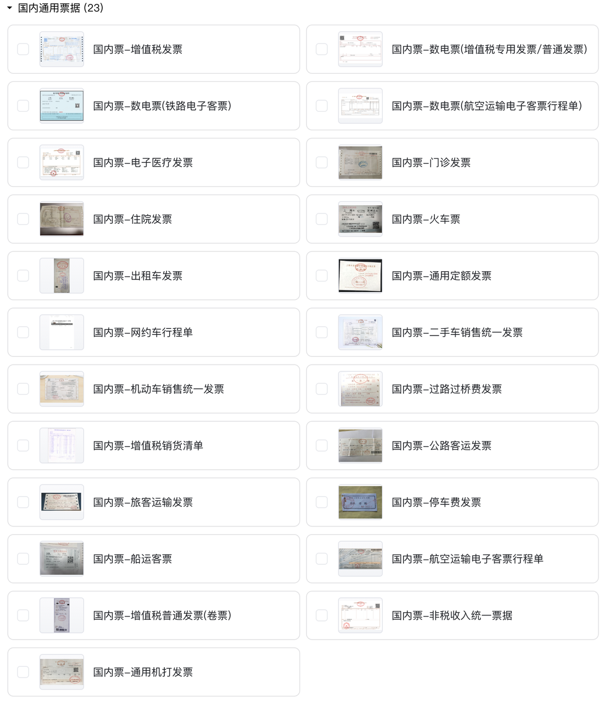
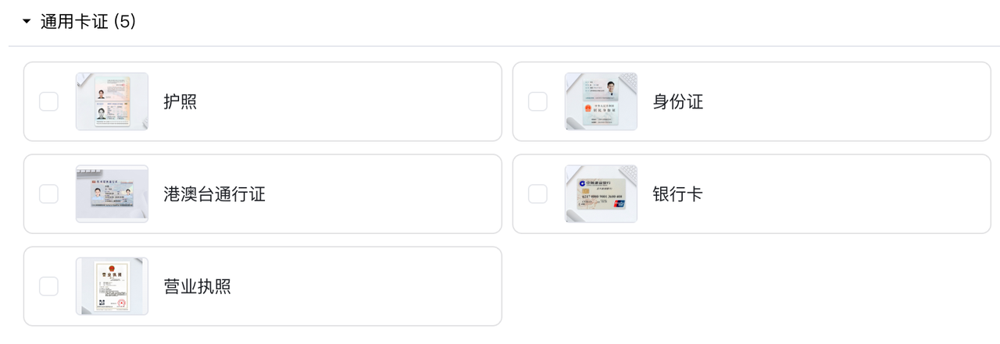

## 01 Product Specifications and Top-up

You can visit "[DocFlow Document Automation - Product Specifications](https://www.textin.com/product/textin_docflow)" on the TextIn official website to view detailed product pricing information and perform T-coin top-up operations to meet your usage needs.

## 02 Fee Inquiry

During usage, you can clearly view T-coin order records and consumption details in the "[Top-up and Consumption Details](https://www.textin.com/console/dashboard/userCenter/finance)" section of the console, allowing you to keep track of your account's financial dynamics at any time.

## 03 Billing Rules

DocFlow Document Automation Platform adopts a simple and clear "per-page billing" model, with the billing unit being "T-coin/page". You can directly top up T-coins according to your needs and flexibly use various functions of the platform. The platform provides three usage methods: SaaS platform usage, API usage, and private deployment usage. The following are specific billing descriptions for these three usage methods:

### 3.1 SaaS Platform

You can access the SaaS platform product by clicking "[Docflow Document Automation Platform](https://docflow.textin.com/)". Its billing rules are as follows:

#### **1. File Processing Billing**

After file upload, the system will charge based on the number of pages successfully classified for the first time. If some files or pages are not successfully classified during the first upload (classified as undefined), no billing will occur. However, if you subsequently make these files successfully classified through re-recognition and other operations, billing will be based on the number of pages successfully classified for the first time. Different file types have different billing standards:

(1) Domestic general tickets: 0.1 yuan/page, currently covering the following 23 ticket types

(2) Standard cards and certificates: 0.1 yuan/page, currently covering the following 5 card and certificate types

(3) Other file types: 0.3 yuan/page

#### 2. Invoice Verification Billing

The billing standard for invoice verification service is 0.2 yuan/time, charged according to the number of initiations. If you need to use this service, please contact business development in advance to activate it.

#### 3. Other Operation Billing

(1) When using file splitting and multi-image cropping functions, the same content will not be charged repeatedly, avoiding unnecessary expenses due to function usage.

(2) For pages that have already been charged, subsequent operations such as re-recognition, category modification, field correction, intelligent review, etc., will not incur additional charges, ensuring clear and controllable costs during your usage.

After successful document automation processing, you can query historical processing results through the workspace file list.

### 3.2 API Interface

When calling platform functions through API interfaces, the billing logic is consistent with the SaaS platform, following the above SaaS platform billing rules. If API requests fail, no billing will occur, ensuring cost security during interface calls.

### 3.3 Private Deployment

If you have private deployment needs, we provide three flexible payment plans:

1. One-time buyout
2. Annual payment
3. Usage-based payment

You can choose the appropriate plan based on your enterprise's actual needs and budget. For specific payment details and plan content, you can contact our business team for detailed consultation and negotiation. We will provide one-on-one professional services to ensure you find the most suitable private deployment payment method.

## 04 New User Benefits

We provide each newly registered user with 50 pages of free DocFlow Document Automation Platform usage quota to help you quickly experience product functions.

In addition, by adding the TextIn Benefits Officer, you can also get an additional 1000 pages (times) of TextIn product usage quota and many other benefits, allowing you to more comprehensively explore the application effects of DocFlow in actual business scenarios.

After the free quota is used up, you need to [top up T-coins](https://www.textin.com/console/dashboard/userCenter/charge) to continue using platform services.