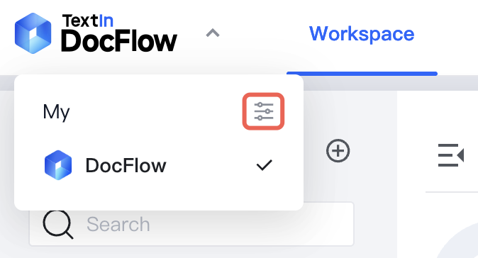
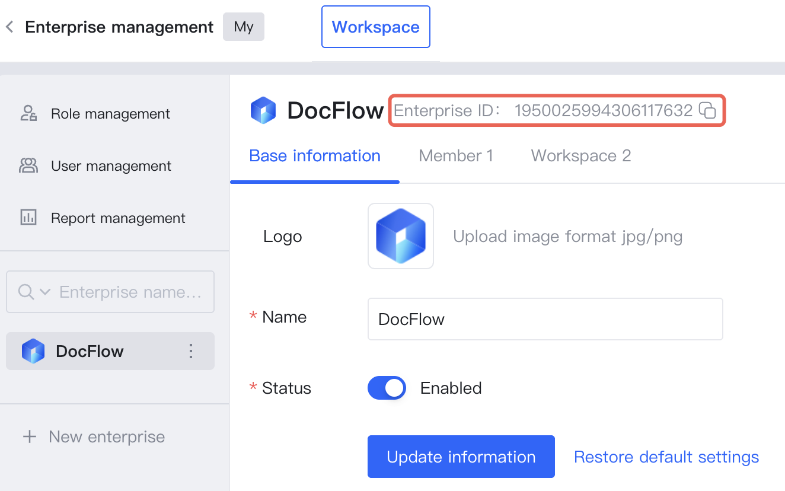

1. In the workspace list, click the DocFlow logo in the upper left corner, and in the pop-up dropdown menu, click the **Enterprise Management** button on the corresponding enterprise organization

2. In the pop-up slide window, **view** or **copy** the enterprise ID

