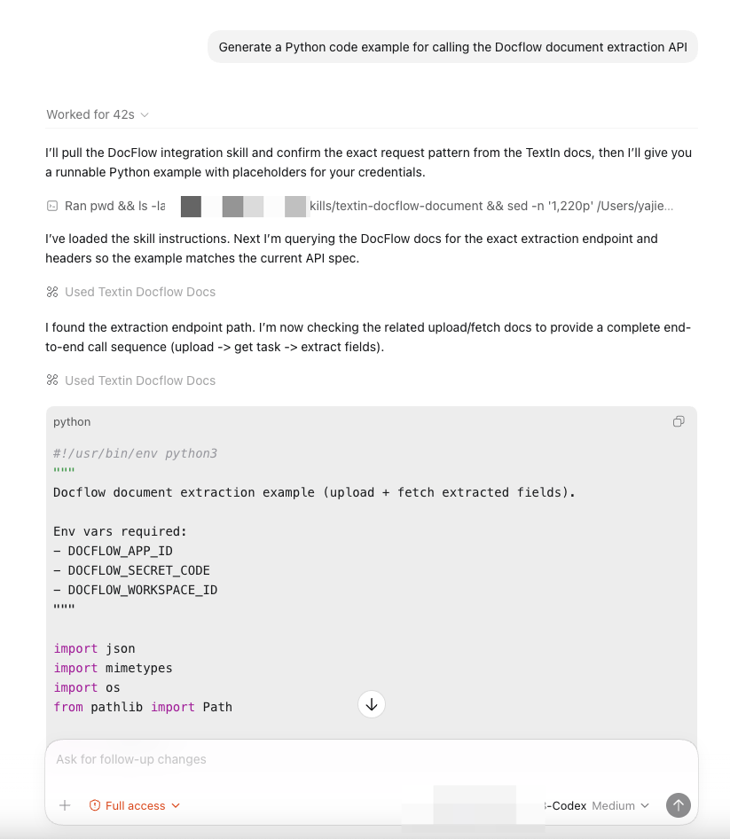

## 01 Scenario

After installing Docflow Document Skill, the Agent can automatically generate standardized calling code based on API documentation, including parameter handling and error handling.

## 02 Examples

### 2.1 Generate Document Extraction Code

```text
Generate a Python code example for calling the Docflow document extraction API
```



<Tip>
  The Agent-generated code automatically references the latest API documentation, ensuring parameter names and endpoint URLs are accurate.
</Tip>
