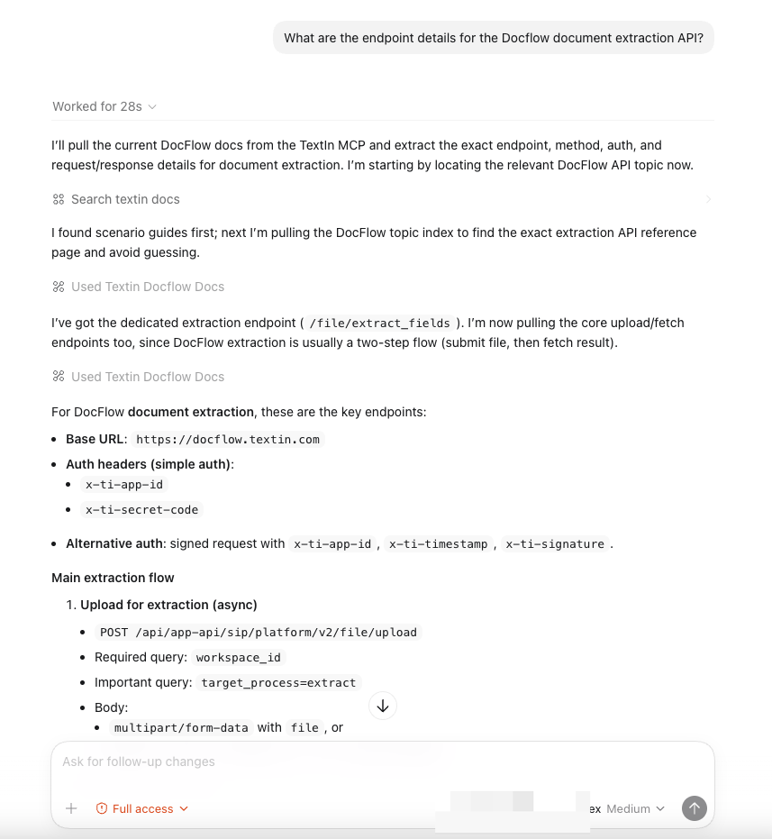
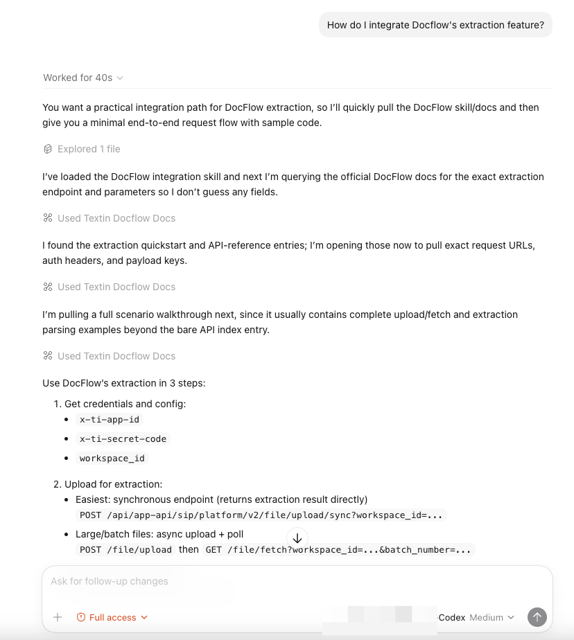

## 01 Scenario

When you need to find Docflow API documentation, parameter descriptions, or usage guides, you can ask your Agent directly. It will retrieve relevant content through the MCP service.

## 02 Examples

### 2.1 Query API Endpoints

```text
What are the endpoint details for the Docflow document extraction API?
```



### 2.2 Query Parameters

```text
What file formats and size limits does Docflow support?
```


### 2.3 Query Best Practices

```text
How do I integrate Docflow's extraction feature?
```



<Tip>
  You can ask questions in natural language. The Agent will automatically determine which documentation to search for your answer.
</Tip>
