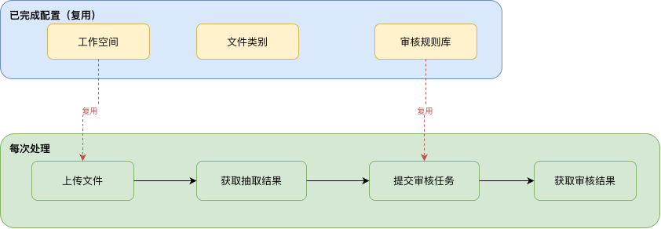
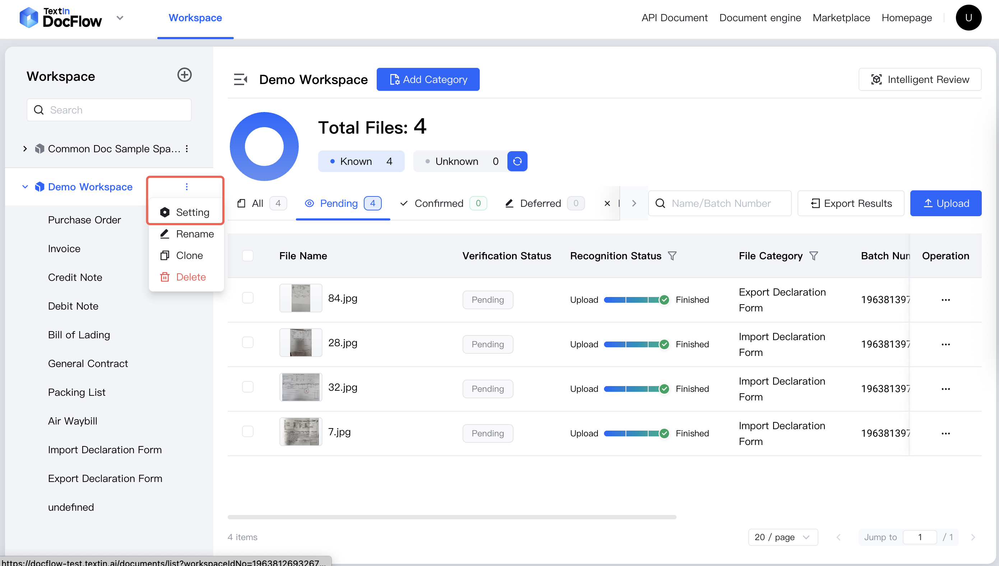
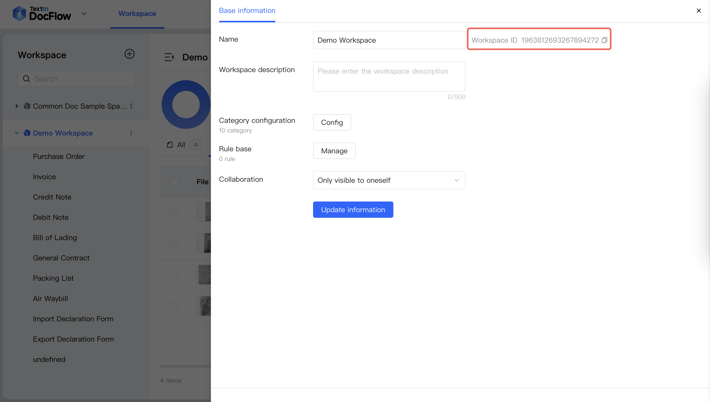
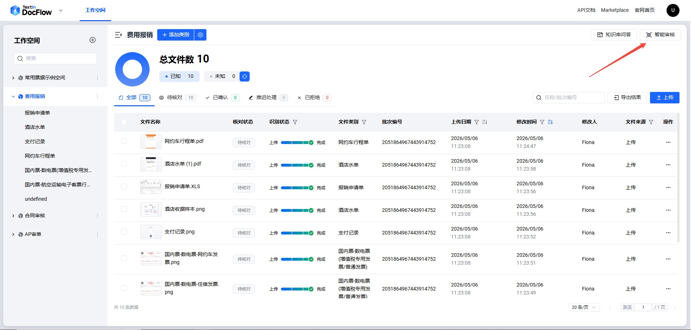
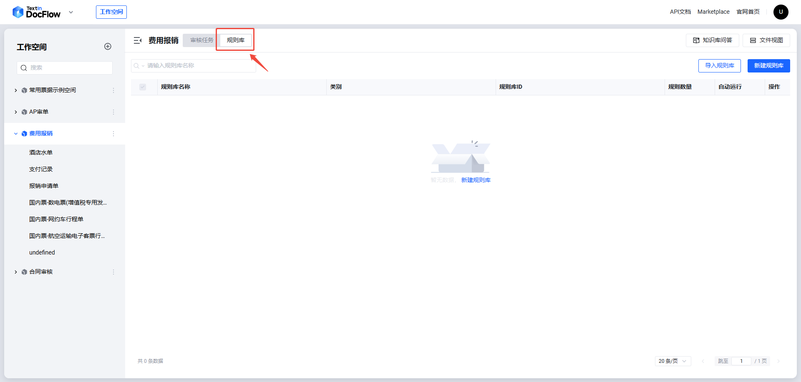
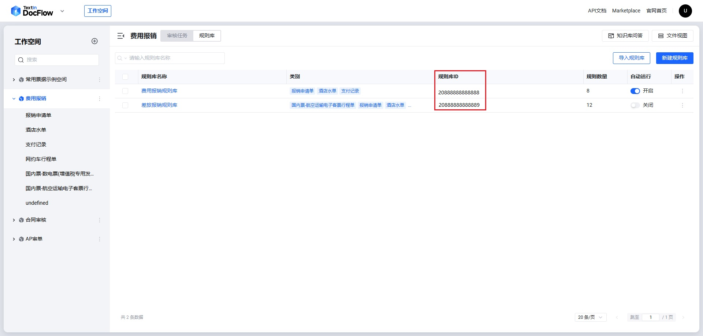

<Tip>
  このページは、ワークスペース、ファイルカテゴリ、レビュー規則リポジトリをすでに設定済みの方向けです。既存設定を使って、日常的なファイルアップロード、フィールド抽出、スマートレビューを API で実行する方法を説明します。
  DocFlow の設定がまだの場合は、先に [AP 照合シナリオ（最初から設定）](./ap_review) を参照してください。
</Tip>

## 01 シナリオ概要

ワークスペース、ファイルカテゴリ、レビュー規則リポジトリは、**一度設定すれば継続して再利用できます**。日常的な AP 照合業務では、API で次の 3 ステップを繰り返します。

1. **ファイルをアップロード**: 新しい書類（請求書、購買契約書、入荷伝票、検収書）をワークスペースにアップロードします
2. **抽出結果を取得**: 分類認識とフィールド抽出の完了を待ち、構造化データを取得します
3. **スマートレビュー**: 既存の規則リポジトリを指定してレビュータスクを送信し、レビュー結果を取得します

このページで説明する全体フローは次の図のとおりです:



## 02 前提条件

このページのコードを実行する前に、次を準備してください:

1. **認証情報**:[TextIn コンソール] から(https://www.textin.ai/console/dashboard/setting) `x-ti-app-id` と `x-ti-secret-code` を取得します
2. **workspace_id**:作成済みワークスペース ID（確認方法は下記）
3. **repo_id**:設定済みレビュー規則リポジトリ ID（確認方法は下記）
4. **処理対象ファイル**: 今回処理する書類（例: 請求書、購買契約書、入荷伝票、検収書）

### workspace_id の取得方法

**ステップ 1**:左側のワークスペース一覧で対象スペース名にマウスオーバーし、表示される「スペース情報」ボタンをクリックします。



**ステップ 2**:スペースの「基本情報」ページに入り、右側の「スペースID」フィールドで `workspace_id` を確認します。コピーアイコンをクリックすると直接コピーできます。



### repo_id の取得方法

**ステップ 1**:対象ワークスペースに入り、右上の「スマートレビュー」ボタンをクリックします。



**ステップ 2**:スマートレビューページで、上部の「規則リポジトリ」タブをクリックします。



**ステップ 3**:規則リポジトリ一覧の「規則リポジトリID」列が `repo_id` です。



## 03 コード構成

この例は日常処理に必要な **3 つのステップ** のみを含み、コード量はゼロから設定する版より約 60% 少なくなります。

### API 呼び出し関数

| 関数（Python） | メソッド（Java） | 対応する API エンドポイント | 説明 |
|---|---|---|---|
| `upload_file` | `uploadFile` | `POST /file/upload` | 非同期でファイルをアップロードし、batch_number を返します。結果取得にはポーリングが必要です |
| `upload_file_sync` | `uploadFileSync` | `POST /file/upload/sync` | 同期でファイルをアップロードし、抽出結果を直接返します。ポーリングは不要です |
| `submit_review_task` | `submitReviewTask` | `POST /review/task/submit` | レビュータスクを送信し、レビュー task_id を返します |

### ステップ別コード説明

<AccordionGroup>
  <Accordion defaultOpen title="ステップ 1:処理対象ファイルをアップロード">
    DocFlow は 2 種類のアップロードモードを提供します:

    - **非同期アップロード**（`file/upload`）:`batch_number` を返します。ステップ 2 で `file/fetch` をポーリングして抽出結果を取得します。一括アップロード後にまとめてポーリングするシーンに適しています。
    - **同期アップロード**（`file/upload/sync`）:認識完了までリクエストが待機し、抽出結果を直接返します（構造は `file/fetch` と同じ）。ポーリングは不要で、ステップ 2 を省略できます。単一ファイルのリアルタイム処理に適しています。

    #### 方法 1:非同期アップロード（ステップ 2 のポーリングが必要）

    <Tabs>
      <Tab title="Python">
        ```python
        upload_targets = [
            os.path.join(FILES_DIR, "sample_invoice.pdf"),
            os.path.join(FILES_DIR, "sample_contract.pdf"),
            os.path.join(FILES_DIR, "sample_inbound.pdf"),
            os.path.join(FILES_DIR, "sample_acceptance.pdf"),
        ]
        batch_numbers = [upload_file(WORKSPACE_ID, p) for p in upload_targets]
        ```
      </Tab>
      <Tab title="Java">
        ```java
        String[] sampleFiles = {
                FILES_DIR + "/sample_invoice.pdf",
                FILES_DIR + "/sample_contract.pdf",
                FILES_DIR + "/sample_inbound.pdf",
                FILES_DIR + "/sample_acceptance.pdf"
        };
        List<String> batchNumbers = new ArrayList<>();
        for (String path : sampleFiles) {
            batchNumbers.add(uploadFile(WORKSPACE_ID, path));
        }
        ```
      </Tab>
    </Tabs>

    #### 方法 2:同期アップロード（抽出結果を直接返す、ステップ 2 を省略）

    <Tabs>
      <Tab title="Python">
        ```python
        def upload_file_sync(workspace_id: str, file_path: str) -> dict:
            """同期アップロード:抽出結果を直接返す、ポーリング不要。"""
            url = f"{BASE_URL}/api/app-api/sip/platform/v2/file/upload/sync"
            with open(file_path, "rb") as f:
                resp = requests.post(url,
                    params={"workspace_id": workspace_id},
                    files={"file": (os.path.basename(file_path), f, _mime(file_path))},
                    headers=_headers(), timeout=300)
            data = _check(resp, "ファイルを同期アップロード")
            return data["result"]["files"][0]   # 戻り値構造は file/fetch と同じ

        # 呼び出し例:同期アップロードして抽出結果を直接取得
        raw_results = [upload_file_sync(WORKSPACE_ID, p) for p in upload_targets]
        ```
      </Tab>
      <Tab title="Java">
        ```java
        public static JsonObject uploadFileSync(String workspaceId, String filePath) throws IOException {
            File file = new File(filePath);
            HttpUrl url = HttpUrl.parse(BASE_URL + "/api/app-api/sip/platform/v2/file/upload/sync")
                    .newBuilder().addQueryParameter("workspace_id", workspaceId).build();
            MultipartBody body = new MultipartBody.Builder().setType(MultipartBody.FORM)
                    .addFormDataPart("file", file.getName(),
                            RequestBody.create(file, MediaType.get(mimeType(file.getName()))))
                    .build();
            Request req = new Request.Builder().url(url).headers(authHeaders()).post(body).build();
            try (Response resp = HTTP.newCall(req).execute()) {
                return checkResponse(resp.body().string(), "ファイルを同期アップロード")
                        .getAsJsonObject("result").getAsJsonArray("files")
                        .get(0).getAsJsonObject();
            }
        }

        // 呼び出し例:同期アップロードして抽出結果を直接取得
        String[] sampleFiles = {
                FILES_DIR + "/sample_invoice.pdf",
                FILES_DIR + "/sample_contract.pdf",
                FILES_DIR + "/sample_inbound.pdf",
                FILES_DIR + "/sample_acceptance.pdf"
        };
        List<JsonObject> rawResults = new ArrayList<>();
        for (String path : sampleFiles) rawResults.add(uploadFileSync(WORKSPACE_ID, path));
        ```
      </Tab>
    </Tabs>
  </Accordion>
  <Accordion defaultOpen title="ステップ 2:抽出結果を取得（同期アップロード使用時は省略可能）">
    <Note>ステップ 1 で同期アップロード `file/upload/sync` を使用した場合、抽出結果はすでに取得済みのため、このステップは省略できます。</Note>

    各 `batch_number` について `file/fetch` API をポーリングし、認識完了後に各文書の分類結果とフィールド抽出結果を取得します。取得した結果から `task_id` を集め、後続のレビューに使用します。

    <Tabs>
      <Tab title="Python">
        ```python
        raw_results = []
        for batch_number in batch_numbers:
            result = wait_for_result(WORKSPACE_ID, batch_number)
            raw_results.append(result)
            display_result(result)

        extract_task_ids = [r.get("task_id") for r in raw_results if r.get("task_id")]
        ```
      </Tab>
      <Tab title="Java">
        ```java
        List<JsonObject> rawResults = new ArrayList<>();
        for (String batchNumber : batchNumbers) {
            JsonObject result = waitForResult(WORKSPACE_ID, batchNumber, 120, 3);
            rawResults.add(result);
            displayResult(result);
        }
        List<String> extractTaskIds = new ArrayList<>();
        for (JsonObject r : rawResults) {
            if (r.has("task_id") && !r.get("task_id").isJsonNull()) {
                extractTaskIds.add(r.get("task_id").getAsString());
            }
        }
        ```
      </Tab>
    </Tabs>
  </Accordion>
  <Accordion defaultOpen title="ステップ 3:レビュータスクを送信して結果を取得">
    すべてのファイルの `task_id` を `review/task/submit` API に渡し、既存の規則リポジトリを指定してレビューを送信します。レビュー完了後、各規則の合格/不合格と AI による判断根拠をポーリングで取得します。

    <Tabs>
      <Tab title="Python">
        ```python
        task_name = f"APレビュー_{datetime.now().strftime('%Y%m%d_%H%M%S')}"
        review_task_id = submit_review_task(WORKSPACE_ID, task_name, REPO_ID, extract_task_ids)

        review_result = wait_for_review(WORKSPACE_ID, review_task_id)
        display_review_result(review_result)
        ```
      </Tab>
      <Tab title="Java">
        ```java
        String taskName = "APレビュー_" + new SimpleDateFormat("yyyyMMdd_HHmmss").format(new Date());
        String reviewTaskId = submitReviewTask(WORKSPACE_ID, taskName, REPO_ID, extractTaskIds);

        JsonObject reviewResult = waitForReview(WORKSPACE_ID, reviewTaskId, 300, 5);
        displayReviewResult(reviewResult);
        ```
      </Tab>
    </Tabs>
  </Accordion>
</AccordionGroup>

## 04 完全な例コード

<Tabs>
  <Tab title="Python">
    ```python
    #!/usr/bin/env python3
    # -*- coding: utf-8 -*-
    """
    DocFlow AP 审单场景例（已完了設定版）

    适用于ワークスペース、ファイルカテゴリ、レビュー規則リポジトリ均已設定完毕的场景。
    フロー:
      1. 処理対象ファイルをアップロード（請求書、購買契約書、入荷伝票、検収書）
      2. ポーリング抽出結果を取得、表示分類とフィールド抽出結果
      3. レビュータスクを送信
      4. ポーリング取得レビュー結果、表示レビュー結論

    依赖:
      pip install requests

    使用前先に填写下方設定项。
    """

    import os
    import time
    from datetime import datetime

    import requests

    # ============================================================
    # 設定项 — してください替换为您的实际值
    # ============================================================
    APP_ID        = "your-app-id"        # TextIn コンソール中的 x-ti-app-id
    SECRET_CODE   = "your-secret-code"   # TextIn コンソール中的 x-ti-secret-code

    WORKSPACE_ID = "your-workspace-id"  # 已作成的ワークスペース ID
    REPO_ID      = "your-repo-id"       # 已設定的レビュー規則リポジトリ ID

    BASE_URL = "https://docflow.textin.ai"

    # 処理対象ファイル目录（默认指向内置例ファイル、可替换为您自己的ファイル路径）
    FILES_DIR = os.path.join(
        os.path.dirname(os.path.abspath(__file__)),
        "..", "sample_files", "ap_review"
    )

    # ============================================================
    # 補助関数
    # ============================================================

    def _headers() -> dict:
        return {
            "x-ti-app-id":      APP_ID,
            "x-ti-secret-code": SECRET_CODE,
        }


    def _check(resp: requests.Response, action: str) -> dict:
        """チェックレスポンスステータス、返す解析后的 JSON。失敗时抛出 RuntimeError。"""
        data = resp.json()
        if data.get("code") != 200:
            raise RuntimeError(f"{action} 失敗（code={data.get('code')}）: {data}")
        return data


    def _mime(file_path: str) -> str:
        """根据ファイル拡張子返す MIME タイプ。"""
        ext = os.path.splitext(file_path)[1].lower()
        return {
            ".png":  "image/png",
            ".jpg":  "image/jpeg",
            ".jpeg": "image/jpeg",
            ".pdf":  "application/pdf",
            ".docx": "application/vnd.openxmlformats-officedocument.wordprocessingml.document",
            ".xlsx": "application/vnd.openxmlformats-officedocument.spreadsheetml.sheet",
        }.get(ext, "application/octet-stream")


    def display_result(file_result: dict):
        """形式化输出ファイル的分類結果和フィールド抽出結果。"""
        print("\n" + "=" * 60)
        print(f"ファイル名   : {file_result.get('name')}")
        print(f"分類結果 : {file_result.get('category') or '未分類'}")
        data = file_result.get("data") or {}
        fields = data.get("fields") or []
        if fields:
            print("\n── 基本情報フィールド ────────────────────────")
            for f in fields:
                print(f"  {f.get('key', ''):<25s}: {f.get('value', '')}")
        tables = data.get("tables") or []
        for table in tables:
            tname = table.get("tableName", "")
            t_items = table.get("items") or []
            if t_items:
                print(f"\n── テーブル[{tname}] ──────────────────────")
                for row_idx, row in enumerate(t_items, start=1):
                    cells = "  |  ".join(f"{c.get('key')}={c.get('value', '')}" for c in row)
                    print(f"  第{row_idx}行: {cells}")


    def display_review_result(review_result: dict):
        """形式化输出レビュータスク的結論和各規則レビュー結果。"""
        STATUS_MAP = {
            0: "未レビュー", 1: "レビュー合格", 2: "レビュー失敗",
            3: "レビュー中", 4: "レビュー不合格", 5: "認識中",
            6: "排队中", 7: "認識失敗",
        }
        RISK_MAP = {10: "高リスク", 20: "中リスク", 30: "低リスク"}

        stats = review_result.get("statistics", {})
        print("\n" + "=" * 60)
        print(f"レビュータスクステータス  : {STATUS_MAP.get(review_result.get('status'), '不明')}")
        print(f"規則合格数    : {stats.get('pass_count', 0)}")
        print(f"規則不合格数  : {stats.get('failure_count', 0)}")

        for group in review_result.get("groups", []):
            print(f"\n── 規則グループ:{group.get('group_name')} ───────────────────")
            for rt in group.get("review_tasks", []):
                result_text = STATUS_MAP.get(rt.get("review_result"), "不明")
                risk_text   = RISK_MAP.get(rt.get("risk_level"), "不明")
                icon = "✓" if rt.get("review_result") == 1 else "✗"
                print(f"  {icon} [{risk_text}] {rt.get('rule_name')}: {result_text}")
                reasoning = rt.get("reasoning", "")
                if reasoning:
                    print(f"    根拠: {reasoning[:100]}{'...' if len(reasoning) > 100 else ''}")


    # ============================================================
    # ステップ 1:処理対象ファイルをアップロード
    # REST API: POST /api/app-api/sip/platform/v2/file/upload
    # ============================================================

    def upload_file(workspace_id: str, file_path: str) -> str:
        """処理対象ファイルをアップロード至ワークスペース、batch_number を返す。"""
        url = f"{BASE_URL}/api/app-api/sip/platform/v2/file/upload"
        with open(file_path, "rb") as f:
            resp = requests.post(
                url,
                params={"workspace_id": workspace_id},
                files={"file": (os.path.basename(file_path), f, _mime(file_path))},
                headers=_headers(),
                timeout=60,
            )
        batch_number = _check(resp, "ファイルをアップロード")["result"]["batch_number"]
        print(f"[ステップ1] ファイルアップロード成功  name={os.path.basename(file_path)}"
              f"  batch_number={batch_number}")
        return batch_number


    # ============================================================
    # ステップ 2:ポーリングなど待抽出結果
    # REST API: GET /api/app-api/sip/platform/v2/file/fetch
    # ============================================================

    def wait_for_result(
        workspace_id: str,
        batch_number: str,
        timeout: int = 120,
        interval: int = 3,
    ) -> dict:
        """
        ポーリング直至ファイル認識完了、返すファイル結果对象（含 task_id）。

        recognition_status: 0=待認識, 1=成功, 2=失敗
        """
        url = f"{BASE_URL}/api/app-api/sip/platform/v2/file/fetch"
        params = {"workspace_id": workspace_id, "batch_number": batch_number}
        deadline = time.time() + timeout
        print(f"[ステップ2] など待処理結果（batch_number={batch_number}）...", end="", flush=True)
        while time.time() < deadline:
            resp = requests.get(url, params=params, headers=_headers(), timeout=30)
            data = _check(resp, "処理結果を取得")
            files = data.get("result", {}).get("files", [])
            if files:
                status = files[0].get("recognition_status")
                if status == 1:
                    print(" 完了")
                    return files[0]
                elif status == 2:
                    raise RuntimeError(f"ファイル処理失敗: {files[0].get('failure_causes')}")
            print(".", end="", flush=True)
            time.sleep(interval)
        raise TimeoutError(f"など待処理結果タイムアウト（{timeout}s）")


    # ============================================================
    # ステップ 3:レビュータスクを送信
    # REST API: POST /api/app-api/sip/platform/v2/review/task/submit
    # ============================================================

    def submit_review_task(
        workspace_id: str,
        name: str,
        repo_id: str,
        extract_task_ids: list,
    ) -> str:
        """レビュータスクを送信、返すレビュータスク task_id。"""
        url = f"{BASE_URL}/api/app-api/sip/platform/v2/review/task/submit"
        payload = {
            "workspace_id":     workspace_id,
            "name":             name,
            "repo_id":          repo_id,
            "extract_task_ids": extract_task_ids,
        }
        resp = requests.post(url, json=payload, headers=_headers(), timeout=30)
        task_id = _check(resp, "レビュータスクを送信")["result"]["task_id"]
        print(f"[ステップ3] レビュータスク送信成功  task_id={task_id}")
        return task_id


    # ============================================================
    # ステップ 4:ポーリングなど待レビュー結果
    # REST API: POST /api/app-api/sip/platform/v2/review/task/result
    # ============================================================

    def wait_for_review(
        workspace_id: str,
        task_id: str,
        timeout: int = 300,
        interval: int = 5,
    ) -> dict:
        """
        ポーリング直至レビュータスク完了、返すレビュー結果对象。

        终态: 1=レビュー合格, 2=レビュー失敗, 4=レビュー不合格, 7=認識失敗
        """
        url = f"{BASE_URL}/api/app-api/sip/platform/v2/review/task/result"
        payload = {"workspace_id": workspace_id, "task_id": task_id}
        deadline = time.time() + timeout
        print(f"[ステップ4] など待レビュー結果（task_id={task_id}）...", end="", flush=True)
        while time.time() < deadline:
            resp = requests.post(url, json=payload, headers=_headers(), timeout=30)
            data = _check(resp, "取得レビュー結果")
            result = data.get("result", {})
            if result.get("status") in (1, 2, 4, 7):
                print(" 完了")
                return result
            print(".", end="", flush=True)
            time.sleep(interval)
        raise TimeoutError(f"など待レビュー結果タイムアウト（{timeout}s）")


    # ============================================================
    # 主フロー
    # ============================================================

    def main():
        print("=" * 60)
        print("  DocFlow AP 审单场景例（已完了設定版）")
        print("=" * 60)
        print(f"ワークスペース: {WORKSPACE_ID}")
        print(f"規則リポジトリ:   {REPO_ID}")

        # ----------------------------------------------------------
        # ステップ 1:処理対象ファイルをアップロード
        # ----------------------------------------------------------
        print("\n開始処理対象ファイルをアップロード...")
        upload_targets = [
            os.path.join(FILES_DIR, "sample_invoice.pdf"),
            os.path.join(FILES_DIR, "sample_contract.pdf"),
            os.path.join(FILES_DIR, "sample_inbound.pdf"),
            os.path.join(FILES_DIR, "sample_acceptance.pdf"),
        ]
        batch_numbers = [upload_file(WORKSPACE_ID, p) for p in upload_targets]

        # ----------------------------------------------------------
        # ステップ 2:ポーリング抽出結果を取得并表示
        # ----------------------------------------------------------
        print("\n開始処理結果を取得...")
        raw_results = []
        for batch_number in batch_numbers:
            result = wait_for_result(WORKSPACE_ID, batch_number)
            raw_results.append(result)
            display_result(result)

        # ----------------------------------------------------------
        # ステップ 3:レビュータスクを送信
        # ----------------------------------------------------------
        print("\n開始レビュー...")
        task_name = f"APレビュー_{datetime.now().strftime('%Y%m%d_%H%M%S')}"
        extract_task_ids = [r.get("task_id") for r in raw_results if r.get("task_id")]
        review_task_id = submit_review_task(WORKSPACE_ID, task_name, REPO_ID, extract_task_ids)

        # ----------------------------------------------------------
        # ステップ 4:ポーリング取得レビュー結果并表示
        # ----------------------------------------------------------
        review_result = wait_for_review(WORKSPACE_ID, review_task_id)
        display_review_result(review_result)


    if __name__ == "__main__":
        main()
    ```
  </Tab>
  <Tab title="Java">
    ```java
    package com.docflow;

    import com.google.gson.*;
    import okhttp3.*;

    import java.io.File;
    import java.io.IOException;
    import java.text.SimpleDateFormat;
    import java.util.*;
    import java.util.concurrent.TimeUnit;

    /**
     * DocFlow AP 审单场景例（已完了設定版）
     *
     * <p>适用于ワークスペース、ファイルカテゴリ、レビュー規則リポジトリ均已設定完毕的场景。
     * <ol>
     *   <li>処理対象ファイルをアップロード（請求書、購買契約書、入荷伝票、検収書）</li>
     *   <li>ポーリング抽出結果を取得、表示分類とフィールド抽出結果</li>
     *   <li>レビュータスクを送信</li>
     *   <li>ポーリング取得レビュー結果、表示レビュー結論</li>
     * </ol>
     *
     * <p>依赖:OkHttp 4.x、Gson（见 pom.xml）
     */
    public class ApReviewConfigured {

        // ============================================================
        // 設定项 — してください替换为您的实际值
        // ============================================================
        private static final String APP_ID        = "your-app-id";        // x-ti-app-id
        private static final String SECRET_CODE   = "your-secret-code";   // x-ti-secret-code

        private static final String WORKSPACE_ID = "your-workspace-id";  // 已作成的ワークスペース ID
        private static final String REPO_ID      = "your-repo-id";       // 已設定的レビュー規則リポジトリ ID

        private static final String BASE_URL = "https://docflow.textin.ai";

        // 処理対象ファイル目录
        private static final String FILES_DIR =
                new File("../sample_files/ap_review").getAbsolutePath();

        // ============================================================
        // 共通ユーティリティ
        // ============================================================
        private static final OkHttpClient HTTP = new OkHttpClient.Builder()
                .connectTimeout(30, TimeUnit.SECONDS)
                .readTimeout(60, TimeUnit.SECONDS)
                .writeTimeout(60, TimeUnit.SECONDS)
                .build();

        private static final Gson GSON = new GsonBuilder().disableHtmlEscaping().create();
        private static final MediaType JSON_TYPE = MediaType.get("application/json; charset=utf-8");

        // ============================================================
        // 補助関数
        // ============================================================

        private static Headers authHeaders() {
            return new Headers.Builder()
                    .add("x-ti-app-id", APP_ID)
                    .add("x-ti-secret-code", SECRET_CODE)
                    .build();
        }

        private static JsonObject checkResponse(String body, String action) {
            JsonObject obj = JsonParser.parseString(body).getAsJsonObject();
            if (obj.get("code").getAsInt() != 200) {
                throw new RuntimeException(action + " 失敗: " + body);
            }
            return obj;
        }

        private static String mimeType(String filename) {
            String lower = filename.toLowerCase();
            if (lower.endsWith(".png"))  return "image/png";
            if (lower.endsWith(".jpg") || lower.endsWith(".jpeg")) return "image/jpeg";
            if (lower.endsWith(".pdf"))  return "application/pdf";
            if (lower.endsWith(".docx")) return "application/vnd.openxmlformats-officedocument.wordprocessingml.document";
            if (lower.endsWith(".xlsx")) return "application/vnd.openxmlformats-officedocument.spreadsheetml.sheet";
            return "application/octet-stream";
        }

        public static void displayResult(JsonObject fileResult) {
            System.out.println("\n" + "=".repeat(60));
            System.out.println("ファイル名   : " + str(fileResult, "name"));
            System.out.println("分類結果 : " + str(fileResult, "category", "未分類"));

            if (!fileResult.has("data") || fileResult.get("data").isJsonNull()) return;
            JsonObject data = fileResult.getAsJsonObject("data");

            JsonArray fields = jsonArray(data, "fields");
            if (fields != null && fields.size() > 0) {
                System.out.println("\n── 基本情報フィールド ────────────────────────");
                for (JsonElement e : fields) {
                    JsonObject f = e.getAsJsonObject();
                    System.out.printf("  %-25s: %s%n", str(f, "key"), str(f, "value"));
                }
            }

            JsonArray tables = jsonArray(data, "tables");
            if (tables != null) {
                for (JsonElement te : tables) {
                    JsonObject table = te.getAsJsonObject();
                    String tname = str(table, "tableName");
                    JsonArray tItems = jsonArray(table, "items");
                    if (tItems != null && tItems.size() > 0) {
                        System.out.println("\n── テーブル[" + tname + "] ──────────────────────");
                        for (int i = 0; i < tItems.size(); i++) {
                            JsonArray row = tItems.get(i).getAsJsonArray();
                            StringBuilder sb = new StringBuilder("  第").append(i + 1).append("行: ");
                            for (int j = 0; j < row.size(); j++) {
                                JsonObject cell = row.get(j).getAsJsonObject();
                                if (j > 0) sb.append("  |  ");
                                sb.append(str(cell, "key")).append("=").append(str(cell, "value"));
                            }
                            System.out.println(sb);
                        }
                    }
                }
            }
        }

        public static void displayReviewResult(JsonObject reviewResult) {
            Map<Integer, String> statusMap = new LinkedHashMap<>();
            statusMap.put(0, "未レビュー");   statusMap.put(1, "レビュー合格");   statusMap.put(2, "レビュー失敗");
            statusMap.put(3, "レビュー中");   statusMap.put(4, "レビュー不合格"); statusMap.put(5, "認識中");
            statusMap.put(6, "排队中");   statusMap.put(7, "認識失敗");
            Map<Integer, String> riskMap = new LinkedHashMap<>();
            riskMap.put(10, "高リスク"); riskMap.put(20, "中リスク"); riskMap.put(30, "低リスク");

            int status = reviewResult.get("status").getAsInt();
            JsonObject stats = reviewResult.has("statistics")
                    ? reviewResult.getAsJsonObject("statistics") : new JsonObject();

            System.out.println("\n" + "=".repeat(60));
            System.out.println("レビュータスクステータス  : " + statusMap.getOrDefault(status, "不明"));
            System.out.println("規則合格数    : " + (stats.has("pass_count")    ? stats.get("pass_count").getAsInt()    : 0));
            System.out.println("規則不合格数  : " + (stats.has("failure_count") ? stats.get("failure_count").getAsInt() : 0));

            JsonArray groups = jsonArray(reviewResult, "groups");
            if (groups != null) {
                for (JsonElement ge : groups) {
                    JsonObject group = ge.getAsJsonObject();
                    System.out.println("\n── 規則グループ:" + str(group, "group_name") + " ───────────────────");
                    JsonArray tasks = jsonArray(group, "review_tasks");
                    if (tasks != null) {
                        for (JsonElement te : tasks) {
                            JsonObject rt = te.getAsJsonObject();
                            int rv        = rt.has("review_result") ? rt.get("review_result").getAsInt() : 0;
                            int riskLevel = rt.has("risk_level")    ? rt.get("risk_level").getAsInt()    : 0;
                            String icon   = rv == 1 ? "✓" : "✗";
                            System.out.printf("  %s [%s] %s: %s%n",
                                    icon, riskMap.getOrDefault(riskLevel, "不明"),
                                    str(rt, "rule_name"), statusMap.getOrDefault(rv, "不明"));
                            String reasoning = str(rt, "reasoning");
                            if (!reasoning.isEmpty()) {
                                System.out.println("    根拠: " + (reasoning.length() > 100
                                        ? reasoning.substring(0, 100) + "..." : reasoning));
                            }
                        }
                    }
                }
            }
        }

        // ============================================================
        // ステップ 1:処理対象ファイルをアップロード
        // REST API: POST /api/app-api/sip/platform/v2/file/upload
        // ============================================================

        public static String uploadFile(String workspaceId, String filePath) throws IOException {
            File file = new File(filePath);
            HttpUrl url = HttpUrl.parse(BASE_URL + "/api/app-api/sip/platform/v2/file/upload")
                    .newBuilder()
                    .addQueryParameter("workspace_id", workspaceId)
                    .build();

            MultipartBody body = new MultipartBody.Builder()
                    .setType(MultipartBody.FORM)
                    .addFormDataPart("file", file.getName(),
                            RequestBody.create(file, MediaType.get(mimeType(file.getName()))))
                    .build();

            Request req = new Request.Builder()
                    .url(url).headers(authHeaders())
                    .post(body)
                    .build();

            try (Response resp = HTTP.newCall(req).execute()) {
                JsonObject data = checkResponse(resp.body().string(), "ファイルをアップロード[" + file.getName() + "]");
                String batchNumber = data.getAsJsonObject("result").get("batch_number").getAsString();
                System.out.println("[ステップ1] ファイルアップロード成功  name=" + file.getName()
                        + "  batch_number=" + batchNumber);
                return batchNumber;
            }
        }

        // ============================================================
        // ステップ 2:ポーリングなど待抽出結果
        // REST API: GET /api/app-api/sip/platform/v2/file/fetch
        // ============================================================

        public static JsonObject waitForResult(
                String workspaceId, String batchNumber,
                int timeoutSec, int intervalSec) throws IOException, InterruptedException {

            HttpUrl url = HttpUrl.parse(BASE_URL + "/api/app-api/sip/platform/v2/file/fetch")
                    .newBuilder()
                    .addQueryParameter("workspace_id", workspaceId)
                    .addQueryParameter("batch_number",  batchNumber)
                    .build();

            long deadline = System.currentTimeMillis() + (long) timeoutSec * 1000;
            System.out.print("[ステップ2] など待処理結果（batch_number=" + batchNumber + "）...");

            while (System.currentTimeMillis() < deadline) {
                Request req = new Request.Builder()
                        .url(url).headers(authHeaders()).get().build();

                try (Response resp = HTTP.newCall(req).execute()) {
                    JsonObject data = checkResponse(resp.body().string(), "処理結果を取得");
                    JsonArray files = data.getAsJsonObject("result").getAsJsonArray("files");
                    if (files != null && files.size() > 0) {
                        JsonObject file = files.get(0).getAsJsonObject();
                        int status = file.get("recognition_status").getAsInt();
                        if (status == 1) { System.out.println(" 完了"); return file; }
                        if (status == 2) {
                            String cause = file.has("failure_causes")
                                    ? file.get("failure_causes").getAsString() : "不明原因";
                            throw new RuntimeException("ファイル処理失敗: " + cause);
                        }
                    }
                }
                System.out.print(".");
                Thread.sleep((long) intervalSec * 1000);
            }
            throw new RuntimeException("など待処理結果タイムアウト（" + timeoutSec + "s）");
        }

        // ============================================================
        // ステップ 3:レビュータスクを送信
        // REST API: POST /api/app-api/sip/platform/v2/review/task/submit
        // ============================================================

        public static String submitReviewTask(
                String workspaceId, String name, String repoId,
                List<String> extractTaskIds) throws IOException {

            String url = BASE_URL + "/api/app-api/sip/platform/v2/review/task/submit";
            JsonObject payload = new JsonObject();
            payload.addProperty("workspace_id", workspaceId);
            payload.addProperty("name",         name);
            payload.addProperty("repo_id",      repoId);
            JsonArray ids = new JsonArray();
            extractTaskIds.forEach(ids::add);
            payload.add("extract_task_ids", ids);

            Request req = new Request.Builder()
                    .url(url).headers(authHeaders())
                    .post(RequestBody.create(GSON.toJson(payload), JSON_TYPE))
                    .build();

            try (Response resp = HTTP.newCall(req).execute()) {
                JsonObject data = checkResponse(resp.body().string(), "レビュータスクを送信");
                String taskId = data.getAsJsonObject("result").get("task_id").getAsString();
                System.out.println("[ステップ3] レビュータスク送信成功  task_id=" + taskId);
                return taskId;
            }
        }

        // ============================================================
        // ステップ 4:ポーリングなど待レビュー結果
        // REST API: POST /api/app-api/sip/platform/v2/review/task/result
        // ============================================================

        public static JsonObject waitForReview(
                String workspaceId, String taskId,
                int timeoutSec, int intervalSec) throws IOException, InterruptedException {

            String url = BASE_URL + "/api/app-api/sip/platform/v2/review/task/result";
            JsonObject payload = new JsonObject();
            payload.addProperty("workspace_id", workspaceId);
            payload.addProperty("task_id",      taskId);

            long deadline = System.currentTimeMillis() + (long) timeoutSec * 1000;
            System.out.print("[ステップ4] など待レビュー結果（task_id=" + taskId + "）...");

            while (System.currentTimeMillis() < deadline) {
                Request req = new Request.Builder()
                        .url(url).headers(authHeaders())
                        .post(RequestBody.create(GSON.toJson(payload), JSON_TYPE))
                        .build();

                try (Response resp = HTTP.newCall(req).execute()) {
                    JsonObject data = checkResponse(resp.body().string(), "取得レビュー結果");
                    JsonObject result = data.getAsJsonObject("result");
                    int status = result.get("status").getAsInt();
                    if (status == 1 || status == 2 || status == 4 || status == 7) {
                        System.out.println(" 完了");
                        return result;
                    }
                }
                System.out.print(".");
                Thread.sleep((long) intervalSec * 1000);
            }
            throw new RuntimeException("など待レビュー結果タイムアウト（" + timeoutSec + "s）");
        }

        // ============================================================
        // 主フロー
        // ============================================================
        public static void main(String[] args) throws Exception {
            System.out.println("=".repeat(60));
            System.out.println("  DocFlow AP 审单场景例（已完了設定版）");
            System.out.println("=".repeat(60));
            System.out.println("ワークスペース: " + WORKSPACE_ID);
            System.out.println("規則リポジトリ:   " + REPO_ID);

            // ステップ 1:処理対象ファイルをアップロード
            System.out.println("\n開始処理対象ファイルをアップロード...");
            String[] sampleFiles = {
                    FILES_DIR + "/sample_invoice.pdf",
                    FILES_DIR + "/sample_contract.pdf",
                    FILES_DIR + "/sample_inbound.pdf",
                    FILES_DIR + "/sample_acceptance.pdf"
            };
            List<String> batchNumbers = new ArrayList<>();
            for (String path : sampleFiles) {
                batchNumbers.add(uploadFile(WORKSPACE_ID, path));
            }

            // ステップ 2:取得并表示抽出結果
            System.out.println("\n開始処理結果を取得...");
            List<JsonObject> rawResults = new ArrayList<>();
            for (String batchNumber : batchNumbers) {
                JsonObject result = waitForResult(WORKSPACE_ID, batchNumber, 120, 3);
                rawResults.add(result);
                displayResult(result);
            }

            // ステップ 3:レビュータスクを送信
            System.out.println("\n開始レビュー...");
            String taskName = "APレビュー_" + new SimpleDateFormat("yyyyMMdd_HHmmss").format(new Date());
            List<String> extractTaskIds = new ArrayList<>();
            for (JsonObject r : rawResults) {
                if (r.has("task_id") && !r.get("task_id").isJsonNull()) {
                    extractTaskIds.add(r.get("task_id").getAsString());
                }
            }
            String reviewTaskId = submitReviewTask(WORKSPACE_ID, taskName, REPO_ID, extractTaskIds);

            // ステップ 4:ポーリング取得レビュー結果
            JsonObject reviewResult = waitForReview(WORKSPACE_ID, reviewTaskId, 300, 5);
            displayReviewResult(reviewResult);
        }

        // ============================================================
        // 私有工具方法
        // ============================================================

        private static String str(JsonObject obj, String key) { return str(obj, key, ""); }

        private static String str(JsonObject obj, String key, String defaultVal) {
            if (obj == null || !obj.has(key) || obj.get(key).isJsonNull()) return defaultVal;
            return obj.get(key).getAsString();
        }

        private static JsonArray jsonArray(JsonObject obj, String key) {
            if (obj == null || !obj.has(key) || obj.get(key).isJsonNull()) return null;
            JsonElement e = obj.get(key);
            return e.isJsonArray() ? e.getAsJsonArray() : null;
        }
    }
    ```
  </Tab>
</Tabs>

## 05 完全な例コードダウンロード

完全な可実行コード（含 Python、Java 两个版本）已内置在文書倉庫的 `examples/` 目录下:

```
examples/
├── python/
│   ├── ap_review_configured.py   # Python 完全な例（已完了設定版）
│   ├── requirements.txt
│   └── README.md
├── java/
│   ├── src/main/java/com/docflow/
│   │   └── ApReviewConfigured.java   # Java 完全な例（已完了設定版）
│   ├── pom.xml
│   └── README.md
└── sample_files/
    └── ap_review/
        ├── sample_invoice.pdf
        ├── sample_contract.pdf
        ├── sample_inbound.pdf
        └── sample_acceptance.pdf
```

<CardGroup cols={2}>
  <Card title="Python 例" icon="python" href="https://github.com/ichaozai/docflow-docs/tree/master/examples/python">
    確認 Python 完全な例コード
  </Card>
  <Card title="Java 例" icon="java" href="https://github.com/ichaozai/docflow-docs/tree/master/examples/java">
    確認 Java 完全な例コード
  </Card>
</CardGroup>

## 06 実行例

<Tabs>
  <Tab title="Python">
    **环境要求**:Python 3.8+

    **1. 安装依赖**

    ```bash
    cd examples/python
    pip install -r requirements.txt
    ```

    **2. 填写設定**

    打开 `ap_review_configured.py`、填写ファイル上部的設定项:

    ```python
    APP_ID       = "your-app-id"        # x-ti-app-id
    SECRET_CODE  = "your-secret-code"   # x-ti-secret-code
    WORKSPACE_ID = "your-workspace-id"  # 已作成的ワークスペース ID
    REPO_ID      = "your-repo-id"       # 已設定的レビュー規則リポジトリ ID
    ```

    **3. 実行**

    ```bash
    python ap_review_configured.py
    ```
  </Tab>
  <Tab title="Java">
    **环境要求**:JDK 11+、Maven 3.6+

    **1. 填写設定**

    打开 `src/main/java/com/docflow/ApReviewConfigured.java`、填写ファイル上部的設定项:

    ```java
    private static final String APP_ID       = "your-app-id";
    private static final String SECRET_CODE  = "your-secret-code";
    private static final String WORKSPACE_ID = "your-workspace-id";
    private static final String REPO_ID      = "your-repo-id";
    ```

    **2. 编译并実行**

    ```bash
    cd examples/java
    mvn compile exec:java -Dexec.mainClass="com.docflow.ApReviewConfigured"
    ```
  </Tab>
</Tabs>

<Tip>
  実行に成功したら、[DocFlow Web ページ](https://docflow.textin.ai/) にログインし、対象ワークスペースで各ファイルの分類結果、フィールド抽出結果、スマートレビュー結果を確認できます。コードの出力結果との照合にも役立ちます。
</Tip>

### 想定されるコンソール出力

```
============================================================
  DocFlow AP 审单场景例（已完了設定版）
============================================================
ワークスペース: <workspace_id>
規則リポジトリ:   <repo_id>

開始処理対象ファイルをアップロード...
[ステップ1] ファイルアップロード成功  name=sample_invoice.pdf  batch_number=<batch_number>
[ステップ1] ファイルアップロード成功  name=sample_contract.pdf  batch_number=<batch_number>
[ステップ1] ファイルアップロード成功  name=sample_inbound.pdf  batch_number=<batch_number>
[ステップ1] ファイルアップロード成功  name=sample_acceptance.pdf  batch_number=<batch_number>

開始処理結果を取得...
[ステップ2] など待処理結果（batch_number=<batch_number>）..... 完了

============================================================
ファイル名   : sample_invoice.pdf
分類結果 : 国内票-数电票

── 基本情報フィールド ────────────────────────
  税込合計                  : ¥50000.00
  税抜金額                  : ¥44247.79
  請求書番号                  : 25312000000123456789
  発行日付                  : 2025年12月01日
  購入者名称                : 上海合合情報科技股份有限公司
  販売者名称                : 上海一二三有限公司
  ...

[ステップ2] など待処理結果（batch_number=<batch_number>）... 完了

============================================================
ファイル名   : sample_contract.pdf
分類結果 : 購買契約書

── 基本情報フィールド ────────────────────────
  契約書番号                  : CG-123456
  甲方全称                  : 上海合合情報科技股份有限公司
  乙方全称                  : 上海一二三有限公司
  ...

[ステップ2] など待処理結果（batch_number=<batch_number>）... 完了

============================================================
ファイル名   : sample_inbound.pdf
分類結果 : 入荷伝票

── 基本情報フィールド ────────────────────────
  入荷伝票番号                : GR-2025-03-0201
  倉庫／库位                : 上海总部倉庫／A区-03
  ...

[ステップ2] など待処理結果（batch_number=<batch_number>）... 完了

============================================================
ファイル名   : sample_acceptance.pdf
分類結果 : 検収書

── 基本情報フィールド ────────────────────────
  乙方施工人                : 胡工
  検収説明                  : 根据双方签订的《契約書》内容、乙方已完了了契約書内约定的...
  ...

開始レビュー...
[ステップ3] レビュータスク送信成功  task_id=<task_id>
[ステップ4] など待レビュー結果（task_id=<task_id>）.... 完了

============================================================
レビュータスクステータス  : レビュー不合格
規則合格数    : 4
規則不合格数  : 1

── 規則グループ:AP审单コンプライアンス性チェック ───────────────────
  ✓ [高リスク] 請求書金額と契約書金額整合性: レビュー合格
  ✓ [高リスク] 入荷数量と契約書数量整合性: レビュー合格
  ✓ [中リスク] 検収書署名完全性: レビュー合格
  ✗ [中リスク] 請求書発行日付妥当性: レビュー不合格
    根拠: 請求書発行日付（2025年12月01日）が入荷日付、不一致合先到货后発行的時系列要件
  ✓ [低リスク] サプライヤー名称整合性: レビュー合格
    ...
```

## 07 結果説明

### 抽出結果

処理完了後、每份ファイル将返す分類結果和フィールド抽出結果。フィールド抽出結果位于 `data.fields[]`、テーブルフィールド位于 `data.items[][]`、每个フィールド含む `key`、`value` 及座標 `position`（利用できます原文ハイライト表示）。

以下为各サンプルファイル的实际API返す（取得元: `file/fetch`、省略しています一部の `position` 座標和フィールド）:

<AccordionGroup>
  <Accordion defaultOpen title="sample_invoice.pdf">
    ```json
    {
      "name": "sample_invoice.pdf",
      "format": "pdf",
      "category": "国内票-数电票",
      "recognition_status": 1,
      "duration_ms": 4832,
      "data": {
        "fields": [
          { "key": "税込合計",           "value": "¥50000.00" },
          { "key": "税抜金額",           "value": "¥44247.79" },
          { "key": "税額",              "value": "3347.79" },
          { "key": "請求書番号",           "value": "25312000000123456789" },
          { "key": "発行日付",           "value": "2025年12月01日" },
          { "key": "購入者名称",          "value": "上海合合情報科技股份有限公司" },
          { "key": "購入者納税者識別番号",   "value": "91310110791485269J" },
          { "key": "販売者名称",          "value": "上海一二三有限公司" },
          { "key": "販売者納税者識別番号",   "value": "91310111111111111D" }
        ],
        "items": [
          [
            { "key": "商品名称", "value": "*计算机网络设备*交换机" },
            { "key": "規格型番", "value": "RG-S6510-48VS8CQ" },
            { "key": "単位",    "value": "台" },
            { "key": "数量",    "value": "1" },
            { "key": "単価",    "value": "25752.21" },
            { "key": "金額",    "value": "25752.21" },
            { "key": "税率",    "value": "13%" },
            { "key": "税額",    "value": "3347.79" }
          ]
        ],
        "stamps": [],
        "handwritings": []
      }
    }
    ```
  </Accordion>
  <Accordion title="sample_contract.pdf">
    ```json
    {
      "name": "sample_contract.pdf",
      "format": "pdf",
      "category": "購買契約書",
      "recognition_status": 1,
      "data": {
        "fields": [
          { "key": "契約書番号",     "value": "CG-123456" },
          { "key": "契約書名称",     "value": "合合情報購買契約書" },
          { "key": "甲方全称",     "value": "上海合合情報科技股份有限公司" },
          { "key": "乙方全称",     "value": "上海一二三有限公司" },
          { "key": "税込合計金額（大写）", "value": "伍万元整" },
          { "key": "税率",        "value": "13％" },
          { "key": "支払サイト",        "value": "60日" },
          { "key": "签订日付",     "value": "2025年9月25日" }
        ]
      }
    }
    ```
  </Accordion>
  <Accordion title="sample_inbound.pdf">
    ```json
    {
      "name": "sample_inbound.pdf",
      "format": "pdf",
      "category": "入荷伝票",
      "recognition_status": 1,
      "data": {
        "fields": [
          { "key": "入荷伝票番号",   "value": "GR-2025-03-0201" },
          { "key": "倉庫／库位",   "value": "上海总部倉庫／A区-03" }
        ]
      }
    }
    ```
  </Accordion>
  <Accordion title="sample_acceptance.pdf">
    ```json
    {
      "name": "sample_acceptance.pdf",
      "format": "pdf",
      "category": "検収書",
      "recognition_status": 1,
      "data": {
        "fields": [
          { "key": "乙方施工人",   "value": "胡工" },
          { "key": "検収説明",     "value": "根据双方签订的《契約書》内容、乙方已完了了契約書内约定的软件到货、资料移交、安装、调试、测试、试実行など相关工作..." }
        ]
      }
    }
    ```
  </Accordion>
</AccordionGroup>

### レビュー結果

レビュー完了後、から `review/task/result` API取得以下情報:

- **`status`**:任务全体ステータス（`1`=レビュー合格、`4`=レビュー不合格、`2`=レビュー失敗）
- **`statistics`**:規則合格数、不合格数集計
- **`groups[].review_tasks[]`**:各規則的詳細レビュー結果、含む:
  - `review_result`:この規則的レビュー結論（`1`=合格、`4`=不合格）
  - `reasoning`:AI によるレビュー根拠説明
  - `anchors`:根拠原文内で座標位置（利用できますハイライト表示）

```json
{
  "task_id": "31415926",
  "task_name": "APレビュー",
  "status": 1,
  "statistics": { "pass_count": 6, "failure_count": 0, "error_count": 0 },
  "groups": [
    {
      "group_name": "サプライヤー整合性チェック",
      "review_tasks": [
        {
          "rule_name": "サプライヤー整合性",
          "risk_level": 10,
          "review_result": 1,
          "reasoning": "請求書販売者名称"上海一二三有限公司"と購買契約書乙方全称一致、納税者識別番号 91310111111111111D 照合、レビュー合格。"
        },
        {
          "rule_name": "請求書と契約書金額照合",
          "risk_level": 10,
          "review_result": 1,
          "reasoning": "請求書税込合計 ¥50000.00 と購買契約書税込合計金額"伍万元整"一致、レビュー合格。"
        },
        {
          "rule_name": "請求書購入者と契約書甲方一致",
          "risk_level": 20,
          "review_result": 1,
          "reasoning": "請求書購入者"上海合合情報科技股份有限公司"と購買契約書甲方全称一致、レビュー合格。"
        }
      ]
    },
    {
      "group_name": "入荷と契約書整合性",
      "review_tasks": [
        {
          "rule_name": "入荷数量と契約書数量照合",
          "risk_level": 10,
          "review_result": 1,
          "reasoning": "入荷伝票実受領数量と購買契約書契約数量一致、レビュー合格。"
        },
        {
          "rule_name": "入荷伝票号関連契約書号",
          "risk_level": 20,
          "review_result": 1,
          "reasoning": "入荷伝票対応する契約書番号 CG-123456 と購買契約書番号一致、レビュー合格。"
        }
      ]
    },
    {
      "group_name": "検収コンプライアンス性",
      "review_tasks": [
        {
          "rule_name": "検収書と入荷伝票品目一致",
          "risk_level": 20,
          "review_result": 1,
          "reasoning": "検収書契約書番号と入荷伝票対応する契約書番号はいずれも CG-123456、品目関連一致、レビュー合格。"
        }
      ]
    }
  ]
}
```
