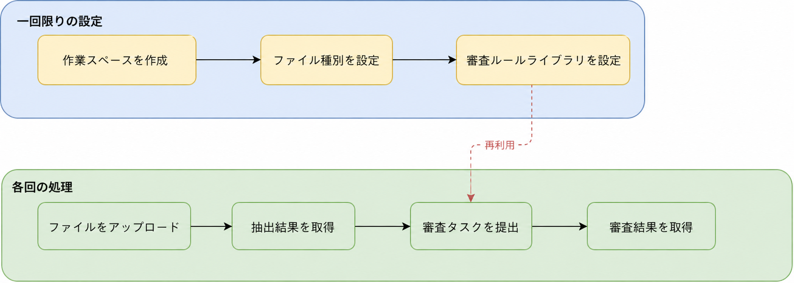
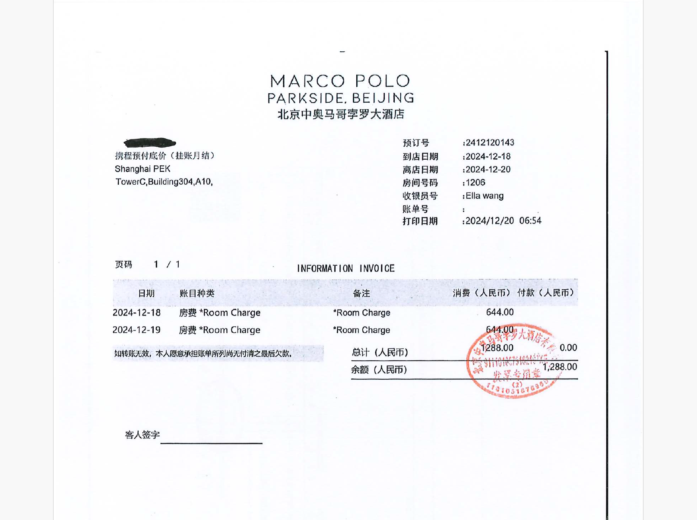
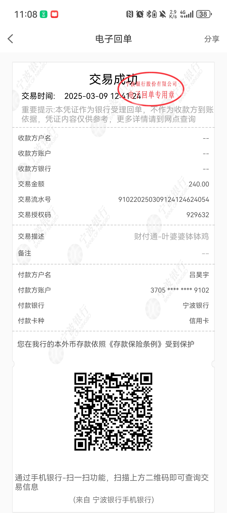

<Tip>
  このページでは**経費精算**を業務シナリオとして、ワークスペース作成、カテゴリ設定、ファイルアップロード、抽出結果取得、スマートレビューまでの一連の流れを API で実行する方法を説明します。
  DocFlow を初めて利用する場合は、このページを読む前に [Web ページ](https://docflow.textin.ai/) で基本機能を確認することをおすすめします。
</Tip>

## 01 シナリオ概要

経費精算業務では、財務担当者が毎日さまざまな種類の精算書類を処理します。例:

- **経費申請書**（XLS 形式）:記録します申請者、出張目的、費用明細など情報
- **ホテル明細**（画像）:チェックイン日、チェックアウト日、利用明細を記録します
- **支払記録**（PDF）:取引番号、取引金額、支払元/受取先情報を記録します

DocFlow では、分類とフィールドを一度設定するだけで、その後アップロードされる書類の**分類認識**と**構造化情報抽出**を自動化できます。レビュー規則リポジトリを設定すると、抽出結果に対して**スマートレビュー**を実行し、金額一致しませんやフィールド欠落などの問題を自動検出できます。

## 02 業務フロー



<Note>
  **ワークスペース、ファイルカテゴリ、レビュー規則リポジトリは一度だけ設定すれば継続利用できます**。以降は新しい処理対象ファイルをアップロードし、新しいレビュータスクを作成するだけです。このサンプルでは全体の流れを示すため、設定手順と処理手順を同じコード内で実行します。
</Note>

## 03 前提条件

1. [TextIn コンソール](https://www.textin.ai/console/dashboard/setting) にログインし、`x-ti-app-id` と `x-ti-secret-code` を取得します
2. [サンプルファイル](https://github.com/ichaozai/docflow-docs/tree/master/examples/sample_files)、または自社の精算書類を使用します

## 04 カテゴリとフィールド設定

この例では 3 つのファイルカテゴリを設定します。フィールド設計は次のとおりです。

<AccordionGroup>
  <Accordion defaultOpen title="ホテル明細（サンプル:sample_hotel_receipt.png）">
    ホテル明細は宿泊費の証憑で、通常はチェックイン/チェックアウト日などの全体情報と、日別課金の利用明細テーブルを含みます。フィールド設定では**基本情報フィールド**（全体情報）と**テーブルフィールド**（明細行）を併用し、書類内の構造化データを網羅的に抽出します。

    

    | フィールド名 | タイプ |
    |---|---|
    | <span style={{color: "#3b82f6"}}>チェックイン日付</span> | 基本情報フィールド |
    | <span style={{color: "#3b82f6"}}>チェックアウト日付</span> | 基本情報フィールド |
    | <span style={{color: "#3b82f6"}}>合計金額</span> | 基本情報フィールド |
    | <span style={{color: "#3b82f6"}}>日付</span> | テーブルフィールド |
    | <span style={{color: "#3b82f6"}}>費用タイプ</span> | テーブルフィールド |
    | <span style={{color: "#3b82f6"}}>金額</span> | テーブルフィールド |
    | <span style={{color: "#3b82f6"}}>備考</span> | テーブルフィールド |
  </Accordion>
  <Accordion defaultOpen title="支払記録（サンプル:sample_payment_record.pdf）">
    支払記録は銀行または決済機関が発行する電子控えで、取引番号、取引当事者、金額などの詳細を含みます。フィールド抽出により、精算金額や支払先/支払元が申請書と一致しているかをすばやく確認できます。

    

    | フィールド名 | タイプ |
    |---|---|
    | <span style={{color: "#3b82f6"}}>取引番号</span> | 基本情報フィールド |
    | <span style={{color: "#3b82f6"}}>取引承認コード</span> | 基本情報フィールド |
    | <span style={{color: "#3b82f6"}}>支払カード種別</span> | 基本情報フィールド |
    | <span style={{color: "#3b82f6"}}>受取人名義</span> | 基本情報フィールド |
    | <span style={{color: "#3b82f6"}}>支払人名義</span> | 基本情報フィールド |
    | <span style={{color: "#3b82f6"}}>取引日時</span> | 基本情報フィールド |
    | <span style={{color: "#3b82f6"}}>備考</span> | 基本情報フィールド |
    | <span style={{color: "#3b82f6"}}>受取方口座</span> | 基本情報フィールド |
    | <span style={{color: "#3b82f6"}}>受取方銀行</span> | 基本情報フィールド |
    | <span style={{color: "#3b82f6"}}>取引金額</span> | 基本情報フィールド |
    | <span style={{color: "#3b82f6"}}>取引説明</span> | 基本情報フィールド |
    | <span style={{color: "#3b82f6"}}>支払銀行</span> | 基本情報フィールド |
    | <span style={{color: "#3b82f6"}}>通貨</span> | 基本情報フィールド |
    | <span style={{color: "#3b82f6"}}>取引口座/支払方法</span> | 基本情報フィールド |
  </Accordion>
  <Accordion defaultOpen title="経費申請書（サンプル:sample_expense_form.xls）">
    経費申請書は出張経費精算のメイン書類で、Excel 表形式で申請者情報、出張行程、各種費用明細を記録します。フィールド抽出により、申請者、金額、税率などの重要データを自動入力でき、手入力ミスを減らせます。

    | フィールド名 | タイプ |
    |---|---|
    | <span style={{color: "#3b82f6"}}>申請者</span> | 基本情報フィールド |
    | <span style={{color: "#3b82f6"}}>出張目的</span> | 基本情報フィールド |
    | <span style={{color: "#3b82f6"}}>精算期間</span> | 基本情報フィールド |
    | <span style={{color: "#3b82f6"}}>目的地</span> | 基本情報フィールド |
    | <span style={{color: "#3b82f6"}}>費用発生日</span> | 基本情報フィールド |
    | <span style={{color: "#3b82f6"}}>費用項目</span> | 基本情報フィールド |
    | <span style={{color: "#3b82f6"}}>出張費金額</span> | 基本情報フィールド |
    | <span style={{color: "#3b82f6"}}>税率</span> | 基本情報フィールド |
    | <span style={{color: "#3b82f6"}}>仮払金精算額</span> | 基本情報フィールド |
    | <span style={{color: "#3b82f6"}}>支払申請額</span> | 基本情報フィールド |
    | <span style={{color: "#3b82f6"}}>備考</span> | 基本情報フィールド |
    | <span style={{color: "#3b82f6"}}>税額</span> | 基本情報フィールド |
  </Accordion>
</AccordionGroup>

## 05 レビュー規則設定

この例のレビュー規則リポジトリには **3 つの規則グループ、8 つのレビュー規則** が含まれます。書類内のコンプライアンスチェック、出張規程との照合、複数書類間のクロスチェックをカバーします。

<AccordionGroup>
  <Accordion defaultOpen title="規則グループ 1:経費申請書コンプライアンス性チェック（適用カテゴリ:経費申請書）">
    | 規則名 | リスクレベル | レビュー条件 |
    |---|---|---|
    | <span style={{color: "#3b82f6"}}>行精算金額チェック</span> | <span style={{color: "#ef4444"}}>●</span> 高リスク | 行支払申請額 ≤ 行出張費金額（税込）- 行仮払金精算額、仮払金精算額空时视为 0 |
    | <span style={{color: "#3b82f6"}}>精算合計金額チェック</span> | <span style={{color: "#ef4444"}}>●</span> 高リスク | 申してください支払合計金額 ≤ Σ 行支払申請額 |
    | <span style={{color: "#3b82f6"}}>精算期間と費用日付照合</span> | <span style={{color: "#eab308"}}>●</span> 中リスク | "費用発生日"应在"精算期間"所覆盖的日付范围内 |
    | <span style={{color: "#3b82f6"}}>必須フィールド完全性チェック</span> | <span style={{color: "#ef4444"}}>●</span> 高リスク | "申請者"、"費用発生日"、"費用項目"、"支払申請額"均不空 |
  </Accordion>
  <Accordion defaultOpen title="規則グループ 2:出張費用政策照合レビュー（適用カテゴリ:ホテル明細）">
    | 規則名 | リスクレベル | レビュー条件 |
    |---|---|---|
    | <span style={{color: "#3b82f6"}}>城市差标照合</span> | <span style={{color: "#eab308"}}>●</span> 中リスク | 酒店住宿単価 ≤ 目的地城市出張基準:一线城市（北京/上海/广州/深圳）≤ 800 元/晚、省会及计划单列市 ≤ 500 元/晚、其他城市 ≤ 300 元/晚 |
    | <span style={{color: "#3b82f6"}}>酒店明细合計金額チェック</span> | <span style={{color: "#eab308"}}>●</span> 中リスク | すべての明細行"金額"合計 = "合計金額" |
  </Accordion>
  <Accordion defaultOpen title="規則グループ 3:複数文書クロスレビュー（適用カテゴリ:経費申請書 + ホテル明細 + 支払記録）">
    | 規則名 | リスクレベル | レビュー条件 |
    |---|---|---|
    | <span style={{color: "#3b82f6"}}>複数文書金額照合</span> | <span style={{color: "#ef4444"}}>●</span> 高リスク | 経費申請書出張費金額 = ホテル明細合計金額 = 支払記録取引金額、許容 ±0.1 元誤差 |
    | <span style={{color: "#3b82f6"}}>支払人身份と申請者整合性</span> | <span style={{color: "#eab308"}}>●</span> 中リスク | 支払記録"支払人名義"と経費申請書"申請者"为同一人物 |

    <Tip>
      複数文書規則的 `category_ids` 含む複数の分類 ID、只有当レビュータスク覆盖所有関連分類时、この規則才会被触发执行。
    </Tip>
  </Accordion>
</AccordionGroup>

## 06 コード構成

例コード将完全な七步フローまとめて実行、便于理解端到端的调用链路。在実際本番中、**ステップ 1、2、5（ワークスペースを作成、設定ファイルカテゴリ、設定レビュー規則リポジトリ）必要なのは一度だけ実行**。以降処理新書類时、必要なのは繰り返す**ステップ 3、4、6、7（ファイルをアップロード → 抽出結果を取得 → 送信レビュータスク → 取得レビュー結果）**、直接再利用既存の的ワークスペース、カテゴリ和規則リポジトリ即可。

例コード中的関数分为两类、理解この一点有助于照合 API 文書进行デバッグ和拡張。

### 2 種類の関数

**REST API 呼び出し関数** — 各関数は API エンドポイントを直接ラップします、関数パラメータとAPI文書対応:

| 関数（Python） | メソッド（Java） | 対応する API エンドポイント | 説明 |
|---|---|---|---|
| `create_workspace` | `createWorkspace` | `POST /workspace/create` | ワークスペースを作成、workspace_id を返す |
| `create_category` | `createCategory` | `POST /category/create` | ファイルカテゴリを作成し、サンプルをアップロードファイル、category_id を返す |
| `batch_add_category_fields` | `batchAddCategoryFields` | `POST /category/fields/batch_add` | 为既存のカテゴリ追加フィールド（用于添加テーブルフィールド） |
| `upload_file` | `uploadFile` | `POST /file/upload` | 非同期でファイルをアップロードし、batch_number を返します。結果取得にはポーリングが必要です |
| `upload_file_sync` | `uploadFileSync` | `POST /file/upload/sync` | 同期でファイルをアップロードし、抽出結果を直接返します。ポーリングは不要です |
| `create_rule_repo` | `createRuleRepo` | `POST /review/rule_repo/create` | レビュー規則リポジトリを作成、repo_id を返す |
| `create_rule_group` | `createRuleGroup` | `POST /review/rule_group/create` | 在規則リポジトリ内規則グループを作成、group_id を返す |
| `create_rule` | `createRule` | `POST /review/rule/create` | 在規則グループ内レビュー規則を作成、適用カテゴリを紐付け |
| `submit_review_task` | `submitReviewTask` | `POST /review/task/submit` | レビュータスクを送信し、レビュー task_id を返します |

**補助関数** — 直接対応しない API エンドポイント、共通処理やポーリング/表示ロジック:

| 関数（Python） | メソッド（Java） | 役割 |
|---|---|---|
| `_headers` | `authHeaders` | 認証リクエストヘッダーを構築 |
| `_check` | `checkResponse` | レスポンス code を検証し、例外処理を統一 |
| `_mime` | `mimeType` | 拡張子から MIME タイプを推定 |
| `wait_for_result` | `waitForResult` | ループでポーリング `file/fetch`、抽出完了を待機 |
| `display_result` | `displayResult` | 抽出結果を整形して出力 |
| `wait_for_review` | `waitForReview` | ループでポーリング `review/task/result`、レビュー完了を待機 |
| `display_review_result` | `displayReviewResult` | レビュー結果を整形して出力 |

### ステップ別コード説明

<AccordionGroup>
  <Accordion defaultOpen title="ステップ 1:ワークスペースを作成">
    ワークスペース名称中加入时间戳、确保每次実行都会作成独立的新スペース、避免重名错误。

    <Tabs>
      <Tab title="Python">
        ```python
        def create_workspace(name: str, description: str = "") -> str:
            """ワークスペースを作成、workspace_id を返す。"""
            url = f"{BASE_URL}/api/app-api/sip/platform/v2/workspace/create"
            payload = {
                "name":          name,
                "description":   description,
                "auth_scope":    0,
            }
            resp = requests.post(url, json=payload, headers=_headers(), timeout=30)
            data = _check(resp, "ワークスペースを作成")
            return data["result"]["workspace_id"]

        # 呼び出し例（名称含时间戳、避免重名）
        workspace_name = f"経費精算_{datetime.now().strftime('%Y%m%d_%H%M%S')}"
        workspace_id = create_workspace(name=workspace_name, description="経費精算書類自動化処理スペース")
        ```
      </Tab>
      <Tab title="Java">
        ```java
        public static String createWorkspace(String name, String description) throws IOException {
            String url = BASE_URL + "/api/app-api/sip/platform/v2/workspace/create";
            JsonObject payload = new JsonObject();
            payload.addProperty("name", name);
            payload.addProperty("description", description);
            payload.addProperty("auth_scope", 0);

            Request req = new Request.Builder().url(url).headers(authHeaders())
                    .post(RequestBody.create(GSON.toJson(payload), JSON_TYPE)).build();
            try (Response resp = HTTP.newCall(req).execute()) {
                JsonObject data = checkResponse(resp.body().string(), "ワークスペースを作成");
                return data.getAsJsonObject("result").get("workspace_id").getAsString();
            }
        }

        // 呼び出し例
        String workspaceName = "経費精算_"
                + new SimpleDateFormat("yyyyMMdd_HHmmss").format(new Date());
        String workspaceId = createWorkspace(workspaceName, "経費精算書類自動化処理スペース");
        ```
      </Tab>
    </Tabs>
  </Accordion>

  <Accordion defaultOpen title="ステップ 2:設定ファイルカテゴリ">
    `create_category` 合格 multipart 表单一度だけの完了カテゴリ作成、サンプルアップロード和フィールド設定。对于必要テーブルフィールド的カテゴリ（如ホテル明細）、在作成后再调用 `batch_add_category_fields` 追加。

    <Tabs>
      <Tab title="Python">
        ```python
        def create_category(workspace_id, name, sample_file_path, fields, category_prompt="") -> str:
            url = f"{BASE_URL}/api/app-api/sip/platform/v2/category/create"
            with open(sample_file_path, "rb") as f:
                form_data = [
                    ("workspace_id",    (None, workspace_id)),
                    ("name",            (None, name)),
                    ("extract_model",   (None, "llm")),
                    ("category_prompt", (None, category_prompt)),
                    ("fields",          (None, json.dumps(fields, ensure_ascii=False))),
                    ("sample_files",    (os.path.basename(sample_file_path), f, _mime(sample_file_path))),
                ]
                resp = requests.post(url, files=form_data, headers=_headers(), timeout=60)
            return _check(resp, f"作成ファイルカテゴリ[{name}]")["result"]["category_id"]

        def batch_add_category_fields(workspace_id, category_id, fields, table_id=None) -> list:
            url = f"{BASE_URL}/api/app-api/sip/platform/v2/category/fields/batch_add"
            payload = {"workspace_id": workspace_id, "category_id": category_id, "fields": fields}
            if table_id:
                payload["table_id"] = str(table_id)
            resp = requests.post(url, json=payload, headers=_headers(), timeout=30)
            return _check(resp, "一括追加フィールド")["result"]

        # 呼び出し例:ホテル明細（含テーブルフィールド）
        hotel_id = create_category(workspace_id, "ホテル明細",
            os.path.join(SAMPLE_DIR, "sample_hotel_receipt.png"),
            [{"name": "チェックイン日付"}, {"name": "チェックアウト日付"}, {"name": "合計金額"}])
        batch_add_category_fields(workspace_id, hotel_id, table_id=-1, fields=[
            {"name": "日付"}, {"name": "費用タイプ"}, {"name": "金額"}, {"name": "備考"}
        ])
        ```
      </Tab>
      <Tab title="Java">
        ```java
        public static String createCategory(String workspaceId, String name,
                String sampleFilePath, List<Map<String, String>> fields,
                String categoryPrompt) throws IOException {
            File sampleFile = new File(sampleFilePath);
            MultipartBody body = new MultipartBody.Builder().setType(MultipartBody.FORM)
                    .addFormDataPart("workspace_id",  workspaceId)
                    .addFormDataPart("name",          name)
                    .addFormDataPart("extract_model", "llm")
                    .addFormDataPart("category_prompt", categoryPrompt)
                    .addFormDataPart("fields", GSON.toJson(fields))
                    .addFormDataPart("sample_files", sampleFile.getName(),
                            RequestBody.create(sampleFile, MediaType.get(mimeType(sampleFile.getName()))))
                    .build();
            Request req = new Request.Builder().url(BASE_URL + "/api/app-api/sip/platform/v2/category/create")
                    .headers(authHeaders()).post(body).build();
            try (Response resp = HTTP.newCall(req).execute()) {
                return checkResponse(resp.body().string(), "作成ファイルカテゴリ")
                        .getAsJsonObject("result").get("category_id").getAsString();
            }
        }

        // 呼び出し例:ホテル明細（含テーブルフィールド）
        String hotelId = createCategory(workspaceId, "ホテル明細",
                SAMPLE_DIR + "/sample_hotel_receipt.png",
                Arrays.asList(field("チェックイン日付"), field("チェックアウト日付"), field("合計金額")), "");
        batchAddCategoryFields(workspaceId, hotelId, "-1",
                List.of("日付", "費用タイプ", "金額", "備考"));
        ```
      </Tab>
    </Tabs>
  </Accordion>

  <Accordion defaultOpen title="ステップ 3:処理対象ファイルをアップロード">
    DocFlow 提供两种アップロード方法:

    - **非同期アップロード** `file/upload`:立即返す `batch_number`、需配合ステップ 4 ポーリング `file/fetch` 取得結果、適しています一括并行アップロード
    - **同期アップロード** `file/upload/sync`: 処理完了まで待機し、抽出結果を直接返します（構造は `file/fetch` と同じ）。ポーリングは不要で、シンプルな連携や少数ファイルのリアルタイム処理に適しています。

    两者的リクエストパラメータ完全一致、仅 URL 路径不同。

    **方法 1:非同期アップロード（需配合ステップ 4 ポーリング）**

    <Tabs>
      <Tab title="Python">
        ```python
        def upload_file(workspace_id: str, file_path: str) -> str:
            url = f"{BASE_URL}/api/app-api/sip/platform/v2/file/upload"
            with open(file_path, "rb") as f:
                resp = requests.post(url,
                    params={"workspace_id": workspace_id},
                    files={"file": (os.path.basename(file_path), f, _mime(file_path))},
                    headers=_headers(), timeout=60)
            return _check(resp, "ファイルをアップロード")["result"]["batch_number"]

        # 呼び出し例
        batch_numbers = [upload_file(workspace_id, p) for p in [
            os.path.join(SAMPLE_DIR, "sample_expense_form.xls"),
            os.path.join(SAMPLE_DIR, "sample_hotel_receipt.png"),
            os.path.join(SAMPLE_DIR, "sample_payment_record.pdf"),
        ]]
        ```
      </Tab>
      <Tab title="Java">
        ```java
        public static String uploadFile(String workspaceId, String filePath) throws IOException {
            File file = new File(filePath);
            HttpUrl url = HttpUrl.parse(BASE_URL + "/api/app-api/sip/platform/v2/file/upload")
                    .newBuilder().addQueryParameter("workspace_id", workspaceId).build();
            MultipartBody body = new MultipartBody.Builder().setType(MultipartBody.FORM)
                    .addFormDataPart("file", file.getName(),
                            RequestBody.create(file, MediaType.get(mimeType(file.getName()))))
                    .build();
            Request req = new Request.Builder().url(url).headers(authHeaders()).post(body).build();
            try (Response resp = HTTP.newCall(req).execute()) {
                return checkResponse(resp.body().string(), "ファイルをアップロード")
                        .getAsJsonObject("result").get("batch_number").getAsString();
            }
        }

        // 呼び出し例
        String[] files = {
            SAMPLE_DIR + "/sample_expense_form.xls",
            SAMPLE_DIR + "/sample_hotel_receipt.png",
            SAMPLE_DIR + "/sample_payment_record.pdf"
        };
        List<String> batchNumbers = new ArrayList<>();
        for (String path : files) batchNumbers.add(uploadFile(workspaceId, path));
        ```
      </Tab>
    </Tabs>

    **方法 2:同期アップロード（抽出結果を直接返す、スキップステップ 4）**

    <Tabs>
      <Tab title="Python">
        ```python
        def upload_file_sync(workspace_id: str, file_path: str) -> dict:
            """同期アップロード:抽出結果を直接返す、ポーリング不要。"""
            url = f"{BASE_URL}/api/app-api/sip/platform/v2/file/upload/sync"
            with open(file_path, "rb") as f:
                resp = requests.post(url,
                    params={"workspace_id": workspace_id},
                    files={"file": (os.path.basename(file_path), f, _mime(file_path))},
                    headers=_headers(), timeout=300)
            data = _check(resp, "ファイルを同期アップロード")
            return data["result"]["files"][0]   # 戻り値構造は file/fetch と同じ

        # 呼び出し例:アップロード即得到抽出結果、可直接用于レビュー
        raw_results = [upload_file_sync(workspace_id, p) for p in [
            os.path.join(SAMPLE_DIR, "sample_expense_form.xls"),
            os.path.join(SAMPLE_DIR, "sample_hotel_receipt.png"),
            os.path.join(SAMPLE_DIR, "sample_payment_record.pdf"),
        ]]
        ```
      </Tab>
      <Tab title="Java">
        ```java
        public static JsonObject uploadFileSync(String workspaceId, String filePath) throws IOException {
            File file = new File(filePath);
            HttpUrl url = HttpUrl.parse(BASE_URL + "/api/app-api/sip/platform/v2/file/upload/sync")
                    .newBuilder().addQueryParameter("workspace_id", workspaceId).build();
            MultipartBody body = new MultipartBody.Builder().setType(MultipartBody.FORM)
                    .addFormDataPart("file", file.getName(),
                            RequestBody.create(file, MediaType.get(mimeType(file.getName()))))
                    .build();
            Request req = new Request.Builder().url(url).headers(authHeaders()).post(body).build();
            try (Response resp = HTTP.newCall(req).execute()) {
                return checkResponse(resp.body().string(), "ファイルを同期アップロード")
                        .getAsJsonObject("result").getAsJsonArray("files")
                        .get(0).getAsJsonObject();   // 戻り値構造は file/fetch と同じ
            }
        }

        // 呼び出し例
        List<JsonObject> rawResults = new ArrayList<>();
        for (String path : new String[]{
                SAMPLE_DIR + "/sample_expense_form.xls",
                SAMPLE_DIR + "/sample_hotel_receipt.png",
                SAMPLE_DIR + "/sample_payment_record.pdf"}) {
            rawResults.add(uploadFileSync(workspaceId, path));
        }
        ```
      </Tab>
    </Tabs>
  </Accordion>

  <Accordion defaultOpen title="ステップ 4:抽出結果を取得（同期アップロード使用時は省略可能）">
    <Note>若ステップ 3 使用了同期アップロード `file/upload/sync`、则已直接获得抽出結果、可スキップ本ステップ。</Note>

    `wait_for_result` ポーリングロジックをラップし、3 秒ごとに照会します `file/fetch`、まで `recognition_status` が `1`（成功）。返す的ファイル对象中含む `task_id`、後続のレビューステップで使用します。

    <Tabs>
      <Tab title="Python">
        ```python
        def wait_for_result(workspace_id, batch_number, timeout=120, interval=3) -> dict:
            url = f"{BASE_URL}/api/app-api/sip/platform/v2/file/fetch"
            deadline = time.time() + timeout
            while time.time() < deadline:
                resp = requests.get(url,
                    params={"workspace_id": workspace_id, "batch_number": batch_number},
                    headers=_headers(), timeout=30)
                files = _check(resp, "処理結果を取得").get("result", {}).get("files", [])
                if files:
                    status = files[0].get("recognition_status")
                    if status == 1:
                        return files[0]   # 含 task_id、供以降レビュー使用
                    elif status == 2:
                        raise RuntimeError(f"ファイル処理失敗: {files[0].get('failure_causes')}")
                time.sleep(interval)
            raise TimeoutError("待機タイムアウト")

        # 呼び出し例（後続レビュー用に task_id を収集）
        raw_results = []
        for batch_number in batch_numbers:
            result = wait_for_result(workspace_id, batch_number)
            raw_results.append(result)
        ```
      </Tab>
      <Tab title="Java">
        ```java
        public static JsonObject waitForResult(String workspaceId, String batchNumber,
                int timeoutSec, int intervalSec) throws IOException, InterruptedException {
            HttpUrl url = HttpUrl.parse(BASE_URL + "/api/app-api/sip/platform/v2/file/fetch")
                    .newBuilder().addQueryParameter("workspace_id", workspaceId)
                    .addQueryParameter("batch_number", batchNumber).build();
            long deadline = System.currentTimeMillis() + (long) timeoutSec * 1000;
            while (System.currentTimeMillis() < deadline) {
                Request req = new Request.Builder().url(url).headers(authHeaders()).get().build();
                try (Response resp = HTTP.newCall(req).execute()) {
                    JsonObject data = checkResponse(resp.body().string(), "処理結果を取得");
                    JsonArray files = data.getAsJsonObject("result").getAsJsonArray("files");
                    if (files != null && files.size() > 0) {
                        JsonObject file = files.get(0).getAsJsonObject();
                        int status = file.get("recognition_status").getAsInt();
                        if (status == 1) return file;   // 含 task_id
                        if (status == 2) throw new RuntimeException("ファイル処理失敗");
                    }
                }
                Thread.sleep((long) intervalSec * 1000);
            }
            throw new RuntimeException("待機タイムアウト");
        }

        // 呼び出し例
        List<JsonObject> rawResults = new ArrayList<>();
        for (String bn : batchNumbers) {
            rawResults.add(waitForResult(workspaceId, bn, 120, 3));
        }
        ```
      </Tab>
    </Tabs>
  </Accordion>

  <Accordion defaultOpen title="ステップ 5:設定レビュー規則リポジトリ">
    規則リポジトリ采用**三层構造**:規則リポジトリ → 規則グループ → 規則。`create_rule` 的 `category_ids` パラメータ指定規則适用的分類、使用ステップ 2 中获得的 `category_id`。

    <Tabs>
      <Tab title="Python">
        ```python
        # 作成規則リポジトリ
        repo_id = create_rule_repo(workspace_id, "経費精算レビュー規則リポジトリ")

        # 規則グループ1:経費申請書コンプライアンス性チェック
        group1_id = create_rule_group(workspace_id, repo_id, "経費申請書コンプライアンス性チェック")
        create_rule(workspace_id, repo_id, group1_id,
            "必須フィールド完全性チェック",
            "\"申請者\"、\"費用発生日\"、\"費用項目\"、\"支払申請額\"均不空、"
            "任一フィールド空则レビュー不合格",
            [baoxiao_id], 10)   # category_ids 传入ステップ2获得的 category_id

        # 規則グループ3:複数文書クロスレビュー（関連複数の分類）
        group3_id = create_rule_group(workspace_id, repo_id, "複数文書クロスレビュー")
        create_rule(workspace_id, repo_id, group3_id,
            "複数文書金額照合",
            "経費申請書出張費金額 = ホテル明細合計金額 = 支払記録取引金額、許容±0.1元誤差",
            [baoxiao_id, hotel_id, payment_id], 10)   # 関連三个分類
        ```
      </Tab>
      <Tab title="Java">
        ```java
        // 作成規則リポジトリ
        String repoId = createRuleRepo(workspaceId, "経費精算レビュー規則リポジトリ");

        // 規則グループ1:経費申請書コンプライアンス性チェック
        String group1Id = createRuleGroup(workspaceId, repoId, "経費申請書コンプライアンス性チェック");
        createRule(workspaceId, repoId, group1Id,
                "必須フィールド完全性チェック",
                "\"申請者\"、\"費用発生日\"、\"費用項目\"、\"支払申請額\"均不空、" +
                "任一フィールド空则レビュー不合格",
                Arrays.asList(baoxiaoId), 10);   // category_ids 传入ステップ2获得的 category_id

        // 規則グループ3:複数文書クロスレビュー（関連複数の分類）
        String group3Id = createRuleGroup(workspaceId, repoId, "複数文書クロスレビュー");
        createRule(workspaceId, repoId, group3Id,
                "複数文書金額照合",
                "経費申請書出張費金額 = ホテル明細合計金額 = 支払記録取引金額、許容±0.1元誤差",
                Arrays.asList(baoxiaoId, hotelId, paymentId), 10);   // 関連三个分類
        ```
      </Tab>
    </Tabs>
  </Accordion>

  <Accordion defaultOpen title="ステップ 6:送信レビュータスク">
    从ステップ 4 的抽出結果中提取 `task_id`、传入レビューAPI。レビュータスク是**异步执行**的、送信后必要ポーリング結果。

    <Tabs>
      <Tab title="Python">
        ```python
        def submit_review_task(workspace_id, name, repo_id, extract_task_ids) -> str:
            url = f"{BASE_URL}/api/app-api/sip/platform/v2/review/task/submit"
            payload = {
                "workspace_id":     workspace_id,
                "name":             name,
                "repo_id":          repo_id,
                "extract_task_ids": extract_task_ids,
            }
            resp = requests.post(url, json=payload, headers=_headers(), timeout=30)
            return _check(resp, "送信レビュータスク")["result"]["task_id"]

        # 呼び出し例（从抽出結果中収集 task_id）
        extract_task_ids = [r.get("task_id") for r in raw_results if r.get("task_id")]
        review_task_id = submit_review_task(workspace_id, "経費精算レビュー", repo_id, extract_task_ids)
        ```
      </Tab>
      <Tab title="Java">
        ```java
        public static String submitReviewTask(String workspaceId, String name,
                String repoId, List<String> extractTaskIds) throws IOException {
            JsonObject payload = new JsonObject();
            payload.addProperty("workspace_id", workspaceId);
            payload.addProperty("name", name);
            payload.addProperty("repo_id", repoId);
            JsonArray ids = new JsonArray();
            extractTaskIds.forEach(ids::add);
            payload.add("extract_task_ids", ids);
            Request req = new Request.Builder()
                    .url(BASE_URL + "/api/app-api/sip/platform/v2/review/task/submit")
                    .headers(authHeaders()).post(RequestBody.create(GSON.toJson(payload), JSON_TYPE)).build();
            try (Response resp = HTTP.newCall(req).execute()) {
                return checkResponse(resp.body().string(), "送信レビュータスク")
                        .getAsJsonObject("result").get("task_id").getAsString();
            }
        }

        // 呼び出し例
        List<String> extractTaskIds = new ArrayList<>();
        for (JsonObject r : rawResults) {
            if (r.has("task_id")) extractTaskIds.add(r.get("task_id").getAsString());
        }
        String reviewTaskId = submitReviewTask(workspaceId, "経費精算レビュー", repoId, extractTaskIds);
        ```
      </Tab>
    </Tabs>
  </Accordion>

  <Accordion defaultOpen title="ステップ 7:取得レビュー結果">
    `wait_for_review` ポーリング `review/task/result` API、まで任务ステータスが终态（1=レビュー合格、2=レビュー失敗、4=レビュー不合格、7=認識失敗）。

    <Tabs>
      <Tab title="Python">
        ```python
        def wait_for_review(workspace_id, task_id, timeout=300, interval=5) -> dict:
            url = f"{BASE_URL}/api/app-api/sip/platform/v2/review/task/result"
            payload = {"workspace_id": workspace_id, "task_id": task_id}
            deadline = time.time() + timeout
            while time.time() < deadline:
                resp = requests.post(url, json=payload, headers=_headers(), timeout=30)
                result = _check(resp, "取得レビュー結果").get("result", {})
                if result.get("status") in (1, 2, 4, 7):
                    return result
                time.sleep(interval)
            raise TimeoutError("待機レビュー結果タイムアウト")

        # 呼び出し例
        review_result = wait_for_review(workspace_id, review_task_id)
        # review_result["status"]      → タスク全体のステータス
        # review_result["statistics"]  → 合格/不合格規則数集計
        # review_result["groups"]      → 各規則グループ的詳細レビュー結果
        ```
      </Tab>
      <Tab title="Java">
        ```java
        public static JsonObject waitForReview(String workspaceId, String taskId,
                int timeoutSec, int intervalSec) throws IOException, InterruptedException {
            JsonObject payload = new JsonObject();
            payload.addProperty("workspace_id", workspaceId);
            payload.addProperty("task_id", taskId);
            long deadline = System.currentTimeMillis() + (long) timeoutSec * 1000;
            while (System.currentTimeMillis() < deadline) {
                Request req = new Request.Builder()
                        .url(BASE_URL + "/api/app-api/sip/platform/v2/review/task/result")
                        .headers(authHeaders()).post(RequestBody.create(GSON.toJson(payload), JSON_TYPE)).build();
                try (Response resp = HTTP.newCall(req).execute()) {
                    JsonObject result = checkResponse(resp.body().string(), "取得レビュー結果")
                            .getAsJsonObject("result");
                    int status = result.get("status").getAsInt();
                    if (status == 1 || status == 2 || status == 4 || status == 7) return result;
                }
                Thread.sleep((long) intervalSec * 1000);
            }
            throw new RuntimeException("待機レビュー結果タイムアウト");
        }

        // 呼び出し例
        JsonObject reviewResult = waitForReview(workspaceId, reviewTaskId, 300, 5);
        ```
      </Tab>
    </Tabs>
  </Accordion>
</AccordionGroup>

### 抽出結果の例


### レビュー結果の例


## 07 完全なサンプルコードのダウンロード

完全な実行可能コード（Python 版、Java 版）は、ドキュメントリポジトリの `examples/` ディレクトリに同梱されています:

```
examples/
├── python/
│   ├── expense_reimbursement.py   # Python 完全な例
│   ├── requirements.txt
│   └── README.md
├── java/
│   ├── src/main/java/com/docflow/ExpenseReimbursement.java
│   ├── pom.xml
│   └── README.md
└── sample_files/
    └── expense_reimbursement/
        ├── sample_expense_form.xls
        ├── sample_hotel_receipt.png
        ├── sample_payment_record.pdf
        └── sample_rule_repo.xlsx
```

<CardGroup cols={2}>
  <Card title="Python 例" icon="python" href="https://github.com/ichaozai/docflow-docs/tree/master/examples/python">
    確認 Python 完全な例コード
  </Card>
  <Card title="Java 例" icon="java" href="https://github.com/ichaozai/docflow-docs/tree/master/examples/java">
    確認 Java 完全な例コード
  </Card>
</CardGroup>

## 08 サンプルの実行

<Tabs>
  <Tab title="Python">
    **環境要件**:Python 3.8+

    **1. 依存関係をインストール**

    ```bash
    cd examples/python
    pip install -r requirements.txt
    ```

    **2. 入力設定**

    開き `expense_reimbursement.py`、入力ファイル上部的設定項目:

    ```python
    APP_ID        = "your-app-id"      # x-ti-app-id
    SECRET_CODE   = "your-secret-code" # x-ti-secret-code
    ```

    **3. 実行**

    ```bash
    python expense_reimbursement.py
    ```
  </Tab>
  <Tab title="Java">
    **環境要件**:JDK 11+、Maven 3.6+

    **1. 入力設定**

    開き `src/main/java/com/docflow/ExpenseReimbursement.java`、入力ファイル上部的設定項目:

    ```java
    private static final String APP_ID        = "your-app-id";
    private static final String SECRET_CODE   = "your-secret-code";
    ```

    **2. ビルドして実行**

    ```bash
    cd examples/java
    mvn clean package -q
    java -jar target/expense-reimbursement-1.0.0.jar
    ```
  </Tab>
</Tabs>

<Tip>
  実行に成功したら、[DocFlow Web ページ](https://docflow.textin.ai/) にログインし、対象ワークスペースで各ファイルの分類結果、フィールド抽出結果、スマートレビュー結果を確認できます。コードの出力結果との照合にも役立ちます。
</Tip>

### 想定されるコンソール出力

成功実行后、コンソール将出力如下内容（workspace_id、category_id など ID 因実行环境不同而变化）:

```
============================================================
  DocFlow 経費精算シナリオ例
============================================================
[ステップ1] ワークスペース作成成功  workspace_id=<workspace_id>
[ステップ2] ファイルカテゴリ作成成功  name=経費申請書  category_id=<category_id>
[ステップ2] ファイルカテゴリ作成成功  name=ホテル明細  category_id=<category_id>
  追加フィールド成功  name=日付  field_id=<field_id>
  追加フィールド成功  name=費用タイプ  field_id=<field_id>
  追加フィールド成功  name=金額  field_id=<field_id>
  追加フィールド成功  name=備考  field_id=<field_id>
[ステップ2] ファイルカテゴリ作成成功  name=支払記録  category_id=<category_id>

設定完了  workspace_id=<workspace_id>
  経費申請書: category_id=<category_id>
  ホテル明細:   category_id=<category_id>
  支払記録:   category_id=<category_id>

開始処理対象ファイルをアップロード...
[ステップ3] ファイルアップロード成功  name=sample_expense_form.xls  batch_number=<batch_number>
[ステップ3] ファイルアップロード成功  name=sample_hotel_receipt.png  batch_number=<batch_number>
[ステップ3] ファイルアップロード成功  name=sample_payment_record.pdf  batch_number=<batch_number>

開始処理結果を取得...
[ステップ4] 待機処理結果（batch_number=<batch_number>）..... 完了

============================================================
ファイル名   : sample_expense_form.xls
分類結果 : 経費申請書

── 普通フィールド ──────────────────────────
  申請者                 : 吕昊宇
  出張目的                : 商务沟通
  精算期間                : 2024-12-18 至 2024-12-20
  目的地                 : 北京
  費用発生日              : 2024/12/20
  費用項目                : 管理費用_出差住宿费
  出張費金額               : 1,215.09
  税率                  : 0.06
  税額                  : 72.91
  仮払金精算額               : 0
  支払申請額              : 1288.00
[ステップ4] 待機処理結果（batch_number=<batch_number>）... 完了

============================================================
ファイル名   : sample_hotel_receipt.png
分類結果 : ホテル明細

── 普通フィールド ──────────────────────────
  チェックイン日付                : 2024-12-18
  チェックアウト日付                : 2024-12-20
  合計金額                 : 1,288.00

── テーブル行データ ────────────────────────
  第1行: 日付=2024-12-18  |  費用タイプ=房费*Room Charge  |  金額=644.00  |  備考=*Room Charge
  第2行: 日付=2024-12-19  |  費用タイプ=房费*Room Charge  |  金額=644.00  |  備考=*Room Charge
[ステップ4] 待機処理結果（batch_number=<batch_number>）.... 完了

============================================================
ファイル名   : sample_payment_record.pdf
分類結果 : 支払記録

── 普通フィールド ──────────────────────────
  取引番号               : 910220250309124124624054
  取引承認コード               : 929632
  支払カード種別                : 信用卡
  支払人名義               : 吕昊宇
  支払銀行                : 宁波銀行
  取引日時                : 2024-12-18 12:41:24
  取引金額                : 1288.00
  取引説明                : 财付通-房费
  取引口座/支払方法           : 信用卡

原始抽出結果已保存至: .../examples/python/results.json

開始設定レビュー規則リポジトリ...
[ステップ5] 規則リポジトリ作成成功  name=経費精算レビュー規則リポジトリ  repo_id=<repo_id>
  規則グループ作成成功  name=経費申請書コンプライアンス性チェック  group_id=<group_id>
    規則作成成功  name=行精算金額チェック  rule_id=<rule_id>
    規則作成成功  name=精算合計金額チェック  rule_id=<rule_id>
    規則作成成功  name=精算期間と費用日付照合  rule_id=<rule_id>
    規則作成成功  name=必須フィールド完全性チェック  rule_id=<rule_id>
  規則グループ作成成功  name=出張費用政策照合レビュー  group_id=<group_id>
    規則作成成功  name=城市差标照合  rule_id=<rule_id>
    規則作成成功  name=酒店明细合計金額チェック  rule_id=<rule_id>
  規則グループ作成成功  name=複数文書クロスレビュー  group_id=<group_id>
    規則作成成功  name=複数文書金額照合  rule_id=<rule_id>
    規則作成成功  name=支払人身份と申請者整合性  rule_id=<rule_id>
[ステップ6] レビュータスク送信成功  task_id=<task_id>
[ステップ7] 待機レビュー結果（task_id=<task_id>）................... 完了

============================================================
レビュータスクステータス  : レビュー不合格
規則合格数    : 5
規則不合格数  : 3

── 規則グループ:複数文書クロスレビュー ───────────────────
  ✗ [中リスク] 支払人身份と申請者整合性: レビュー不合格
    根拠: 支払記録支払人名義"吕昊宇"と経費申請書申請者签名"徐汉波"一致しません。
  ✓ [高リスク] 複数文書金額照合: レビュー合格
    根拠: 経費申請書出張費金額 1288.00 = ホテル明細合計金額 1288.00 = 支払記録取引金額 1288.00、在許容誤差范围内。

── 規則グループ:出張費用政策照合レビュー ───────────────────
  ✓ [中リスク] 酒店明细合計金額チェック: レビュー合格
    根拠: 明细行金額 644.00 + 644.00 = 1288.00、と合計金額一致。
  ✓ [中リスク] 城市差标照合: レビュー合格
    根拠: 酒店あります北京（一线城市）、住宿単価 644.00 元/晚未超過 800 元/晚的基準。

── 規則グループ:経費申請書コンプライアンス性チェック ───────────────────
  ✓ [高リスク] 必須フィールド完全性チェック: レビュー合格
    根拠: 申請者、費用発生日、費用項目、支払申請額はいずれも入力済み。
  ✗ [中リスク] 精算期間と費用日付照合: レビュー不合格
    根拠: 費用発生日 2024/12/20 在精算期間范围内、但申請者签名と申請者フィールド一致しません。
  ✓ [高リスク] 精算合計金額チェック: レビュー合格
    根拠: 申してください支払合計金額 1288.00 など于行支払申請額合計 1288.00。
  ✗ [高リスク] 行精算金額チェック: レビュー不合格
    根拠: 行支払申請額 1288.00 大于行出張費金額（税込）1215.09 + 税額 72.91 - 仮払金精算額 0 = 1288.00、など于上限、レビュー不合格。

============================================================
  例実行完了
============================================================
```

## 09 結果の説明

### 抽出結果

処理完了後、各ファイルの分類結果とフィールド抽出結果が返されます。フィールド抽出結果は `data.fields[]` に格納され、各フィールドには `key`、`value`、座標情報 `position` が含まれます（原文のハイライト表示に利用できます）。

以下は、3 つのサンプルファイルに対する実際の API レスポンス例です（`file/fetch` から取得。一部の `position` 座標は省略しています）。

<AccordionGroup>
  <Accordion defaultOpen title="sample_expense_form.xls">
    ```json
    {
      "id": "2029124607672344576",
      "name": "sample_expense_form.xls",
      "format": "xls",
      "category": "経費申請書",
      "recognition_status": 1,
      "duration_ms": 5316,
      "data": {
        "fields": [
          {
            "key": "目的地",
            "value": "无锡",
            "position": [{ "page": 0, "vertices": [902, 158, 925, 158, 925, 170, 902, 170] }]
          },
          { "key": "費用発生日", "value": "2025/4/22" },
          { "key": "費用項目",    "value": "管理費用_出差住宿费(含洗衣费)" },
          { "key": "支払申請額", "value": "531.00" },
          { "key": "申請者",      "value": "合合情報" },
          { "key": "出張目的",    "value": "商务沟通" },
          { "key": "出張費金額",  "value": "500.94" },
          { "key": "税率",        "value": "6%" },
          { "key": "仮払金精算額",  "value": "" },
          { "key": "備考",        "value": "配合chris 4月22日上午政府会见、事先行程预演、并チェックイン政府推荐就近酒店" },
          { "key": "税額",        "value": "30.06" },
          { "key": "精算期間",    "value": "2025年04月" }
        ],
        "stamps": [],
        "handwritings": []
      }
    }
    ```
  </Accordion>
  <Accordion defaultOpen title="sample_hotel_receipt.png">
    ```json
    {
      "id": "2029521862627704832",
      "name": "sample_hotel_receipt.png",
      "format": "png",
      "category": "ホテル明細",
      "recognition_status": 1,
      "duration_ms": 6185,
      "data": {
        "fields": [
          {
            "key": "合計金額",
            "value": "1,288.00",
            "position": [{ "page": 0, "vertices": [1258, 838, 1337, 838, 1337, 860, 1258, 860] }]
          },
          { "key": "チェックイン日付", "value": "2024-12-18" },
          { "key": "チェックアウト日付", "value": "2024-12-20" }
        ],
        "items": [
          [
            { "key": "日付",     "value": "2024-12-18", "position": [{ "page": 0, "vertices": [259, 714, 370, 714, 370, 732, 259, 732] }] },
            { "key": "費用タイプ", "value": "房费*Room Charge" },
            { "key": "金額",     "value": "644.00" },
            { "key": "備考",     "value": "*Room Charge" }
          ],
          [
            { "key": "日付",     "value": "2024-12-19" },
            { "key": "費用タイプ", "value": "房费*Room Charge" },
            { "key": "金額",     "value": "644.00" },
            { "key": "備考",     "value": "*Room Charge" }
          ]
        ],
        "stamps": [
          {
            "page": 0,
            "text": "北京中■马哥华罗大酒店有限 911101007916219X 請求書专用章",
            "type": "其他",
            "color": "红色",
            "shape": "椭圆章"
          }
        ],
        "handwritings": []
      }
    }
    ```
  </Accordion>
  <Accordion defaultOpen title="sample_payment_record.pdf">
    ```json
    {
      "id": "2029124614827827202",
      "name": "sample_payment_record.pdf",
      "format": "pdf",
      "category": "支払記録",
      "recognition_status": 1,
      "duration_ms": 7203,
      "data": {
        "fields": [
          {
            "key": "取引説明",
            "value": "财付通-叶婆婆钵钵鸡",
            "position": [{ "page": 0, "vertices": [741, 1288, 1157, 1288, 1157, 1330, 741, 1330] }]
          },
          { "key": "取引番号",       "value": "910220250309124124624054" },
          { "key": "受取人名義",       "value": "" },
          { "key": "取引日時",         "value": "2025-03-09 12:41:24" },
          { "key": "受取方口座",       "value": "" },
          { "key": "取引金額",         "value": "240.00" },
          { "key": "支払銀行",         "value": "宁波銀行" },
          { "key": "通貨",             "value": "" },
          { "key": "取引口座/支払方法", "value": "信用卡" },
          { "key": "取引承認コード",       "value": "929632" },
          { "key": "支払カード種別",         "value": "信用卡" },
          { "key": "支払人名義",       "value": "吕昊宇" },
          { "key": "備考",             "value": "" },
          { "key": "受取方銀行",       "value": "" }
        ],
        "stamps": [
          {
            "page": 0,
            "text": "宁波銀行股份有限公司 電子控え专用章",
            "type": "其他",
            "color": "红色",
            "shape": "椭圆章"
          }
        ],
        "handwritings": []
      }
    }
    ```
  </Accordion>
</AccordionGroup>

### レビュー結果

レビュー完了後、`review/task/result` API から次の情報を取得できます:

- **`status`**:タスク全体のステータス（`1`=レビュー合格、`4`=レビュー不合格、`2`=レビュー失敗）
- **`statistics`**:規則合格数、不合格数汇总
- **`groups[].review_tasks[]`**:各規則的詳細レビュー結果、含む:
  - `review_result`:この規則的レビュー結論
  - `reasoning`:AI によるレビュー根拠の説明
  - `anchors`:原文内で根拠となる座標位置（ハイライト表示に利用できます）

```json
{
  "task_id": "31415926",
  "task_name": "経費精算レビュー",
  "status": 4,
  "statistics": { "pass_count": 5, "failure_count": 3, "error_count": 0 },
  "groups": [
    {
      "group_name": "経費申請書コンプライアンス性チェック",
      "review_tasks": [
        {
          "rule_name": "必須フィールド完全性チェック",
          "risk_level": 10,
          "review_result": 1,
          "reasoning": "申請者、費用発生日、費用項目、支払申請額はいずれも入力済み、レビュー合格。"
        },
        {
          "rule_name": "行精算金額チェック",
          "risk_level": 10,
          "review_result": 4,
          "reasoning": "行支払申請額 1288.00 大于行出張費金額（税込）1215.09 + 税額 72.91 = 1288.00、など于上限、レビュー不合格。"
        },
        {
          "rule_name": "精算合計金額チェック",
          "risk_level": 10,
          "review_result": 1,
          "reasoning": "申してください支払合計金額 1288.00 など于行支払申請額合計 1288.00、レビュー合格。"
        },
        {
          "rule_name": "精算期間と費用日付照合",
          "risk_level": 20,
          "review_result": 4,
          "reasoning": "費用発生日 2024/12/20 在精算期間 2024-12-18 至 2024-12-20 范围内、但申請者签名と申請者フィールド一致しません、レビュー不合格。"
        }
      ]
    },
    {
      "group_name": "出張費用政策照合レビュー",
      "review_tasks": [
        {
          "rule_name": "城市差标照合",
          "risk_level": 20,
          "review_result": 1,
          "reasoning": "酒店あります北京（一线城市）、住宿単価 644.00 元/晚未超過 800 元/晚的基準、レビュー合格。"
        },
        {
          "rule_name": "酒店明细合計金額チェック",
          "risk_level": 20,
          "review_result": 1,
          "reasoning": "明细行金額 644.00 + 644.00 = 1288.00、と合計金額 1288.00 一致、レビュー合格。"
        }
      ]
    },
    {
      "group_name": "複数文書クロスレビュー",
      "review_tasks": [
        {
          "rule_name": "複数文書金額照合",
          "risk_level": 10,
          "review_result": 1,
          "reasoning": "経費申請書出張費金額 1288.00 = ホテル明細合計金額 1288.00 = 支払記録取引金額 1288.00、在許容誤差范围内、レビュー合格。"
        },
        {
          "rule_name": "支払人身份と申請者整合性",
          "risk_level": 20,
          "review_result": 4,
          "reasoning": "支払記録支払人名義"吕昊宇"と経費申請書申請者签名"徐汉波"一致しません、レビュー不合格。"
        }
      ]
    }
  ]
}
```
