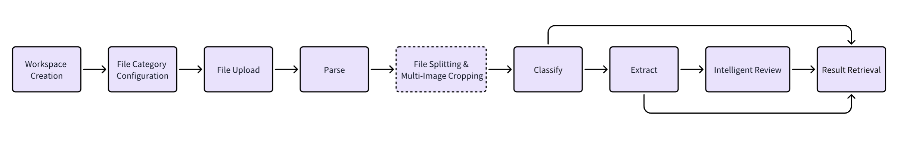
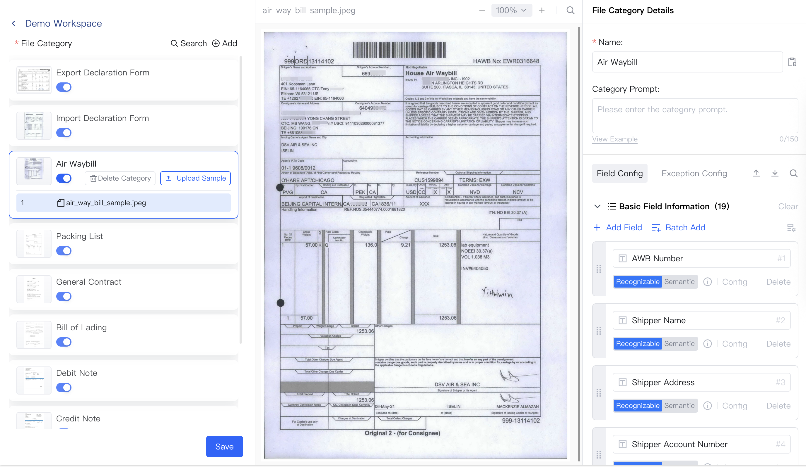
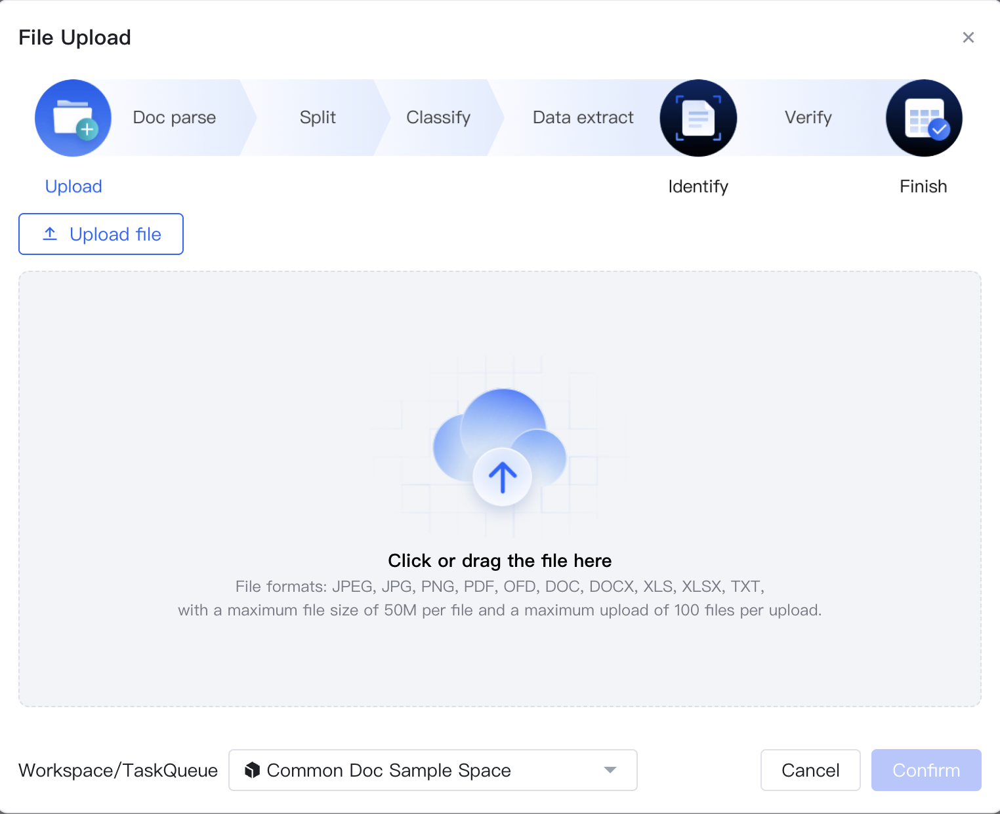
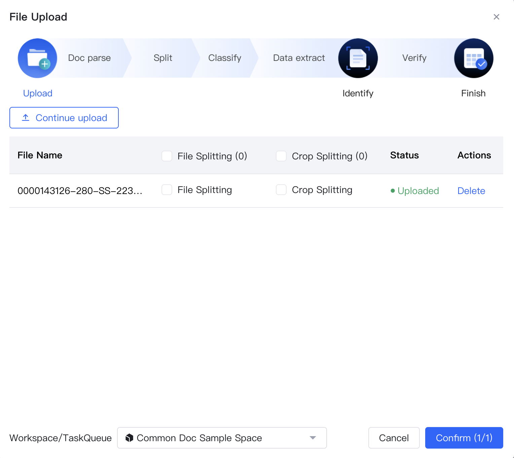
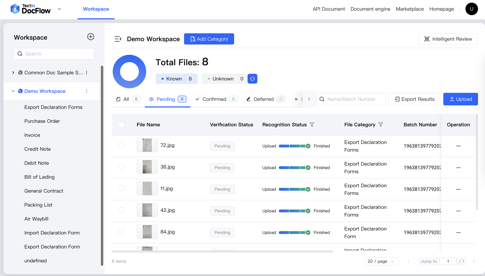
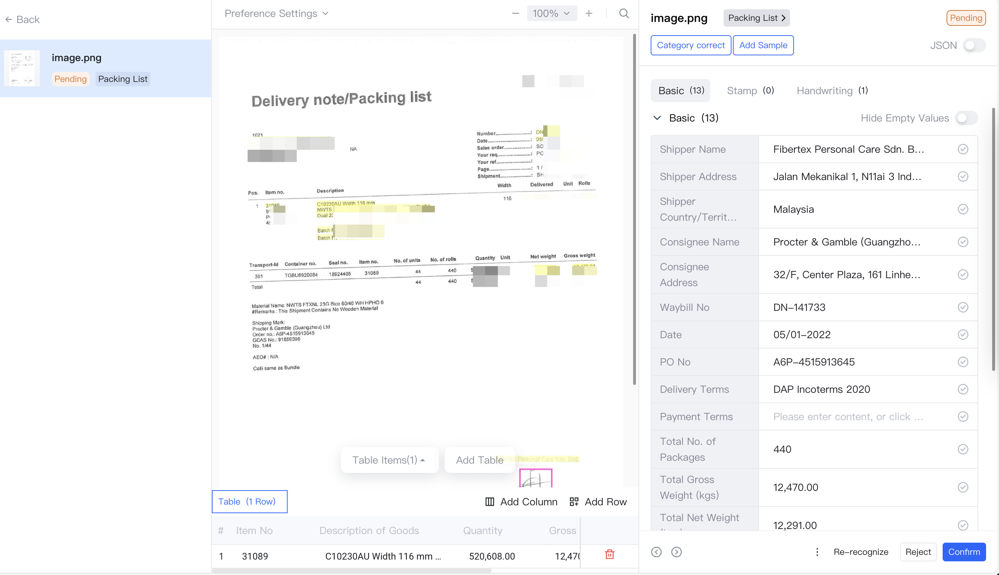
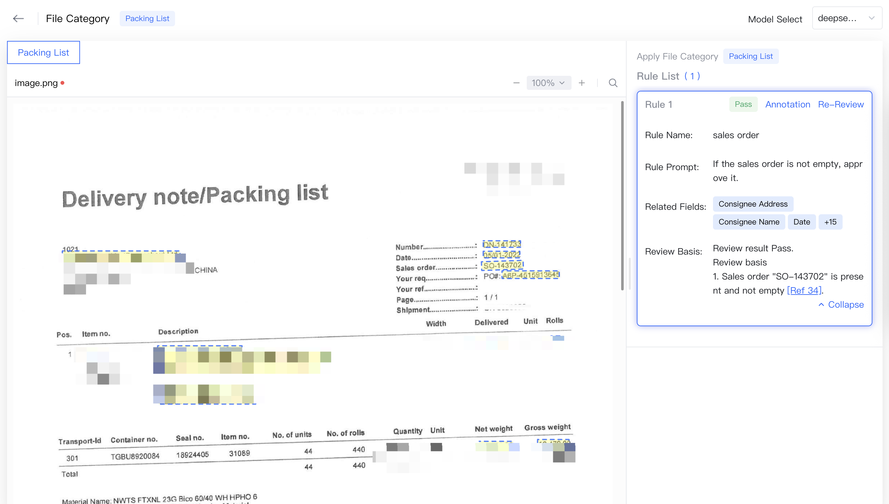

## 01 製品概要

**Docflow 文書自動化プラットフォーム**は、Intsig のブランドである TextIn が提供する、AI 駆動のエンタープライズ向け文書自動化ソリューションです。

Intsig の業界トップクラスの文書解析・文書理解技術を活用し、国内外のさまざまな形式の文書に対して、**インテリジェント収集**、**文書解析**、**文書分類**、**情報抽出**、**スマートレビュー**を提供します。銀行与信、財務シェアードサービス、物流通関、保険請求などの業務領域で、効率的かつ高精度な文書処理を実現します。安定した使いやすい API により、DocFlow を各種業務システムへスムーズに組み込み、文書収集から情報抽出までのプロセスを自動化して、手入力と確認作業のコストを大幅に削減できます。

## 02 主な価値

情報量が急増する現在、企業は契約書、請求書、レポート、申請書など大量の文書を日々処理する必要があります。従来の手作業による処理は時間と工数がかかり、ミスも発生しやすくなります。**DocFlow 文書自動化プラットフォーム**は、企業の文書管理における課題を解決し、業務効率とデータ精度を大きく向上させます。

### 2.1 **エンドツーエンドの自動化**

- ファイルアップロードから結果取得まで、ほぼ人手を介さずシステムが自動で処理し、文書処理の効率を大幅に高めます。

### 2.2 **高速・高精度な抽出**

- 大量の文書を短時間で解析・抽出し、処理リードタイムを短縮して業務効率を高めます。
- 専門的な大規模モデルの能力を活用し、画像品質の最適化や文書構造の分析などの前処理によって認識精度を高め、さまざまな利用シーンに対応します。

### 2.3 スマートな文書分割

- 複数カテゴリ・複数文書が混在するスキャンファイルや、1 ページに複数の証憑が貼り付けられた文書に対して、文書分割、カテゴリ分離、認識を自動で実行し、手作業による分割コストを削減します。

### 2.4 スマートレビュー

- 文書から抽出した情報とレビュー規則を組み合わせて、自動レビューを実行します。レビュー結果では主要な判断根拠を確認でき、レビュー結果の再確認効率を高めます。

### 2.5 多様な文書形式への対応

- 最大 1000 ページの長文書処理に対応
- JPEG、JPG、PNG、PDF、OFD、DOC、DOCX、XLS、XLSX、TXT などのファイル形式に対応

### 2.6 要件に応じたカスタマイズとすぐに使える設定

- 個別設定: 独自サンプルをアップロードしてフィールドを設定することで、システムがファイルカテゴリを認識し、構造化情報を抽出します。
- 効率的な比較と確認: 元ファイルと認識結果を並べて確認でき、情報の確認や補完を効率化し、業界ごとの個別要件に対応します。

### 2.7 強力な連携機能

- スキャナー、メール、API など複数のチャネルから文書を受け付け、抽出したデータを ERP、RPA、OMS などの自動化システムや業務フローへシームレスに連携できます。

## 03 利用フロー

**Docflow 文書自動化プラットフォーム**は、文書管理プロセスを簡素化し、企業の文書処理効率を高めることを目的としています。企業はカテゴリ情報を設定するだけで、文書処理ワークフローを自動化できます。具体的な流れは以下のとおりです。

### 3.1 ワークスペース作成

ログイン後、ユーザーは業務シナリオに応じたワークスペースを作成し、そのシナリオに関連するファイルカテゴリと文書を管理できます。

### 3.2 ファイルカテゴリ設定

ワークスペース作成後、ユーザーは対象の業務スペースを選択し、業務要件に応じて以下を設定します。これにより、より正確な自動分類とフィールド抽出が可能になります。

1. ファイルカテゴリを作成し、サンプルをアップロードする
2. ファイルカテゴリの分類プロンプト、フィールド抽出情報などを管理する

   

### 3.3 ファイルアップロード

ワークスペースとファイルカテゴリの設定後、ユーザーはシステム画面または API を通じて、処理対象の文書を指定したワークスペースへアップロードできます。JPEG、JPG、PNG、PDF、OFD、DOC、DOCX、XLS、XLSX、TXT など、複数形式の文書自動処理に対応しています。

### 3.4 文書解析

Docflow は [xParse](https://www.textin.ai/market/detail/pdf_to_markdown) を中核となる文書解析サービスとして利用しています。アップロードされた PDF、Word、一般的な画像形式の文書を、テキスト、表、見出し階層、数式、手書き文字、画像情報を含む構造化データへ自動変換し、後続の自動処理と分析に活用できます。

### 3.5 ファイル分割と複数画像クロップ

実際の業務では、1 つの文書に複数のファイル種別が含まれる場合があります。DocFlow はファイル分割と複数画像クロップ機能を提供しており、ユーザーはシステム画面または API から必要な機能を有効化できます。これにより、文書分類と抽出内容の正確性・完全性を確保できます。例:

1. 保険請求シナリオ: 複数ページの PDF に身分証明書、請求書、銀行明細などの資料が同時に含まれる場合、ページ単位で文書を分割する必要があります。
2. 経費精算シナリオ: A4 用紙にタクシー領収書や航空券旅程表など複数の証憑が並べて貼り付けられている場合、画像のクロップ処理が必要です。

   

### 3.6 文書分類

DocFlow は、ワークスペースのファイルカテゴリ設定に基づいて解析済み文書を自動分類します。これにより、ユーザーは文書をすばやく検索・管理でき、後続の情報抽出やレビューにも利用できます。API から分類結果を取得し、他の下流システムで活用することも可能です。

### 3.7 情報抽出

DocFlow は、ワークスペースのファイルカテゴリに設定されたフィールド情報に基づき、解析・分類された文書から情報を自動抽出して表示します。ユーザーはシステム画面または API から抽出結果を取得できます。

### 3.8 スマートレビュー

ユーザーはシステム画面または API を通じてワークスペースのレビュー規則を作成・管理し、レビュータスクを開始できます。DocFlow は文書解析・抽出結果とレビュー規則に基づいて、レビュータスク内のファイルに対して一括で規則チェックを行い、レビュー結果を出力します。

## 04 今すぐ試す

<CardGroup cols={2}>
  <Card title="SaaS プラットフォーム" icon="sparkles" href="https://docflow.textin.ai/">
    文書自動化処理フローをワンストップですばやく体験できます
  </Card>
  <Card title="API" icon="sparkles" href="/api-reference/%E3%83%95%E3%82%A1%E3%82%A4%E3%83%AB%E3%82%92%E3%82%A2%E3%83%83%E3%83%97%E3%83%AD%E3%83%BC%E3%83%89">
    複数のプログラミング言語に対応し、高度にカスタマイズ可能な API を利用できます
  </Card>
  <Card title="Docflow 公式サイト" icon="sparkles" href="https://www.textin.ai/product/textin_docflow">
    より詳しい製品情報をご覧いただけます
  </Card>
  <Card title="お問い合わせ" icon="sparkles" href="https://www.textin.ai/contact?type=27&sub_type=1">
    導入や連携に関するご相談はこちらからお問い合わせください
  </Card>
</CardGroup>
