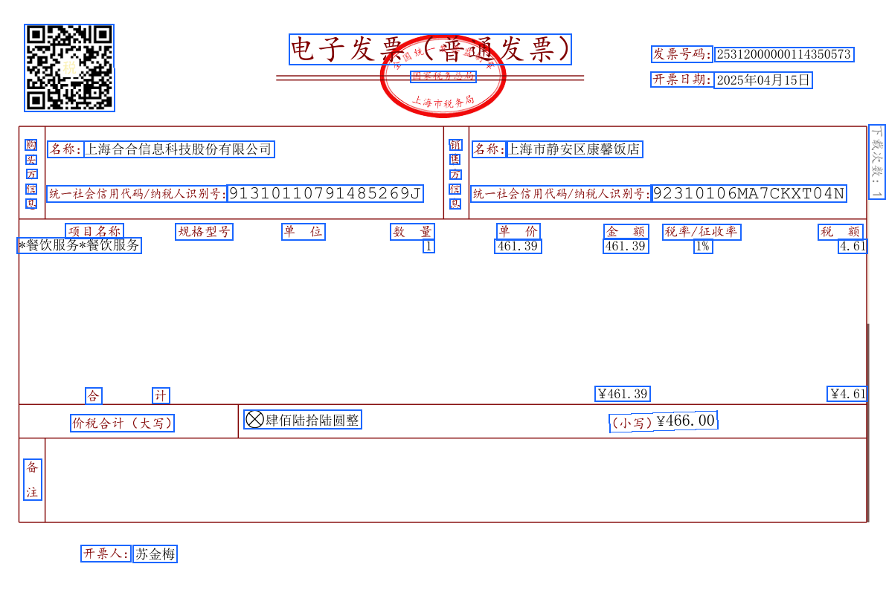

<Tip>
  このページでは、[前のセクション](./quickstart) に続き、取得した解析結果を処理して、元ファイル上の対応位置にテキストボックスを描画する方法を説明します。
</Tip>

<Tip>
  このページでは、[こちらのサンプル文書](https://dllf.intsig.net/download/2025/Solution/20250829/simple.pdf) を例に、元ファイル画像上にテキストボックスを描画する方法を説明します。
</Tip>

<Tip>
  サンプルコードを実行する前に依存関係をインストールしてください。
  `pip install PyMuPDF pillow requests`
</Tip>

## サンプルコード

<CodeGroup>

```python Python expandable icon=python lines
import requests
import json
import os
import fitz  # PyMuPDF
from PIL import Image, ImageDraw

ti_app_id = "your_app_id"
ti_secret_code = "your_app_secret"
workspace_id = "your_workspace_id"
file_id = "your_file_id"

host = "https://docflow.textin.ai"
url = "/api/app-api/sip/platform/v2/file/fetch"
params = {
    "workspace_id":workspace_id,
    "with_document": "true",
    "file_id":file_id
    }
resp = requests.get(url=f"{host}{url}",
                    params=params,
                    headers={"x-ti-app-id": ti_app_id,
                             "x-ti-secret-code": ti_secret_code,
                             })
resp_json = json.loads(resp.text)

def extract_pages_from_docflow(document):
    pages_out = []
    for page in document.get("pages", []):
        pages_out.append({
            "width": page.get("width", 0),
            "height": page.get("height", 0),
            "angle": page.get("angle", 0),
            "lines": page.get("lines", [])
        })
    return pages_out

def pdf_to_images(pdf_path, output_dir="./docflow_pages", dpi=144):
    os.makedirs(output_dir, exist_ok=True)
    doc = fitz.open(pdf_path)
    zoom = dpi / 72.0
    mat = fitz.Matrix(zoom, zoom)
    image_paths = []
    for i, page in enumerate(doc):
        pix = page.get_pixmap(matrix=mat)
        img_path = os.path.join(output_dir, f"page_{i+1}.png")
        pix.save(img_path)
        image_paths.append(img_path)
    doc.close()
    return image_paths

def draw_quads_on_image(image_path, quads, page_width, page_height, color=(26,102,255), line_width=2):
    image = Image.open(image_path).convert("RGB")
    draw = ImageDraw.Draw(image)
    img_w, img_h = image.size
    scale_x = img_w / page_width if page_width else 1
    scale_y = img_h / page_height if page_height else 1
    for q in quads:
        pos = q.get("position")
        if pos and len(pos) == 8:
            points = [
                (pos[0]*scale_x, pos[1]*scale_y),
                (pos[2]*scale_x, pos[3]*scale_y),
                (pos[4]*scale_x, pos[5]*scale_y),
                (pos[6]*scale_x, pos[7]*scale_y),
                (pos[0]*scale_x, pos[1]*scale_y)
            ]
            draw.line(points, fill=color, width=line_width)
    out_path = image_path.replace('.png', '_boxed.png')
    image.save(out_path)
    return out_path

# Select the original PDF to visualize (same file as parsed)
pdf_path = "./simple.pdf"  # Please replace with your original PDF path

# Extract coordinate data
files = resp_json.get("result", {}).get("files", [])
if not files:
    raise RuntimeError("No file parsing results obtained")
document = files[0].get("document", {})
pages = extract_pages_from_docflow(document)

# Convert to images and draw coordinates
image_paths = pdf_to_images(pdf_path, output_dir="./docflow_pages")
annotated = []
for i, page in enumerate(pages):
    if i >= len(image_paths):
        break
    out_path = draw_quads_on_image(
        image_paths[i],
        page["lines"],
        page["width"],
        page["height"]
    )
    annotated.append(out_path)

print("Annotated images output:", annotated)
```

</CodeGroup>

出力ディレクトリで、テキストボックスの描画結果を確認できます。



## サンプルコードのロジック

- **解析結果を取得**: 結果取得 API を `with_document=true` で呼び出し、`result.files[].document` を取得します。
- **ページと座標を抽出**: `document.pages[]` から `width/height/angle` と `lines[]` を読み取ります。各 `line.position` は `[x1,y1,x2,y2,x3,y3,x4,y4]` の時計回り 4 点座標です。
- **ベース画像を準備**: 解析と同じファイルを使用してページ画像を生成します。自分で画像変換を行う場合は、レンダリングした `img_width/img_height` を記録してください。
- **座標スケーリング**: `scale_x = img_width / page.width`、`scale_y = img_height / page.height` を計算し、返された座標をベース画像のピクセル座標系に合わせてスケーリングします。
- **可視化を描画**: スケーリングされた 4 点を対応するページ画像上に閉じた折れ線（または塗りつぶしポリゴン）として行ごとに描画します。線幅、色、透明度は設定可能です。
- **出力と表示**: 注釈付き画像を保存するか、フロントエンドの canvas/SVG/Canvas でオーバーレイ描画します。ページごとの対応を確保してください。
- **オプションの拡張**：
  - `angle` 回転の処理: ベース画像が正しく回転されていない場合、`page.angle` に基づく座標回転補正が必要です。
  - タイプ別の色分け: 異なる要素タイプに異なる色/凡例を使用できます。テーブル、画像などのタイプがある場合、必要に応じて区別できます。
  - 文字レベルのハイライト: `charPositions` が返された場合、各文字座標をスケーリングして描画することで、より細かくハイライトできます。
  - パフォーマンス最適化: 一括描画、解像度の調整、オンデマンドページレンダリングにより、一度に多くのページを処理して遅延が発生するのを避けます。
  - 堅牢性: null 値のチェック、座標境界のクリッピング、ネットワーク/解析例外への対応。

上記のプロセスは言語に依存しません。他の言語で実装する場合は、HTTP リクエスト、JSON 解析、画像描画、座標スケーリングに使用するライブラリと API を置き換えるだけで済みます。
