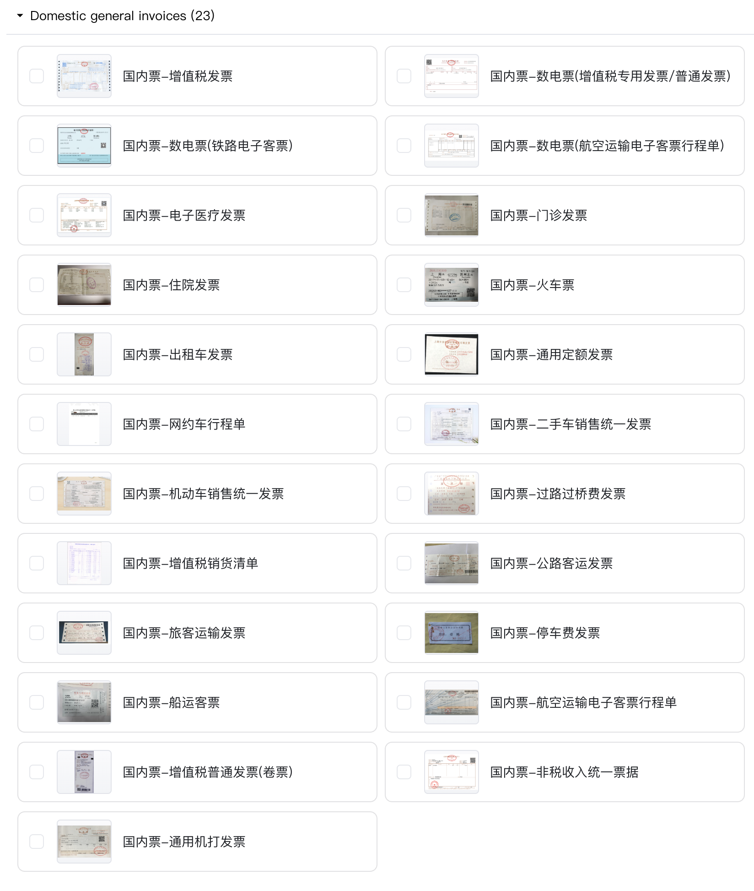
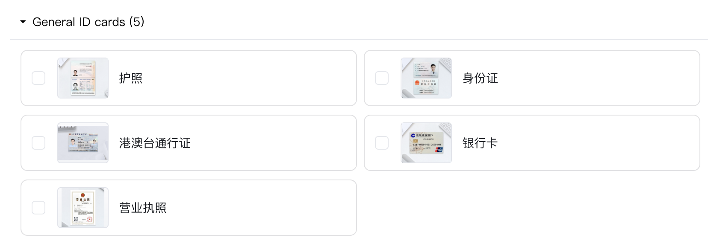

## 01 製品仕様とチャージ

TextIn 公式サイトの「[DocFlow Document Automation - 製品仕様](https://www.textin.ai/product/textin_docflow)」で、詳細な製品料金情報を確認できます。利用ニーズに応じて **T-Coins** をチャージできます。

## 02 **料金の確認**

利用中は、ワークスペースダッシュボードの「[チャージと消費明細](https://www.textin.ai/console/dashboard/userCenter/finance)」で T-coin の注文記録と消費明細を確認できます。アカウントの利用状況をいつでも把握できます。

## 03 課金ルール

DocFlow Document Automation Platform は、シンプルで分かりやすい「ページ単位課金」モデルを採用しており、課金単位は「T-coin / ページ」です。必要に応じて T-coins をチャージし、プラットフォームの各種機能を柔軟に利用できます。

プラットフォームには、SaaS プラットフォーム利用、API 利用、プライベートデプロイ利用の 3 つの利用方法があります。以下では、それぞれの課金ルールを説明します。

### 3.1 SaaS プラットフォーム

「[Docflow Document Automation Platform](https://docflow.textin.ai/)」から SaaS プラットフォームにアクセスできます。課金ルールは次のとおりです。

#### **1. ファイル処理の課金**

- アップロード後、**初回** に分類成功したページ数にもとづいて課金されます。
- 初回アップロード時に `undefined` に分類されたページは **課金されません**。
- その後に再認識して分類に成功した場合、初めて分類成功したページ数にもとづいて課金されます。

(1) 中国国内の一般的な証憑: 0.1 RMB / ページ。現在、以下の 23 種類の証憑に対応しています

(2) 標準カード・証明書: 0.1 RMB / ページ。現在、以下の 5 種類のカード・証明書に対応しています

(3) その他のファイルタイプ: 0.3 RMB / ページ

#### 2. 請求書検証の課金

請求書検証サービスの課金基準は 0.2 RMB / 回で、起動回数に応じて課金されます。このサービスを利用する場合は、事前に営業担当へ連絡して有効化してください。

#### 3. その他操作の課金

(1) ファイル分割や複数画像クロップ機能を使用する場合、同じ内容に対して重複課金されません。機能利用による不要な費用を避けられます。

(2) すでに課金済みのページについては、再認識、カテゴリ変更、フィールド修正、インテリジェントレビューなどの後続操作で追加課金は発生しません。利用中のコストを明確に管理できます。

文書自動処理が成功した後は、ワークスペースのファイル一覧から過去の処理結果を確認できます。

### 3.2 API 利用

API からプラットフォーム機能を呼び出す場合、課金ロジックは SaaS プラットフォームと同じで、上記の SaaS プラットフォーム課金ルールに従います。API リクエストが失敗した場合は課金されないため、API 呼び出し時のコストを安全に管理できます。

### 3.3 プライベートデプロイ

プライベートデプロイのニーズがある場合、次の 3 つの柔軟な支払いプランを提供しています。

1. 一括買い切り
2. 年額支払い
3. 従量課金

企業の実際のニーズと予算に応じて適切なプランを選択できます。具体的な支払い詳細やプラン内容については、営業チームへお問い合わせください。最適なプライベートデプロイ支払い方法を選べるよう、個別にサポートします。

## 04 新規ユーザー特典

新規登録ユーザーには、DocFlow Document Automation Platform の 50 ページ分の無料利用枠を提供しており、製品機能をすばやく体験できます。

さらに、TextIn Benefits Officer を追加すると、TextIn 製品の追加 1000 ページ（回）分の利用枠やその他の特典を受け取れます。実際の業務シナリオで DocFlow の活用効果をより広く確認できます。

無料枠を使い切った後もプラットフォームサービスを継続利用するには、[T-coins をチャージ](https://www.textin.ai/console/dashboard/userCenter/charge) する必要があります。
