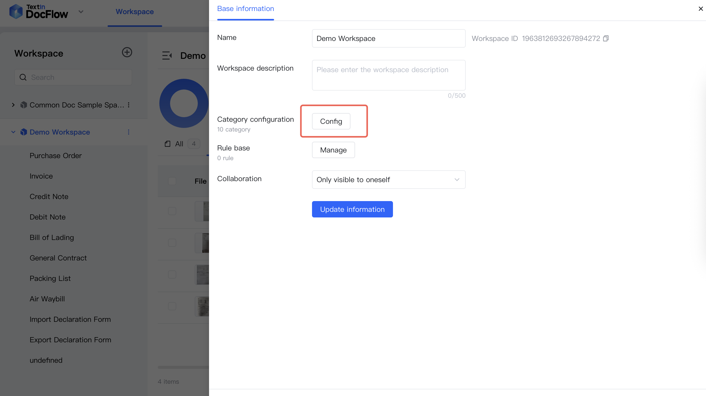
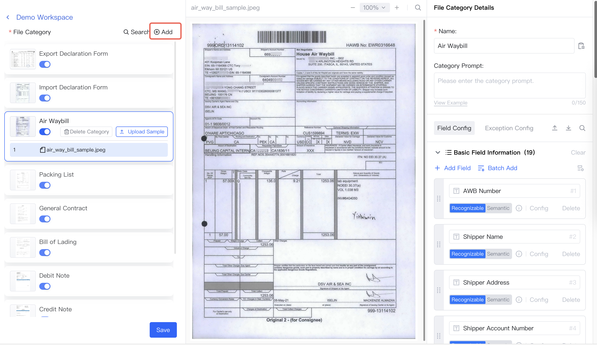
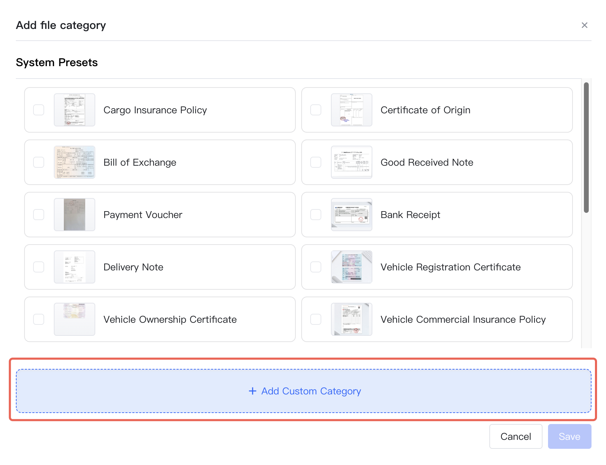
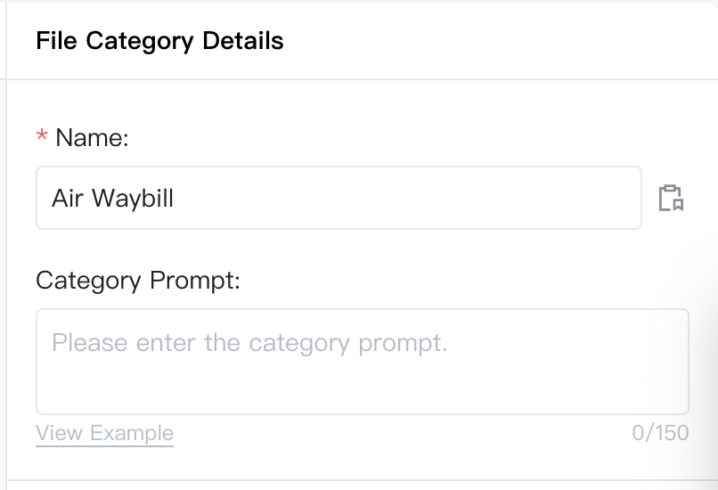
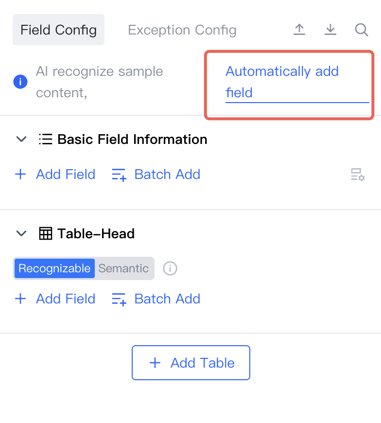
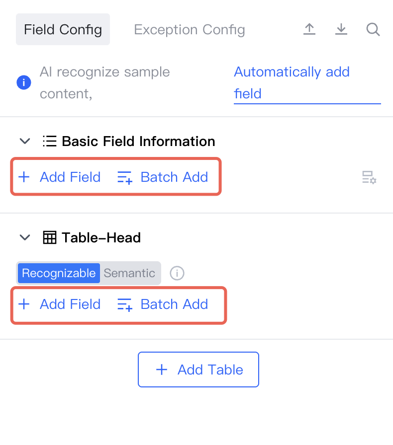
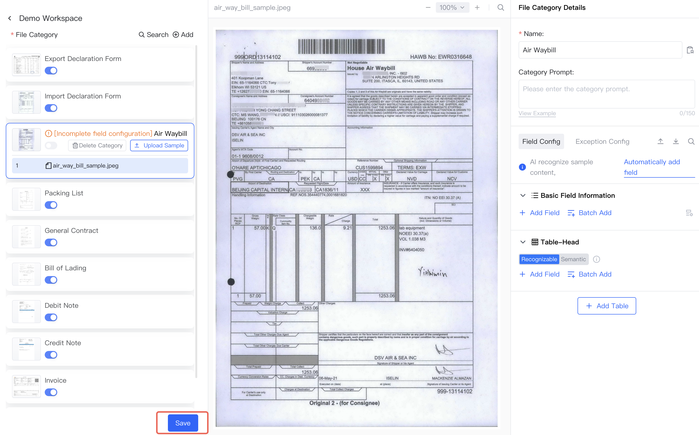

## カテゴリ設定ページの開き方

1. ワークスペース一覧でワークスペースを選択し、**その他の操作 - 設定** をクリックします

2. 表示されたスライドパネルで、カテゴリの **設定** をクリックしてファイルカテゴリ設定ページを開きます

## カテゴリサンプルファイルを追加

1. **カテゴリを追加** をクリックします

2. **カスタムカテゴリを追加** をクリックし、ファイルをアップロードします

## 分類名を設定

分類名を設定します

## サンプルフィールドを設定

**フィールドを自動追加** をクリックすると、AI が文書にもとづいてフィールドを自動追加します

手動でフィールドを追加、調整、削除することもできます

## 設定を保存

**保存** をクリックします

