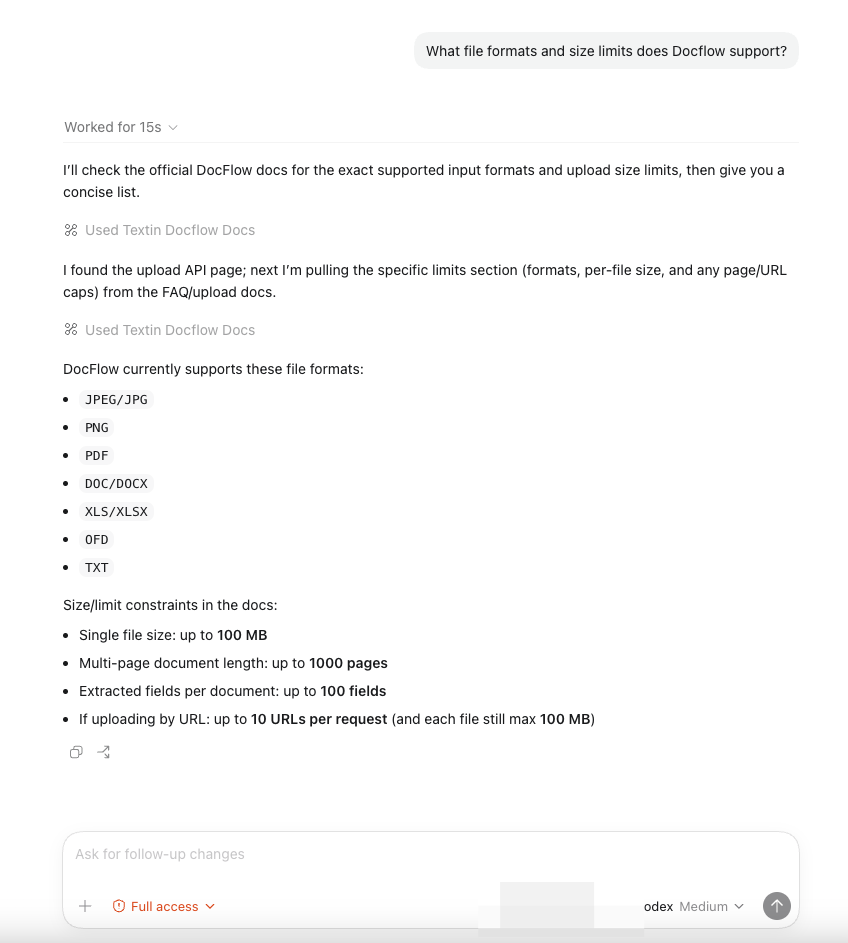

## 01 シナリオ

Docflow API ドキュメント、パラメータ説明、利用ガイドを探したい場合は、Agent に直接質問できます。Agent は MCP サービス経由で関連内容を取得します。

## 02 例

### 2.1 API エンドポイントを確認

```text
What are the endpoint details for the Docflow document extraction API?
```


### 2.2 パラメータを確認

```text
What file formats and size limits does Docflow support?
```



### 2.3 ベストプラクティスを確認

```text
How do I integrate Docflow's extraction feature?
```


<Tip>
  自然言語で質問できます。Agent は回答に必要なドキュメントを自動で判断して検索します。
</Tip>
